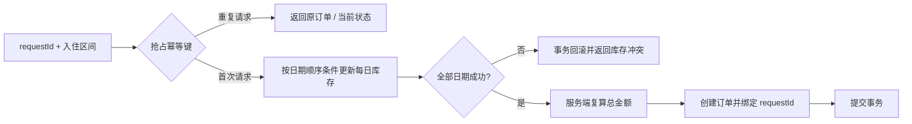
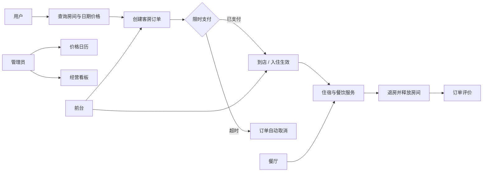
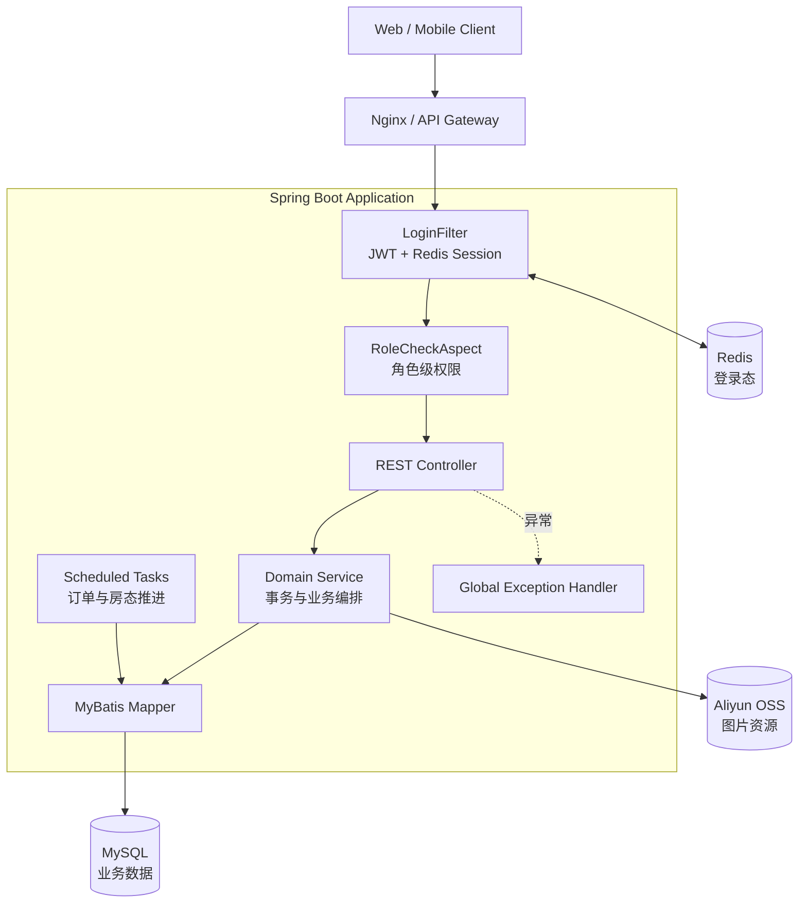

# HotelSystemBackend

<div align="center">
  <p><strong>面向酒店预订、前台履约、餐饮服务与经营分析的一体化后端</strong></p>
  <p>
    
    
    
    
    
    
  </p>
  <p>
    <a href="#项目定位">项目定位</a> ·
    <a href="#核心能力">核心能力</a> ·
    <a href="#系统架构">系统架构</a> ·
    <a href="#快速开始">快速开始</a> ·
    <a href="#设计文档">设计文档</a>
  </p>
  <p><strong>4 类业务角色 · 7 个领域服务 · 46 个 REST API · 3 个自动调度任务</strong></p>
</div>

## 项目定位

HotelSystemBackend 是一个以酒店真实业务链路为背景的 Spring Boot 后端项目。系统围绕“用户预订 - 支付 - 入住 - 退房”主流程，延伸出员工权限、房态管理、动态价格、餐饮订单和经营看板等模块。

项目重点不是接口数量，而是把分散的 CRUD 组织成一条可解释的业务闭环：

- 用户能够查询房态、提交订单、支付、取消和评价；
- 前台能够管理订单、办理入住并维护实时房态；
- 餐厅能够处理送餐订单及状态流转；
- 管理员能够管理员工、房间、价格日历并查看经营指标；
- 定时任务自动处理未支付订单、入住生效和退房释放。

> 当前公开分支保留了核心业务实现。针对高并发预订、请求幂等和缓存一致性的生产化方案，单独记录在[《并发预订与幂等设计》](docs/booking-consistency.md)中，便于区分“现有实现”和“演进设计”。

## 核心能力

| 能力 | 实现方式 | 业务价值 |
| --- | --- | --- |
| 多角色认证授权 | JWT 表达身份，Redis 保存有效登录态，过滤器统一鉴权，AOP 注解校验角色 | 同时支持用户、管理员、前台和餐厅四类角色 |
| 房间全生命周期 | 房态、客房订单和定时任务协同推进预订、入住、退房及超时取消 | 避免订单状态与实际房态长期脱节 |
| 日期价格日历 | 按房型和日期维护价格；下单时逐日取价，缺省时回退至房型基础价 | 支持周末、节假日和旺季差异化定价 |
| 服务端金额计算 | 客房按晚累计并落库；餐饮按库中菜品价格计算主单与明细金额，忽略客户端金额 | 降低客户端篡改金额带来的风险 |
| 事务一致性 | 客房下单/改期、房态变更、调度任务及餐饮主从单使用 Spring 数据库事务 | 同一数据库事务内发生异常时回滚，避免部分写入 |
| 经营分析 | 聚合营收、入住率、平均房价、房型收入、楼层热力图和菜品 Top 10 | 将业务数据转化为运营决策指标 |
| 统一异常处理 | 业务异常集中映射为统一响应结构 | 降低 Controller 重复判断，便于前后端联调 |
| 并发防超卖（V2 仅设计完成，未实现） | 计划按“客房 + 入住日期”维护每日库存，唯一键约束冲突，事务内逐日条件更新 | 设计目标：跨日库存全部成功或全部回滚 |
| 下单幂等（V2 仅设计完成，未实现） | 计划用 `requestId` 唯一索引配合幂等状态记录，重复请求返回原订单 | 设计目标：重复请求返回同一结果 |

### V2 并发预订方案

当前预订已在事务内对房间行加锁，并检查 `[checkin, checkout)` 区间冲突，拒绝重叠预订。V2 每日库存及 `requestId` 幂等只完成技术方案设计，尚未实现，代码计划在后续版本合并：

- **每日库存建模**：以 `(room_id, stay_date)` 唯一键定义最小库存冲突单元；
- **事务内条件更新**：按固定日期顺序逐日执行 `available = 1 -> 0`，任一日期失败则整体回滚；
- **请求幂等**：使用 `requestId` 唯一索引选出唯一执行者，并记录 `PROCESSING / SUCCESS / FAILED` 状态；
- **服务端计价**：库存抢占成功后按价格日历复算总金额，再写入订单主表和明细；
- **缓存边界**：Cache Aside 只用于客房详情和可售展示，数据库更新后删除缓存，并通过随机 TTL 分散集中失效风险；最终库存仍以数据库更新结果为准；
- **索引验证**：围绕库存与订单查询设计联合索引，并使用 `EXPLAIN` 检查访问类型、命中索引与预估扫描行数；
- **并发验收**：设计 50 个请求同时抢占单份库存的测试，验收目标为 1 个成功订单、49 个库存冲突、0 个重复订单和 0 个负库存。



完整的数据模型、SQL、死锁规避、缓存策略和测试方法见[《并发预订与幂等设计》](docs/booking-consistency.md)。

## 业务全景



## 系统架构



更完整的模块边界、数据关系和关键时序见[《系统设计》](docs/architecture.md)。

## 角色与权限

| 角色 | 主要权限 |
| --- | --- |
| 用户 `USER` | 注册登录、查询房间、创建/支付/取消订单、餐饮下单、查看历史和评价 |
| 管理员 `MANAGER` | 员工管理、客房管理、价格日历、订单管理、经营分析 |
| 前台 `FRONT` | 线下开单、订单调整、房态墙和入住退房处理 |
| 餐厅 `RESTAURANT` | 查看实时餐饮订单、更新制作及配送状态 |

权限校验分为两层：

1. `LoginFilter` 校验请求头中的 token，并从 Redis 确认登录态是否仍然有效；
2. `@RoleRequired` 与 `RoleCheckAspect` 对具体接口执行角色级授权。

## 技术栈

| 分类 | 技术 |
| --- | --- |
| 核心框架 | Java 17、Spring Boot 3.3.4、Spring MVC |
| 数据访问 | MyBatis 3、MySQL |
| 状态与鉴权 | Redis、JWT、Servlet Filter、Spring AOP |
| 工程能力 | Maven、Lombok、Spring Transaction、Scheduled Tasks |
| 接口文档 | SpringDoc OpenAPI / Swagger UI |
| 对象存储 | Aliyun OSS |

## 模块划分

```text
src/main/java/com/winniethepooh/hotelsystembackend
├── annotation       # 角色权限注解
├── aspect           # AOP 权限校验
├── config           # Web 与跨域配置
├── constant         # 角色、房态、订单状态常量
├── context          # 当前请求上下文
├── controller       # REST API 入口
├── dto              # 写请求数据模型
├── entity           # 领域实体
├── exception        # 业务异常与统一异常处理
├── filter           # JWT + Redis 登录态校验
├── mapper           # MyBatis 数据访问接口
├── service          # 业务编排、事务与定时任务
├── utils            # JWT、日期与 OSS 工具
└── vo               # 面向页面的响应模型
```

### 业务模块

| 模块 | 代表能力 |
| --- | --- |
| 用户与员工 | 注册登录、资料维护、员工启停、角色授权、单端登录态替换 |
| 客房 | 条件分页、房态墙、房间维护、按日期动态取价 |
| 客房订单 | 用户/前台双入口、服务端计价、支付、取消、评价、超时关闭 |
| 餐饮 | 分类与菜品维护、主从订单写入、实时订单及状态流转 |
| 经营分析 | 营收同比、月度趋势、入住率、平均房价、楼层热力图、菜品排行 |
| 调度任务 | 未支付订单关闭、到店订单生效、离店房间释放 |

## 关键设计

### 1. 登录态为什么同时使用 JWT 和 Redis

JWT 负责携带用户 ID 与角色信息；Redis 同时保存 token 与 `session:{ROLE}_{id}` 反向索引，使员工退出、员工停用/删除、住客改密码及重复登录挤下线立即生效。住客页面的“退出”清除本浏览器会话，当前没有住客服务端退出接口；住客、员工 token 都有 3 小时有效期。

### 2. 为什么采用价格日历

客房价格不是房间的静态属性。系统以“房型 + 日期”查询当天价格，找不到配置时回退到房型默认价；下单时遍历入住日期并由服务端计算总金额，从而支持节假日和旺季定价，并减少客户端金额不可信的问题。

### 3. 如何推进订单与房态

订单状态和房间状态分别建模：未支付的住客订单 15 分钟后由任务关闭；前台未收款订单不参与超时关闭。入住任务推进已支付住客订单或前台订单；退房任务结束订单并将占用房间置为清洁中，前台确认清洁完成后改为空闲。

### 4. 餐饮主从订单如何保证一致

餐饮订单先校验菜品和数量，使用库中价格计算金额，再写主单并回填主键，逐项写入明细。主从单处于同一数据库事务中，写入异常整体回滚；客户端的单价、总价不参与结算。

## API 概览

| 路径前缀 | 模块 | 典型接口 |
| --- | --- | --- |
| `/user` | 用户 | 注册、登录、资料查询与修改 |
| `/staff` | 员工 | 登录、退出、注册、启停与列表 |
| `/rooms` | 客房 | 条件查询、维护、房态更新与房态墙 |
| `/order` | 订单 | 查询、创建、支付、取消、评价与餐饮下单 |
| `/food` | 菜品 | 分类与菜品管理 |
| `/restaurant` | 餐厅 | 实时订单与状态更新 |
| `/business` | 经营分析 | 营收、入住率、趋势、热力图、排行与价格日历 |
| `/upload` | 文件 | 图片上传至对象存储 |

接口权限和状态编码详见[《API 与权限概览》](docs/api-overview.md)。

## 快速开始

### 环境要求

- JDK 17+
- Maven 3.8+
- MySQL 8+
- Redis 6+

### 启动步骤

```bash
git clone https://github.com/Attacker687/HotelSystemBackend.git
cd HotelSystemBackend
```

默认配置连接本机的 `HotelSystem` 数据库与 Redis。也可以通过环境变量覆盖连接信息：

```bash
export DB_URL='jdbc:mysql://localhost:3306/HotelSystem?useSSL=false&allowPublicKeyRetrieval=true&serverTimezone=Asia/Shanghai'
export DB_USERNAME='root'
export DB_PASSWORD='your-password'
export REDIS_HOST='localhost'
export REDIS_PORT='6379'
```

PowerShell：

```powershell
$env:DB_URL='jdbc:mysql://localhost:3306/HotelSystem?useSSL=false&allowPublicKeyRetrieval=true&serverTimezone=Asia/Shanghai'
$env:DB_USERNAME='root'
$env:DB_PASSWORD='your-password'
$env:REDIS_HOST='localhost'
$env:REDIS_PORT='6379'
```

只有使用图片上传功能时才需要设置 `ALIYUN_ACCESS_KEY_ID`、`ALIYUN_SECRET_KEY` 和 `ALIYUN_BUCKET_NAME`。敏感信息不要提交到公开仓库。

先建库（只需一次）：

```sql
CREATE DATABASE HotelSystem DEFAULT CHARACTER SET utf8mb4;
```

**本地开发**：设置 `SPRING_PROFILES_ACTIVE=dev` 再启动。`dev` profile 启动时会自动执行 `src/main/resources/db/schema.sql`（建表）和 `src/main/resources/db/demo-data.sql`（演示数据），两份脚本都可以重复执行。

所有 profile 都必须提供至少 256 位的随机 `JWT_SECRET`。本地可用 `openssl rand -hex 32` 生成，再通过环境变量传入，勿提交到仓库。

```bash
export SPRING_PROFILES_ACTIVE=dev      # PowerShell：$env:SPRING_PROFILES_ACTIVE='dev'
export JWT_SECRET="$(openssl rand -hex 32)"
mvn spring-boot:run
```

演示账号（仅 dev 加载，仅用于本地）：经理 `admin` / `Admin@123`，前台 `front` / `Front@123`，餐厅 `kitchen` / `Kitchen@123`，住客手机号 `13900000000` / `User@1234`。

**生产部署**：不设置 `SPRING_PROFILES_ACTIVE`（默认不激活任何 profile）。此时应用不会执行任何 SQL，也不会写入演示数据，需要先手动建表：

```bash
mysql -uroot -p HotelSystem < src/main/resources/db/schema.sql
mvn spring-boot:run
```

定时任务默认开启，设置环境变量 `HOTEL_SCHEDULER_ENABLED=false` 可关闭。

### 浏览器页面与隔离演示

启动后打开 `http://localhost:8080/`。原生 HTML/CSS/JS 页面由 Spring Boot 同源提供，无需另起前端服务。住客可注册、预订、支付/取消、点餐和评价；前台可开单、看订单和房态、确认清洁完成；餐厅可推进订单；经理可维护价格、查看营收/菜品 Top10、管理员工。接口返回 401 时页面清除会话并回登录页。

Windows 上可运行隔离演示（Docker 已启动）：

```powershell
mvn -DskipTests package
powershell -NoProfile -File scripts/demo.ps1 -Port 8080
```

脚本创建独立临时 MySQL 8 和 Redis 7 容器，生成随机密钥，以 `dev` 启动并加载上述演示账号。`Ctrl+C` 停止后清理本次容器；每次启动都是独立数据。它用于人工浏览器操作，与自动化用例执行分别记录。

### 运行测试

完整验证另需 Node 24+、npm 11+；Playwright 固定为 `@playwright/test` 1.63.0。先安装测试依赖和 Chromium：

```bash
npm ci
npx playwright install chromium
```

```bash
mvn test     # 单元测试，不依赖 Docker
mvn -B clean verify  # 单元、API 集成、六条真实浏览器流程；需要 Docker 和上述 Playwright 依赖
mvn -B verify -DskipApiTests=true  # 复跑六条浏览器流程（仍保留单元测试）
mvn -B verify -DskipBrowserTests=true  # 只跑单元与 API 集成测试
```

浏览器流程通过单独的 failsafe `browser-e2e` 执行启动独立 MySQL/Redis 和 `e2e` 应用，按 Fixtures 别名恢复基础数据，不预置住客。Playwright 仅用有限的测试源码桥读库和推进时间夹具，真实 cron 每分钟执行，不能用直接调用任务替代；TC-133 超时检查等满 70 秒。TC-136 另用独立空库、两份脚本、`dev` jar 验证启动与 Swagger。可加 `-Dit.test=BrowserE2EIT#tc132*` 选择单条（同时加 `-DskipApiTests=true`）；运行时的地址及桥密钥由 JUnit 注入 Node，无需手填。

JUnit 结果分别在 `target/surefire-reports`、`target/failsafe-reports`、`target/failsafe-e2e-reports`；Playwright 每条日志、JUnit XML、截图和 trace 在 `target/e2e`（全部忽略，不提交）。查看 trace：`npx playwright show-trace <trace.zip路径>`。

Swagger UI 路径为 `/swagger-ui.html`，仅 `SPRING_PROFILES_ACTIVE=dev` 时匿名开放，含 `/swagger-ui/**` 和 `/v3/api-docs`；其他 profile 下仍需要有效 token。

## 设计文档

- [系统设计：模块边界、关键时序与数据模型](docs/architecture.md)
- [并发预订与幂等：从业务版到生产化订单链路](docs/booking-consistency.md)
- [API 与权限概览：角色矩阵、接口分组与状态编码](docs/api-overview.md)

## 项目边界与演进方向

该项目以业务建模和后端工程实践为主要目标，不直接等同于生产级酒店 PMS。现有预订采用房间行锁和区间冲突检查；以下 V2 勾选项均仅代表设计完成，未实现每日库存、`requestId` 幂等或 Cache Aside。生产化仍需进一步完善：

- [x] 完成“客房 + 入住日期”每日库存、条件更新与事务回滚方案设计；
- [x] 完成 `requestId` 唯一约束、幂等状态机与重复请求返回方案设计；
- [x] 完成 Cache Aside 边界与 50 并发请求验收标准设计；
- [ ] 将并发库存与幂等方案合并至主分支代码；
- 为热点查询增加 Cache Aside，并设计更新后的失效策略；
- 集成、并发及六条端到端回归已补齐；后续完善可观测性与数据库版本迁移；
- 使用 Docker Compose 固化 MySQL、Redis 与应用运行环境。

对应的约束、SQL 思路和验收方法已整理在[并发预订设计文档](docs/booking-consistency.md)中。

## License

本仓库用于学习与技术交流。若需要在其他项目中使用，请先与仓库作者确认授权方式。
