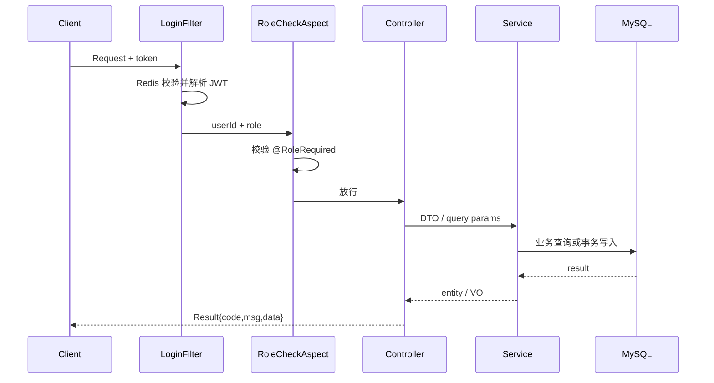

# API 与权限概览

本文提供接口分组、角色权限和状态编码的快速索引。完整参数与响应结构以代码和运行时 OpenAPI 文档为准。

## 1. 通用约定

### 登录态

除住客注册、住客/员工登录和具体静态页资产（`/`、`/index.html`、`/app.js`、`/style.css`）外，业务请求需要在 Header 中携带 token。`/staff/register` 要求经理权限；Swagger UI 及 OpenAPI 仅在 `dev` profile 匿名开放。

```http
token: <JWT_TOKEN>
```

服务端先在 Redis 中确认 token 有效，再解析 JWT 中的主体 ID 与角色。角色不满足 `@RoleRequired` 时拒绝访问。

### 统一响应

业务接口统一返回 `Result`：

```json
{
  "code": 0,
  "msg": "success",
  "data": {}
}
```

成功 `code=0`，失败 `code=1`。输入、认证、权限、冲突等错误同时使用相应 HTTP 状态（如 400、401、403、409）；提示说明具体原因。

## 2. 角色矩阵

| 角色 | 编码 | 说明 |
| --- | ---: | --- |
| `USER` | 0 | 注册用户 |
| `MANAGER` | 1 | 酒店管理员 |
| `FRONT` | 2 | 前台员工 |
| `RESTAURANT` | 3 | 餐厅员工 |

## 3. 接口分组

### 用户 `/user`

| Method | Path | 权限 | 说明 |
| --- | --- | --- | --- |
| POST | `/user/register` | 公开 | 用户注册 |
| POST | `/user/login` | 公开 | 用户登录并签发 token |
| POST | `/user/change` | USER | 修改个人资料或密码 |
| GET | `/user/{id}` | USER | 查询用户信息 |

### 员工 `/staff`

| Method | Path | 权限 | 说明 |
| --- | --- | --- | --- |
| POST | `/staff/login` | 公开 | 员工登录 |
| POST | `/staff/logout` | MANAGER / FRONT / RESTAURANT | 退出并撤销登录态 |
| POST | `/staff/register` | MANAGER | 创建员工账号 |
| POST | `/staff/status` | MANAGER | 启用或停用员工 |
| DELETE | `/staff` | MANAGER | 删除员工 |
| GET | `/staff/list` | MANAGER | 查询员工列表 |

### 客房 `/rooms`

| Method | Path | 权限 | 说明 |
| --- | --- | --- | --- |
| GET | `/rooms` | 登录用户 | 按房号、房型、状态和日期分页查询 |
| GET | `/rooms/{id}` | 登录用户 | 查询客房详情 |
| PUT | `/rooms` | MANAGER / FRONT | 更新房态 |
| POST | `/rooms` | MANAGER | 新增客房 |
| PUT | `/rooms/{id}` | MANAGER | 修改客房信息 |
| DELETE | `/rooms/{id}` | MANAGER | 逻辑删除客房 |
| GET | `/rooms/status-wall` | FRONT | 查询前台房态墙 |

### 订单 `/order`

| Method | Path | 权限 | 说明 |
| --- | --- | --- | --- |
| GET | `/order/user/query` | USER | 查询个人客房与餐饮订单 |
| POST | `/order/user/comment` | USER | 提交订单评价 |
| GET | `/order/query` | MANAGER / FRONT | 分页查询客房订单 |
| POST | `/order` | USER / FRONT | 用户在线下单或前台代客开单 |
| PUT | `/order/{id}` | FRONT | 调整订单信息 |
| DELETE | `/order/{id}` | MANAGER | 逻辑删除订单 |
| POST | `/order/pay` | USER | 支付客房订单，id 用查询参数 |
| POST | `/order/cancel` | USER | 取消尚未入住的客房订单，已支付单标为已退款 |
| POST | `/order/meal-order` | USER | 创建餐饮主从订单 |
| PUT | `/order/meal-order/{id}/cancel` | USER | 取消本人的新餐饮订单 |

### 菜品 `/food`

| Method | Path | 权限 | 说明 |
| --- | --- | --- | --- |
| GET | `/food/category` | 登录用户 | 查询分类列表 |
| GET | `/food/category/{id}` | 登录用户 | 查询分类详情 |
| POST | `/food/category` | MANAGER | 新增分类 |
| DELETE | `/food/category/{id}` | MANAGER | 删除分类 |
| POST | `/food/dish` | MANAGER | 新增菜品 |
| PUT | `/food/dish` | MANAGER | 修改菜品 |
| DELETE | `/food/dish` | MANAGER | 删除菜品 |
| GET | `/food/dish/list` | 登录用户 | 查询菜品列表 |

### 餐厅 `/restaurant`

| Method | Path | 权限 | 说明 |
| --- | --- | --- | --- |
| GET | `/restaurant/live-order` | RESTAURANT | 查询近一天实时订单及状态统计 |
| PUT | `/restaurant/status` | RESTAURANT | 更新餐饮订单状态 |

### 经营分析 `/business`

该 Controller 整体要求 `MANAGER` 角色。

| Method | Path | 说明 |
| --- | --- | --- |
| GET | `/business/revenue/stats` | 查询指定日期营收、月营收、平均房价与入住率 |
| GET | `/business/revenue/trend` | 查询区间营收与入住率趋势 |
| GET | `/business/revenue/room-type` | 查询不同房型收入占比 |
| GET | `/business/occupancy/heatmap` | 查询日期与楼层维度入住热力图 |
| GET | `/business/dish/top10` | 查询菜品销量 Top 10 |
| GET | `/business/detail` | 查询逐日经营明细 |
| POST | `/business/calendar` | 批量维护价格日历 |
| GET | `/business/calendar` | 查询房型日期价格 |

### 文件 `/upload`

| Method | Path | 权限 | 说明 |
| --- | --- | --- | --- |
| POST | `/upload/image` | 登录用户 | 上传图片至对象存储 |

## 4. 状态编码

### 房间状态

| 编码 | 常量 | 含义 |
| ---: | --- | --- |
| 0 | `AVAILABLE` | 可用 |
| 1 | `OCCUPIED` | 占用 |
| 2 | `CLEANING` | 清洁中 |
| 3 | `REPAIRING` | 维修中 |

### 客房订单状态

| 编码 | 常量 | 含义 |
| ---: | --- | --- |
| 0 | `ONGOING` | 进行中 |
| 1 | `DONE` | 已完成 |
| 2 | `CANCELLED` | 已取消 |

### 客房订单支付状态

| 编码 | 常量 | 含义 |
| ---: | --- | --- |
| 0 | `UNPAID` | 未支付 |
| 1 | `PAID` | 已支付 |
| 2 | `REFUNDED` | 已退款 |

### 餐饮订单状态

| 编码 | 常量 | 含义 |
| ---: | --- | --- |
| 0 | `NEW_ORDER` | 新订单 |
| 1 | `PENDING` | 处理中 |
| 2 | `DONE` | 已完成 |
| 3 | `CANCELLED` | 已取消 |

## 5. 典型请求流程



## 6. 接口演进建议

- 支付、取消和员工退出已使用 POST；GET 调用返回 405，不改变状态；
- 统一 token Header 为标准 `Authorization: Bearer <token>`；
- 分页、日期范围、评分、数量和金额已有约束；继续补齐其他写接口的参数校验；
- 通过 OpenAPI Schema 补齐示例、错误码和字段枚举；
- 对创建订单增加 `Idempotency-Key` 或 `requestId`；
- 经营分析及价格日历日期区间已限制为最多 366 天。
