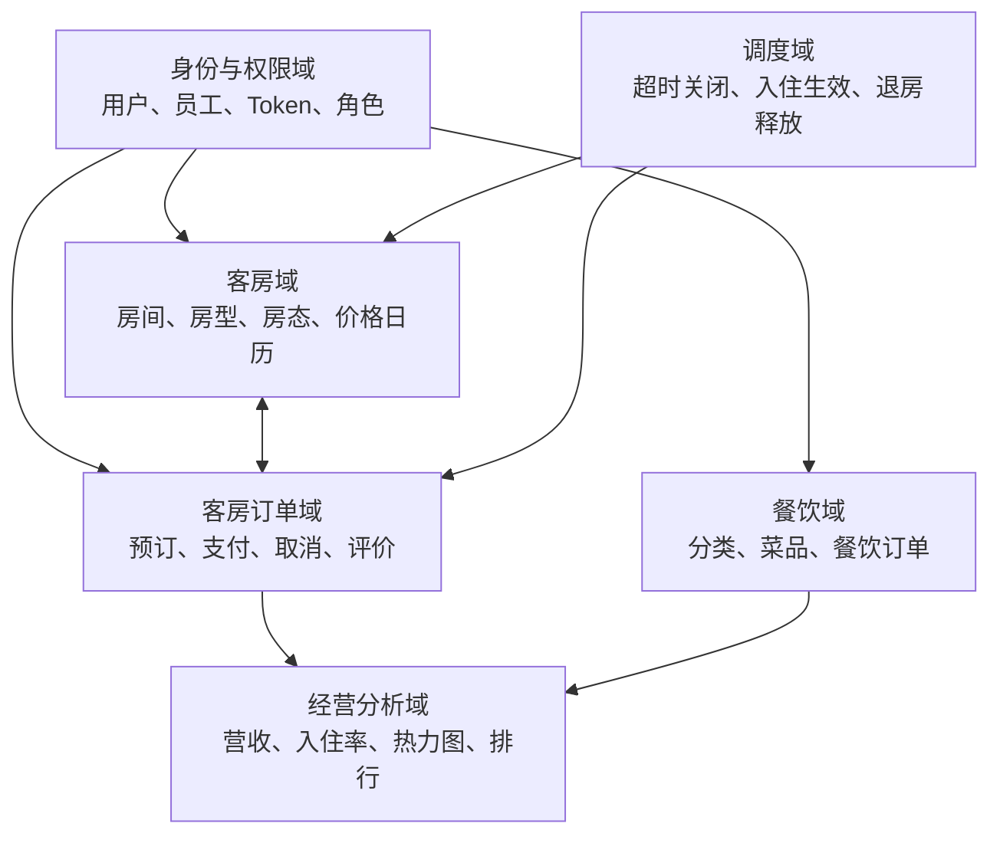
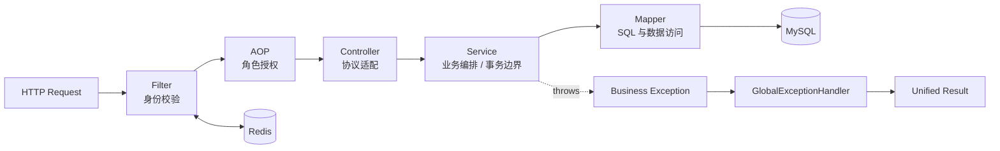
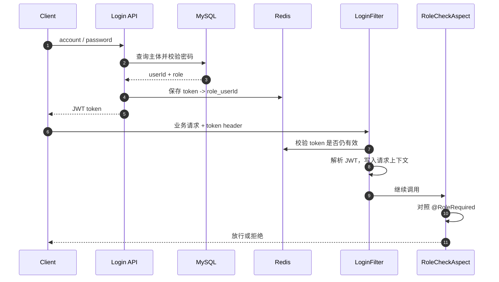
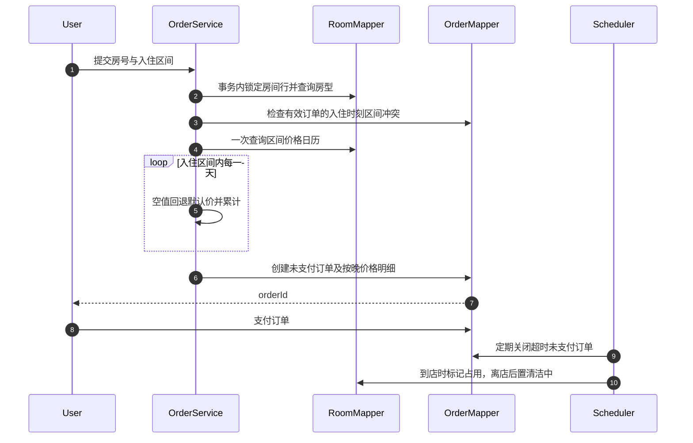
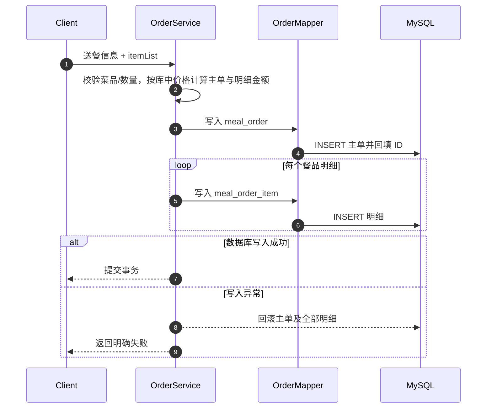
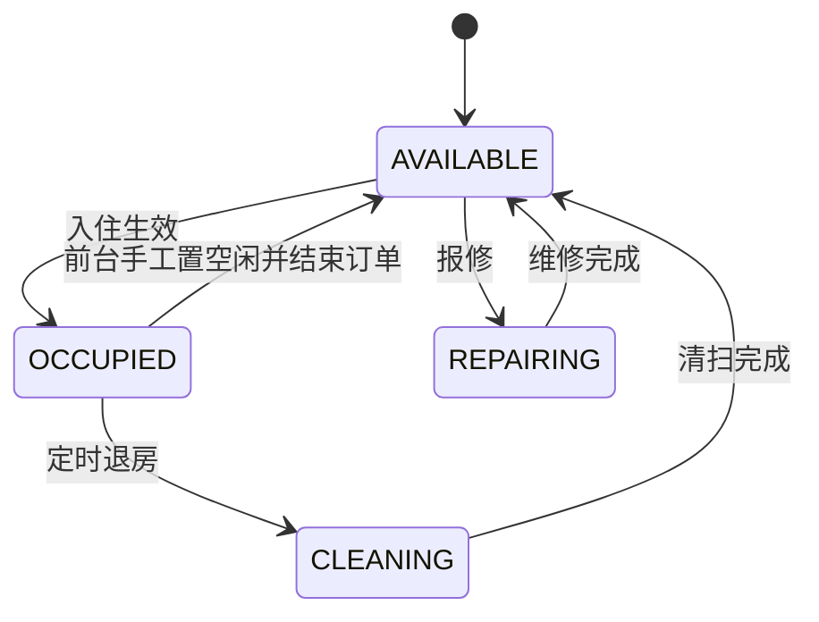
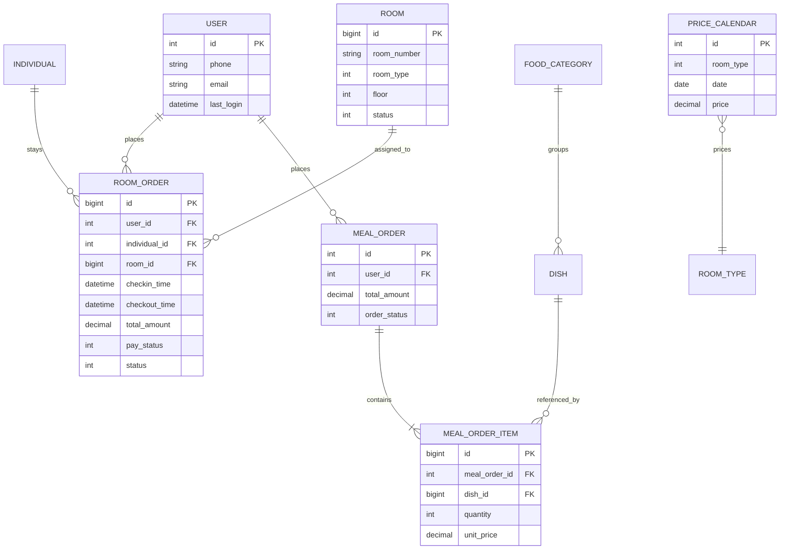
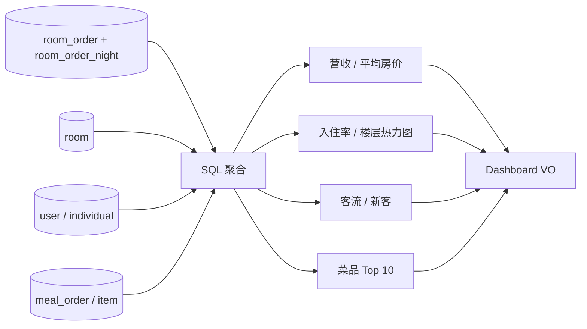

# 系统设计

本文从业务边界、应用分层、关键时序和数据关系四个角度说明 HotelSystemBackend 的设计。内容以当前公开分支为依据；尚未进入主分支的能力会明确标记为演进项。

## 1. 设计目标

系统面向中小型酒店的日常运营，核心目标包括：

1. 用统一的订单模型连接线上用户、前台和客房履约；
2. 将登录、身份和角色权限从具体业务接口中抽离；
3. 使房价能够按房型和日期变化，而不是固定在房间记录中；
4. 自动推进超时支付、到店入住和离店释放等时间驱动流程；
5. 在业务数据之上形成营收、入住率和商品销量等运营指标。

## 2. 系统参与者

| 参与者 | 核心诉求 | 对应角色 |
| --- | --- | --- |
| 住客 | 查询客房、在线预订、支付、取消、餐饮下单、评价 | `USER` |
| 酒店管理员 | 管理员工、客房和价格策略，查看经营数据 | `MANAGER` |
| 前台员工 | 线下开单、修改订单、维护入住和房态 | `FRONT` |
| 餐厅员工 | 查看实时送餐订单并更新状态 | `RESTAURANT` |
| 系统调度器 | 根据时间自动关闭订单、激活入住、释放客房 | 内部任务 |

## 3. 领域模块

### 身份与权限域

- 用户与员工分别登录，统一生成包含 ID 和角色的 JWT；
- Redis 保存 token 与主体身份的映射，用于主动失效登录态；
- Filter 负责“是否登录”，AOP 负责“是否拥有访问权限”；
- 当前请求主体写入请求上下文，供 Service 层读取。

相关实现：

- [`LoginFilter`](../src/main/java/com/winniethepooh/hotelsystembackend/filter/LoginFilter.java)
- [`RoleCheckAspect`](../src/main/java/com/winniethepooh/hotelsystembackend/aspect/RoleCheckAspect.java)
- [`RoleRequired`](../src/main/java/com/winniethepooh/hotelsystembackend/annotation/RoleRequired.java)

### 客房域

- 管理房号、楼层、房型、容量、图片和当前房态；
- 支持按房号、房型、状态分页过滤；
- 通过价格日历为不同日期配置房型价格；
- 房态墙聚合当天价格、入住人和入住区间，为前台提供单屏视图。

相关实现：

- [`RoomServiceImpl`](../src/main/java/com/winniethepooh/hotelsystembackend/service/impl/RoomServiceImpl.java)
- [`RoomMapper.xml`](../src/main/resources/mapper/RoomMapper.xml)

### 订单域

- 同时支持用户在线下单与前台代客开单；
- 用户订单由服务端按入住日期逐日计算房价；
- 支持支付、取消、查询与评价；
- 餐饮订单采用主单与明细模型，并通过事务保证原子写入。

相关实现：

- [`OrderServiceImpl`](../src/main/java/com/winniethepooh/hotelsystembackend/service/impl/OrderServiceImpl.java)
- [`OrderMapper.xml`](../src/main/resources/mapper/OrderMapper.xml)

### 经营分析域

在订单、客房和用户数据上进行实时聚合，输出：

- 当日/月度营收及环比变化；
- 当日平均房价与入住率；
- 指定区间的营收和入住率趋势；
- 房型收入分布、楼层入住热力图；
- 餐饮菜品销量 Top 10；
- 每日客流、新客与复住相关数据。

相关实现：[`BusinessServiceImpl`](../src/main/java/com/winniethepooh/hotelsystembackend/service/impl/BusinessServiceImpl.java)。

## 4. 应用分层

| 层 | 主要职责 | 不应承担的职责 |
| --- | --- | --- |
| Filter / AOP | 登录态校验、角色授权 | 具体业务判断 |
| Controller | 参数接收、协议转换、返回统一结果 | 复杂查询和事务编排 |
| Service | 业务规则、跨 Mapper 编排、事务边界 | 拼接 HTTP 响应 |
| Mapper | SQL 与实体映射 | 业务状态机 |
| Scheduler | 触发时间驱动任务 | 重复实现订单规则 |

## 5. 关键时序

### 5.1 登录与鉴权

这种组合保留 JWT 解析效率，同时拥有服务端主动撤销能力。登录时通过 `session:{ROLE}_{id}` 撤销旧 token；重复登录、员工退出/停用/删除、住客改密码立即失效旧会话。住客、员工 token 都有 3 小时有效期。网页住客退出仅清除本浏览器会话，当前没有住客服务端退出接口。

### 5.2 用户客房订单

当前流程在数据库事务内用房间行锁与 `[checkin, checkout)` 冲突检查防止重叠预订，金额和按晚明细一起落库。每日库存与 `requestId` 幂等仅设计完成，尚未实现，见[《并发预订与幂等设计》](booking-consistency.md)。前台订单按 `paid` 设置收款状态，未收款前台单不参与超时取消，仍由入住/退房任务推进。

### 5.3 餐饮主从订单事务

## 6. 状态模型

### 房间状态

| 编码 | 状态 |
| --- | --- |
| `0` | 可用 `AVAILABLE` |
| `1` | 占用 `OCCUPIED` |
| `2` | 清洁中 `CLEANING` |
| `3` | 维修中 `REPAIRING` |

### 客房订单状态

| 编码 | 状态 |
| --- | --- |
| `0` | 进行中 `ONGOING` |
| `1` | 已完成 `DONE` |
| `2` | 已取消 `CANCELLED` |

支付状态单独建模为未支付、已支付和已退款，避免用一个字段同时表达履约和资金状态。

## 7. 核心数据关系

`INDIVIDUAL` 与 `USER` 分离，是为了同时支持注册用户在线预订和未注册住客由前台代客开单。

## 8. 经营指标的数据路径

当前实现采用查询时聚合，适合数据量较小的教学与演示场景。数据量增大后，可按指标时效性拆分为实时查询、Redis 短缓存和离线汇总表。

客房营收按 `room_order_night.night/price` 拆分，只计已支付且未取消订单；ADR 为营收除以间夜数，离店当天不计入住。菜品 Top10 排除已取消餐饮订单。

## 9. 关键取舍

| 决策 | 当前选择 | 原因 | 进一步演进 |
| --- | --- | --- | --- |
| 持久层 | MyBatis + 显式 SQL | 便于控制复杂统计查询 | 引入数据库迁移与 SQL 测试 |
| 登录态 | JWT + Redis | 兼顾解析效率和主动失效 | Token 轮换、黑名单与设备管理 |
| 价格 | 房型日期日历 | 满足节假日和旺季定价 | 规则引擎、套餐与促销叠加 |
| 调度 | 单体内 `@Scheduled` | 实现简单，适合单实例 | 分布式锁、任务表与失败补偿 |
| 经营统计 | 请求时实时聚合 | 数据新鲜、实现直接 | 汇总表、缓存和异步计算 |
| 库存 | 房间行锁 + 有效订单的时刻区间冲突检查 | 防止重叠预订 | 每日库存表、条件更新与幂等请求（仅设计完成） |

## 10. 工程化改进清单

- [ ] 为客房预订增加每日库存记录和唯一约束；
- [ ] 引入 `requestId` 唯一索引及幂等状态机；
- [x] JWT/OSS 等敏感配置使用环境变量，JWT 随机密钥缺失时拒绝启动；
- [ ] 补充 Flyway/Liquibase 数据库迁移脚本；
- [x] 建立 API 集成、并发及六条 Playwright 端到端回归测试；
- [ ] 为定时任务增加多实例互斥和失败重试；
- [ ] 增加请求日志、慢查询和核心业务指标监控；
- [ ] 使用 Docker Compose 提供一键本地环境。
