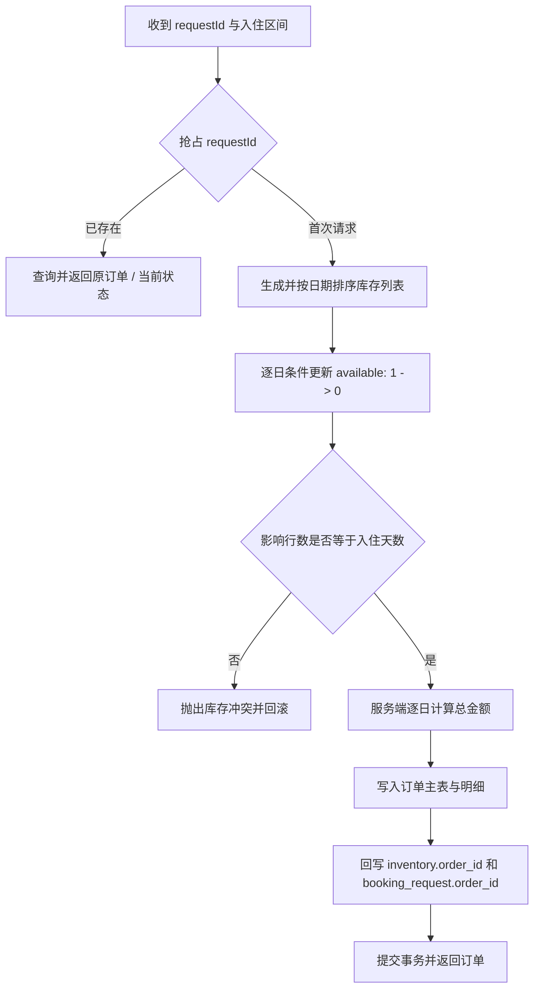
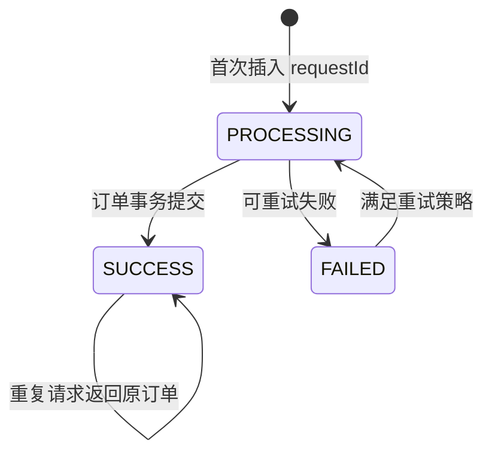
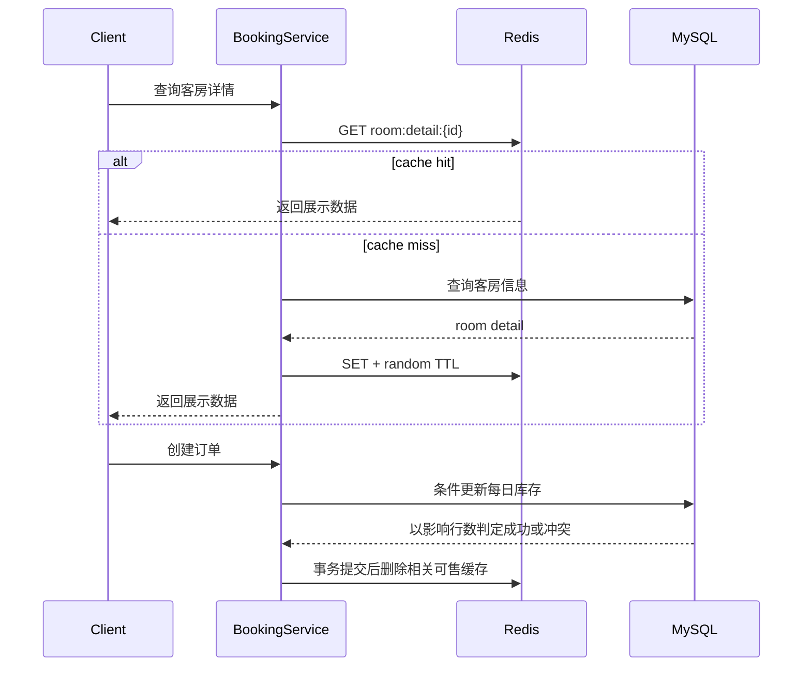

# 并发预订与幂等设计

> 文档状态：生产化演进设计。本文用于说明酒店订单从基础业务实现演进到并发安全实现时的约束、数据模型和验收方法；没有进入当前主分支的内容不作为现有代码能力宣称。

## 1. 问题定义

酒店预订与普通商品库存不同：一次订单会占用同一客房的一段连续日期。如果只检查“房间当前是否可用”，两个请求可能同时通过检查并创建重叠订单，形成超卖。

同时，客户端可能因为网络超时、重复点击或网关重试多次提交相同请求。如果没有幂等控制，同一业务意图可能创建多个订单。

因此预订链路需要同时满足四个不变量：

1. 同一客房、同一入住日期最多被一个有效订单占用；
2. 一次入住区间要么全部日期成功，要么全部失败；
3. 同一个 `requestId` 最多创建一个业务订单；
4. 缓存不能成为库存是否可售的最终判断依据。

## 2. 为什么选择每日库存模型

假设订单入住区间为 `[checkIn, checkOut)`，即退房日不占库存。将其拆为每天的库存记录：

```text
2026-08-07 -> room 1208
2026-08-08 -> room 1208
2026-08-09 -> room 1208
```

数据库通过 `(room_id, stay_date)` 唯一键表达最小冲突单元。相比在订单表中做区间重叠查询，这种模型更容易使用唯一约束或条件更新获得确定的并发结果。

### 建议表结构

```sql
CREATE TABLE room_inventory (
    id          BIGINT PRIMARY KEY AUTO_INCREMENT,
    room_id     BIGINT  NOT NULL,
    stay_date   DATE    NOT NULL,
    available   TINYINT NOT NULL DEFAULT 1,
    order_id    BIGINT  NULL,
    updated_at  DATETIME NOT NULL DEFAULT CURRENT_TIMESTAMP
                           ON UPDATE CURRENT_TIMESTAMP,
    UNIQUE KEY uk_room_stay_date (room_id, stay_date),
    KEY idx_stay_date_available (stay_date, available)
);

CREATE TABLE booking_request (
    id          BIGINT PRIMARY KEY AUTO_INCREMENT,
    request_id  VARCHAR(64) NOT NULL,
    user_id     BIGINT      NOT NULL,
    order_id    BIGINT      NULL,
    status      VARCHAR(16) NOT NULL,
    created_at  DATETIME    NOT NULL DEFAULT CURRENT_TIMESTAMP,
    updated_at  DATETIME    NOT NULL DEFAULT CURRENT_TIMESTAMP
                            ON UPDATE CURRENT_TIMESTAMP,
    UNIQUE KEY uk_request_id (request_id)
);
```

## 3. 下单事务



核心原则是让“库存抢占、订单写入、幂等记录”位于同一数据库事务中。

### 条件更新

```sql
UPDATE room_inventory
SET available = 0,
    order_id = :pendingOrderId
WHERE room_id = :roomId
  AND stay_date = :stayDate
  AND available = 1;
```

每次更新必须检查受影响行数：

- `1`：该日期抢占成功；
- `0`：库存已被其他事务占用，整个事务失败；
- 任意日期失败：抛出异常，依赖事务回滚之前已更新的日期。

若采用批量 SQL，也必须确认总影响行数等于请求的入住天数，不能只依赖“SQL 未报错”。

## 4. 幂等请求的并发处理

仅在业务代码中先查再插并不安全：两个并发请求可能同时查询不到记录，然后各自创建订单。最终兜底必须是数据库唯一约束。



推荐处理顺序：

1. 尝试插入 `booking_request(request_id, user_id, PROCESSING)`；
2. 插入成功者成为本次请求的执行者；
3. 命中唯一键冲突时，查询已有记录；
4. `SUCCESS` 返回原订单，`PROCESSING` 返回处理中，`FAILED` 根据错误类型决定能否重试；
5. 订单创建成功后，在同一事务中写入 `order_id` 并更新为 `SUCCESS`。

幂等键还应绑定用户与关键请求摘要，避免客户端误用同一个 `requestId` 提交不同参数。

## 5. 跨日期更新与死锁

两个订单可能占用部分重叠日期：

```text
请求 A：8月7日、8月8日、8月9日
请求 B：8月8日、8月9日、8月10日
```

如果两个事务以不同顺序更新库存行，容易形成循环等待。所有请求应按照固定顺序获取行锁，例如：

```text
ORDER BY room_id ASC, stay_date ASC
```

同时应：

- 控制事务范围，只包含库存与订单写入；
- 对死锁异常设置有限次数重试，并增加随机退避；
- 不在事务中调用支付、短信或其他远程服务；
- 记录 `requestId`、房间和日期范围，便于排查冲突。

## 6. 缓存边界

客房详情、房型介绍和面向用户的可售状态可以使用 Cache Aside；真正的库存抢占必须以数据库条件更新结果为准。



随机 TTL 用于降低大量 key 同时过期造成的缓存雪崩，但不能解决数据库与缓存的一致性问题。更新后删除缓存仍存在短暂竞态，因此缓存只能提供展示与查询加速，不能替代库存约束。

## 7. 失败场景与预期结果

| 场景 | 预期行为 |
| --- | --- |
| 两个不同请求抢占同一客房同一日期 | 一个事务成功，另一个返回库存冲突 |
| 三晚中最后一晚已被占用 | 前两晚的更新随事务全部回滚 |
| 相同 `requestId` 顺序重复提交 | 返回第一次创建的订单，不新增记录 |
| 相同 `requestId` 并发提交 | 唯一索引选出唯一执行者，其余读取已有状态 |
| 订单写入失败 | 库存和幂等记录一并回滚或进入明确失败态 |
| 缓存中仍显示可售但数据库已售出 | 下单以数据库为准，返回库存冲突并使缓存失效 |
| 数据库发生死锁 | 当前事务回滚，按有限重试策略重新执行 |

## 8. 并发测试方案

### 目标场景

使用固定线程池和 `CountDownLatch` 让 50 个请求同时抢占同一客房、同一入住日期，库存初始值为 1。

### 验收标准

```text
成功订单数       = 1
有效库存占用数   = 1
库存冲突数       = 49
重复有效订单数   = 0
库存负数         = 0
事务异常残留记录 = 0
```

### 测试层次

1. **Mapper 集成测试**：验证条件更新和唯一索引；
2. **Service 并发测试**：验证事务回滚、重复请求和最终数据不变量；
3. **接口压测**：验证 HTTP 层错误码、响应时间与数据库连接池表现；
4. **故障注入**：在库存成功后模拟订单写入失败，确认完整回滚。

压测结果应同时保存测试参数、数据库隔离级别、机器配置和验证 SQL，避免只展示一个无法复现的数字。

## 9. 索引与查询验证

建议重点检查：

```sql
EXPLAIN SELECT id, available
FROM room_inventory
WHERE room_id = ?
  AND stay_date BETWEEN ? AND ?;

EXPLAIN SELECT id, order_id, status
FROM booking_request
WHERE request_id = ?;
```

预期分别命中 `uk_room_stay_date` 与 `uk_request_id`。对于范围查询，需要结合真实数据量观察 `type`、`key`、`rows` 和 `Extra`，不能仅以“出现索引名”判定优化完成。

## 10. 方案边界

该方案解决单酒店、单房间粒度下的并发预订与重复提交问题。继续演进时还应考虑：

- 房型库存而非指定房间库存；
- 订单支付超时后的库存释放；
- 支付回调幂等和退款状态；
- 多实例定时任务互斥；
- 跨服务事务、消息最终一致性和补偿；
- 库存校准任务与异常订单修复工具。
