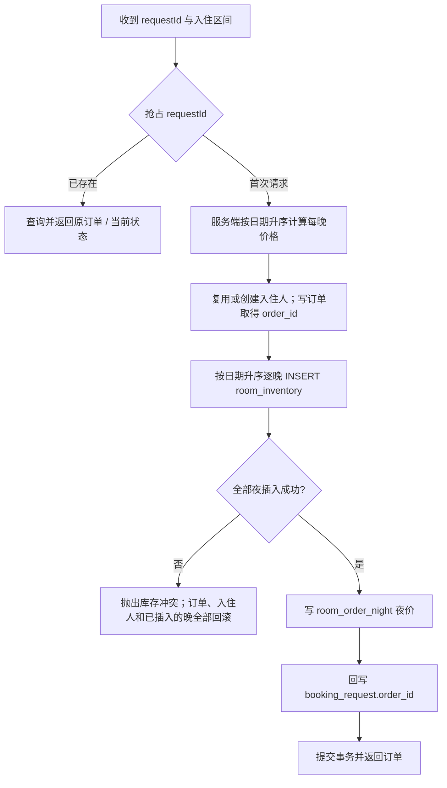
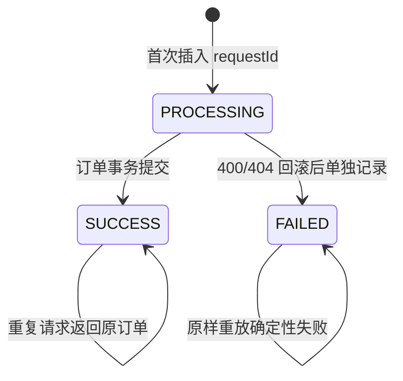
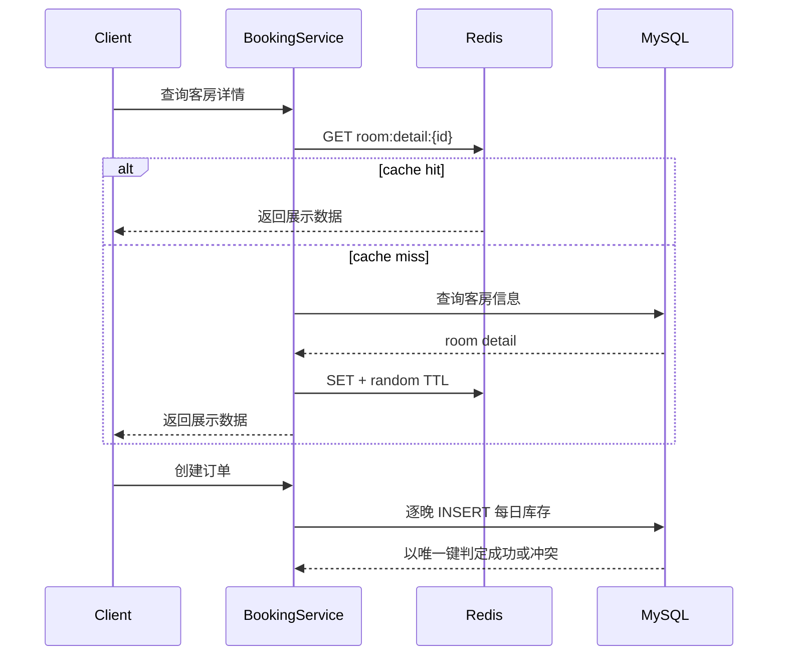

# 并发预订与幂等设计

> 文档状态：M1 下单幂等已实现；S03 已提供每日库存 DDL 与手工历史回填。当前订单仍用房间行锁与时刻区间检查，库存业务读写在 S04 一次切换。下文库存事务与并发验收描述 S04 目标，部署顺序见 [README](../README.md#每日库存建表与回填m2)。

## 1. 问题定义

酒店预订与普通商品库存不同：一次订单会占用同一客房的一段连续日期。如果只检查“房间当前是否可用”，两个请求可能同时通过检查并创建重叠订单，形成超卖。

同时，客户端可能因为网络超时、重复点击或网关重试多次提交相同请求。如果没有幂等控制，同一业务意图可能创建多个订单。

因此预订链路需要同时满足四个不变量：

1. 同一客房、同一入住日期最多被一个有效订单占用；
2. 一次入住区间要么全部日期成功，要么全部失败；
3. 同一个 `requestId` 最多创建一个业务订单；
4. 缓存不能成为库存是否可售的最终判断依据。

## 2. 为什么选择每日库存模型

假设订单入住区间为 `[checkIn, checkOut)`，即退房日不占库存。将其拆为每天的库存记录：

```text
2026-08-07 -> room 1208
2026-08-08 -> room 1208
2026-08-09 -> room 1208
```

数据库通过 `(room_id, stay_date)` 唯一键表达最小冲突单元。行存在即表示被该订单占用，无行表示可订；唯一约束裁决并发结果，房态不参与判定。

### 已提供的库存表结构

```sql
CREATE TABLE IF NOT EXISTS room_inventory
(
    id         BIGINT   NOT NULL AUTO_INCREMENT,
    room_id    BIGINT   NOT NULL,
    stay_date  DATE     NOT NULL,
    order_id   BIGINT   NOT NULL,
    created_at DATETIME NOT NULL DEFAULT CURRENT_TIMESTAMP,
    PRIMARY KEY (id),
    UNIQUE KEY uk_room_inventory_room_date (room_id, stay_date),
    KEY idx_room_inventory_order (order_id)
) ENGINE = InnoDB DEFAULT CHARSET = utf8mb4 COMMENT = '客房每晚占用';
```

新库 [schema.sql](../src/main/resources/db/schema.sql) 和旧库 [m2-room-inventory.sql](../src/main/resources/db/migration/m2-room-inventory.sql) 使用相同 DDL，无外键。M1 的请求幂等结构见 `schema.sql` 中的 `booking_request`，普通下单与助手动作共用全局请求号唯一键。

### 历史订单回填与核对

手工脚本 [m2-room-inventory-backfill.sql](../src/main/resources/db/migration/m2-room-inventory-backfill.sql) 先用递归 CTE 生成冲突清单：同房同晚超过一单时输出房间、日期、数量和升序订单号。**步骤 1 必须人工核对，无输出才单独执行步骤 2，不能直接运行整份文件。**有冲突必须停止并处理历史订单，再重跑步骤 1。

步骤 2 是单条 `INSERT…WITH RECURSIVE`，只展开 status=0、未软删除、有房间且 `checkout_time > NOW()` 的订单，从入住日到离店日前一天；已入住单也包含过去晚。旧订单可能没有夜价，因此回填不依赖 `room_order_night`。同房同日冲突触发唯一键错误，整条 INSERT 原子失败，空库存仍为空。

回填后运行以下 SQL，两条都应无输出：

```sql
-- I1：离店时间在未来的有效订单，占用数量应等于完整夜集合。
SELECT o.id FROM room_order o
WHERE o.status = 0 AND o.is_deleted = 0 AND o.room_id IS NOT NULL AND o.checkout_time > NOW()
  AND (SELECT COUNT(*) FROM room_inventory i WHERE i.order_id = o.id AND i.room_id = o.room_id
         AND i.stay_date >= DATE(o.checkin_time) AND i.stay_date < DATE(o.checkout_time))
      <> DATEDIFF(DATE(o.checkout_time), DATE(o.checkin_time));
-- I2：不允许孤儿、已删除或已取消订单的占用；已完成的历史夜允许保留。
SELECT i.id FROM room_inventory i LEFT JOIN room_order o ON o.id = i.order_id
WHERE o.id IS NULL OR o.is_deleted = 1 OR o.status = 2;
```

必须停旧版、保持停写，依次建表、人工核对冲突、回填、核对 I1/I2 后，接续启动 S04。脚本只执行一次；重做先 `TRUNCATE room_inventory`。回滚 jar 可保留表，但旧版写入不会维护库存，再次上线 S04 前必须重新停写、清空、回填和核对。

## 3. 下单事务



核心原则是让“库存抢占、订单写入、幂等记录”位于同一数据库事务中。

### 逐晚插入

```sql
INSERT INTO room_inventory (room_id, stay_date, order_id)
VALUES (:roomId, :stayDate, :orderId);
```

任一晚唯一键冲突返回 409「房间在该时段已被预订」，整个事务回滚。改期同房只更新新旧夜集合的差集，交集行主键不变；换房删除该订单旧占用后占用新房。取消、超时取消和软删除在订单状态更新的同一事务内按 order_id 释放；提前结束只删除今天及以后的晚，正常退房保留历史夜。支付和营收夜价不改库存。

## 4. 幂等请求的并发处理

仅在业务代码中先查再插并不安全：两个并发请求可能同时查询不到记录，然后各自创建订单。最终兜底必须是数据库唯一约束。



推荐处理顺序：

1. 尝试插入 `booking_request(request_id, user_id, PROCESSING)`；
2. 插入成功者成为本次请求的执行者；
3. 命中唯一键冲突时，查询已有记录；
4. `SUCCESS` 返回原订单，`FAILED` 原样重放 400/404；409、锁冲突、500 不记录 FAILED，可再次请求；
5. 订单创建成功后，在同一事务中写入 `order_id` 并更新为 `SUCCESS`。

幂等键还应绑定用户与关键请求摘要，避免客户端误用同一个 `requestId` 提交不同参数。

M1 在事务内抢请求号，重复请求等待首单提交后重读并重放；仅锁等待失败且无已提交记录时返回 409「请求处理中」。PROCESSING 不单独提交。记录保留 7 天；同 key 修改内容返回 422，其他身份或角色复用返回 409。

## 5. 跨日期更新与死锁

两个订单可能占用部分重叠日期：

```text
请求 A：8月7日、8月8日、8月9日
请求 B：8月8日、8月9日、8月10日
```

如果两个事务以不同顺序插入库存行，容易形成循环等待。所有请求应按日期升序逐晚插入，例如：

```text
ORDER BY room_id ASC, stay_date ASC
```

同时应：

- 控制事务范围，只包含库存与订单写入；
- 插入库存时死锁或锁等待转 409「该时段预订繁忙，请稍后重试」，其他数据库锁冲突转 409「系统繁忙，请稍后重试」，不自动重试；
- 不在事务中调用支付、短信或其他远程服务；
- 记录 `requestId`、房间和日期范围，便于排查冲突。

## 6. 缓存边界

客房详情和房型价格可以使用 Cache Aside；真正的库存抢占必须以数据库唯一键插入结果为准。



随机 TTL 用于降低大量 key 同时过期造成的缓存雪崩，但不能解决数据库与缓存的一致性问题。更新后删除缓存仍存在短暂竞态，因此缓存只能提供展示与查询加速，不能替代库存约束。

## 7. 失败场景与预期结果

| 场景 | 预期行为 |
| --- | --- |
| 两个不同请求抢占同一客房同一日期 | 一个事务成功，另一个返回库存冲突 |
| 三晚中最后一晚已被占用 | 前两晚的插入随事务全部回滚 |
| 相同 `requestId` 顺序重复提交 | 返回第一次创建的订单，不新增记录 |
| 相同 `requestId` 并发提交 | 唯一索引选出唯一执行者，其余读取已有状态 |
| 订单写入失败 | 库存和幂等记录一并回滚或进入明确失败态 |
| 缓存中仍显示可售但数据库已售出 | 下单以数据库为准，返回库存冲突并使缓存失效 |
| 数据库发生死锁 | 当前事务回滚，返回 409，不自动重试 |

## 8. 并发测试方案

### 目标场景

使用固定线程池和 `CountDownLatch` 让 50 个请求同时抢占同一客房、同一入住日期，库存表初始为空。

### 验收标准

```text
成功订单数       = 1
有效库存占用数   = 1
库存冲突数       = 49
重复有效订单数   = 0
重复房晚占用数   = 0
事务异常残留记录 = 0
```

### 测试层次

1. **Mapper 集成测试**：验证插入和唯一索引；
2. **Service 并发测试**：验证事务回滚、重复请求和最终数据不变量；
3. **接口压测**：验证 HTTP 层错误码、响应时间与数据库连接池表现；
4. **故障注入**：在库存成功后模拟订单写入失败，确认完整回滚。

压测结果应同时保存测试参数、数据库隔离级别、机器配置和验证 SQL，避免只展示一个无法复现的数字。

## 9. 索引与查询验证

建议重点检查：

```sql
EXPLAIN SELECT id, order_id
FROM room_inventory
WHERE room_id = ?
  AND stay_date >= ? AND stay_date < ?;

EXPLAIN SELECT id, order_id, status
FROM booking_request
WHERE request_id = ?;
```

预期分别命中 `uk_room_inventory_room_date` 与 `uk_booking_request_request_id`。对于范围查询，需要结合真实数据量观察 `type`、`key`、`rows` 和 `Extra`，不能仅以“出现索引名”判定优化完成。

## 10. 方案边界

该方案解决单酒店、单房间粒度下的并发预订与重复提交问题。继续演进时还应考虑：

- 房型库存而非指定房间库存；
- 订单支付超时后的库存释放；
- 支付回调幂等和退款状态；
- 多实例定时任务互斥；
- 跨服务事务、消息最终一致性和补偿；
- 库存校准任务与异常订单修复工具。
