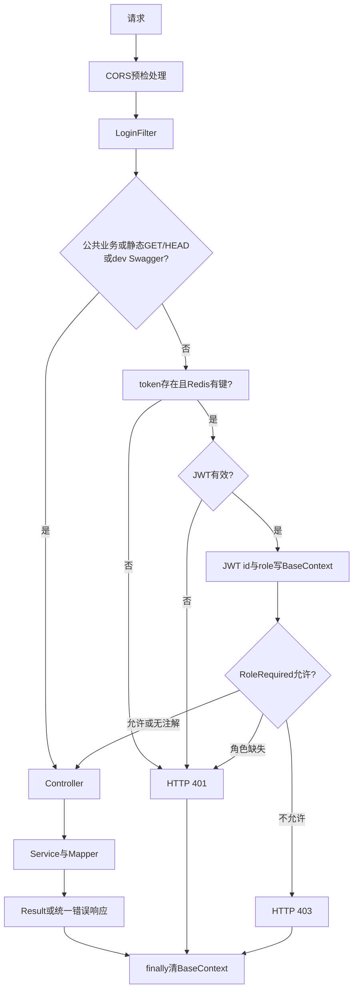
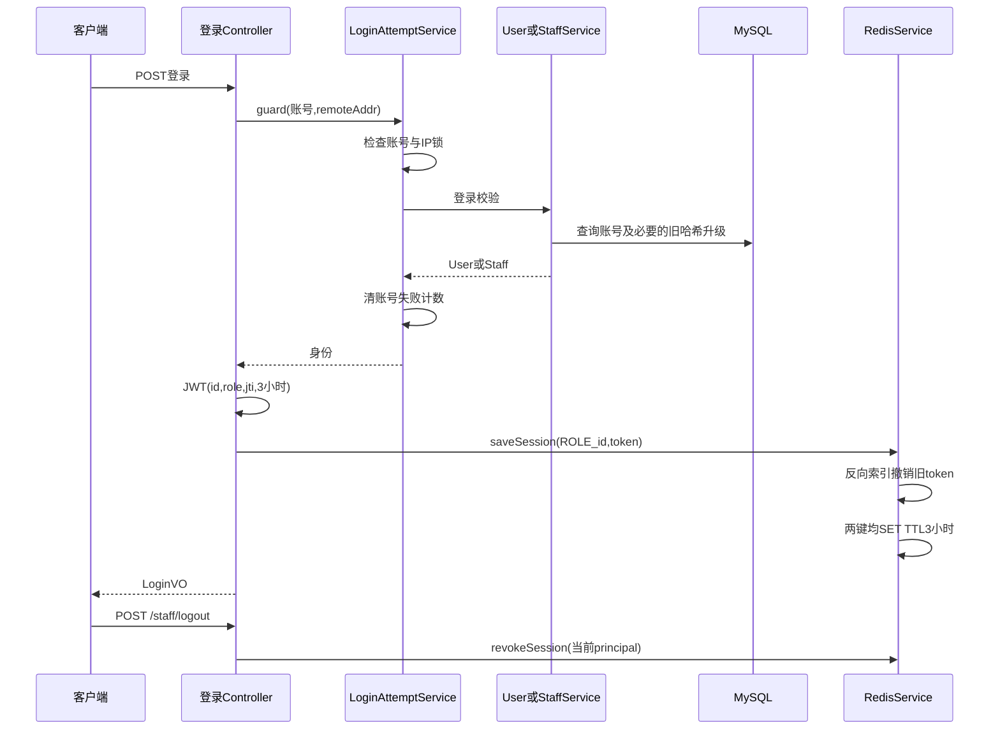
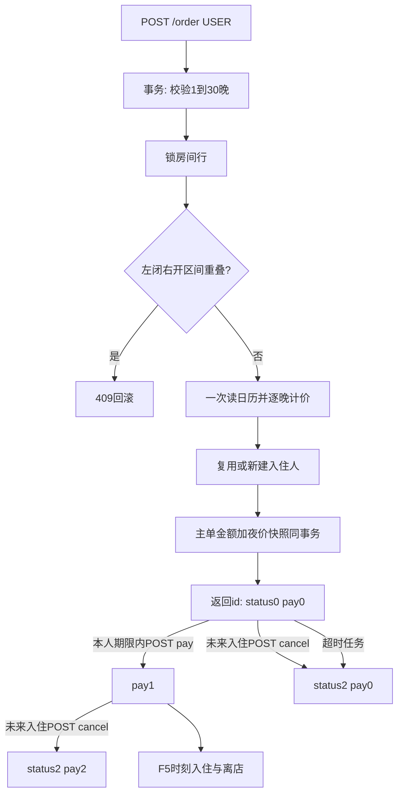
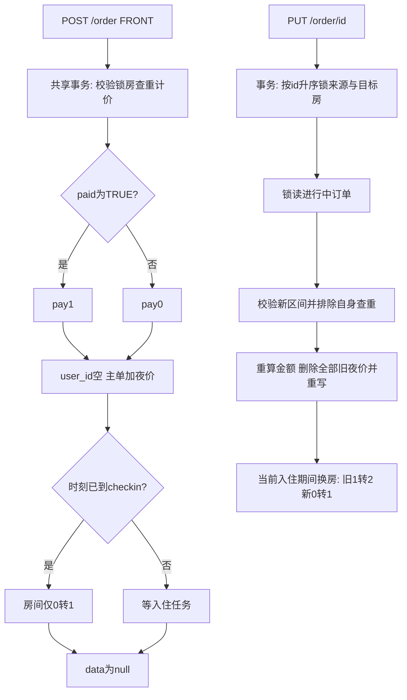
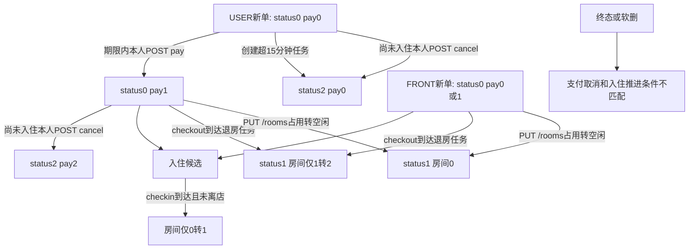
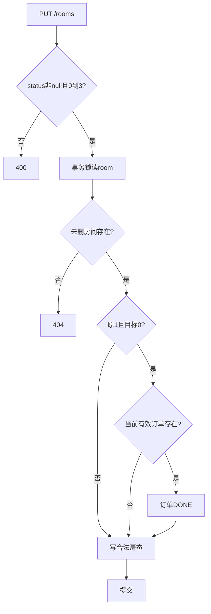
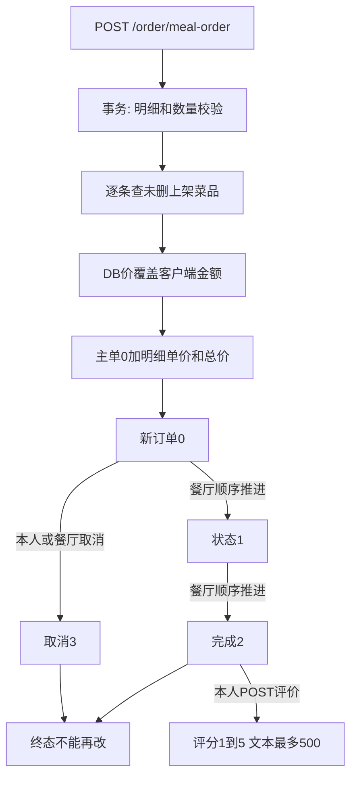
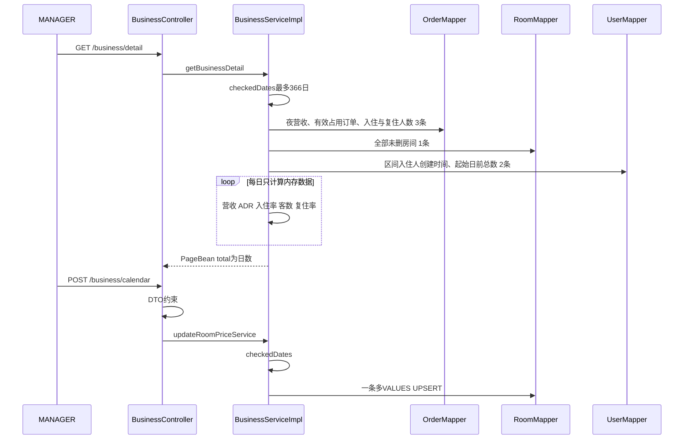
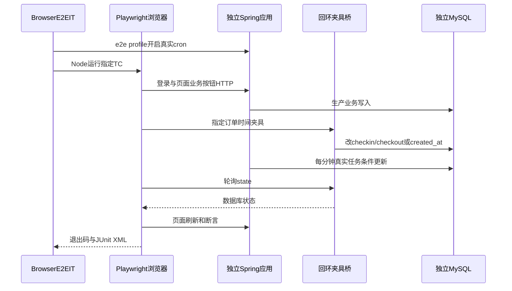

# 04 端到端流程

以集成基准源码描述八条核心流程；时刻/日期口径、事务和状态边界均有出处。只记录现有行为，测试存在不等于本地图执行过验证。

## F1 请求鉴权与角色限制

触发入口：Spring注册的LoginFilter和Controller角色切面（`src/main/java/com/winniethepooh/hotelsystembackend/filter/LoginFilter.java:20-21`、`src/main/java/com/winniethepooh/hotelsystembackend/aspect/RoleCheckAspect.java:20-22`）。

1. CORS最高优先级处理配置来源的预检；非预检请求进入Filter（`src/main/java/com/winniethepooh/hotelsystembackend/config/GlobalCorsConfig.java:18-30`）。
2. 精确公共业务路径为/user/login、/user/register、/staff/login；/、/index.html、/app.js、/style.css仅GET/HEAD免token；dev另放行Swagger资源边界。公共请求直接转发，仍进入finally清上下文（`src/main/java/com/winniethepooh/hotelsystembackend/filter/LoginFilter.java:26-27`、`src/main/java/com/winniethepooh/hotelsystembackend/filter/LoginFilter.java:46-50`、`src/main/java/com/winniethepooh/hotelsystembackend/filter/LoginFilter.java:73-84`）。
3. 其他请求读header token，缺失、Redis无键、JWT验签失败/过期→sendError401；Redis值只检查非null，不以它重新读取数据库角色（`src/main/java/com/winniethepooh/hotelsystembackend/filter/LoginFilter.java:51-70`）。
4. 验签成功把JWT id/role写ThreadLocal，RoleRequired按方法优先、否则类注解取允许集合；角色缺失401，不在集合403。business类只MANAGER、restaurant类只RESTAURANT（`src/main/java/com/winniethepooh/hotelsystembackend/filter/LoginFilter.java:62-66`、`src/main/java/com/winniethepooh/hotelsystembackend/aspect/RoleCheckAspect.java:23-44`、`src/main/java/com/winniethepooh/hotelsystembackend/controller/BusinessController.java:20`、`src/main/java/com/winniethepooh/hotelsystembackend/controller/RestaurantController.java:11`）。
5. 请求结束或异常均清id/role；Controller业务异常返回对应HTTP+Result，意外500通用提示。过滤器sendError不承诺Result格式（`src/main/java/com/winniethepooh/hotelsystembackend/filter/LoginFilter.java:72-75`、`src/main/java/com/winniethepooh/hotelsystembackend/exception/GlobalExceptionHandler.java:33-55`）。

## F2 登录、会话登记与撤销

触发入口：POST /user/login、POST /staff/login（`src/main/java/com/winniethepooh/hotelsystembackend/controller/UserController.java:45-62`、`src/main/java/com/winniethepooh/hotelsystembackend/controller/StaffController.java:41-56`）。

1. Controller把账号及remoteAddr交LoginAttemptService.guard；账号/IP任一锁存在→429；凭据错误记录两种失败计数，成功仅清账号失败计数（`src/main/java/com/winniethepooh/hotelsystembackend/controller/UserController.java:48-49`、`src/main/java/com/winniethepooh/hotelsystembackend/controller/StaffController.java:43-44`、`src/main/java/com/winniethepooh/hotelsystembackend/service/LoginAttemptService.java:31-55`）。
2. 住客按手机找user、员工只查启用且未删的account；不存在/密码错统一HTTP400/code1。BCrypt匹配新哈希，旧MD5恒时比较，登录成功升级旧哈希；住客还更新last_login（`src/main/java/com/winniethepooh/hotelsystembackend/service/impl/UserServiceImpl.java:43-51`、`src/main/java/com/winniethepooh/hotelsystembackend/service/impl/StaffServiceImpl.java:31-38`、`src/main/resources/mapper/StaffMapper.xml:35-39`、`src/main/java/com/winniethepooh/hotelsystembackend/utils/PasswordUtils.java:21-30`、`src/main/java/com/winniethepooh/hotelsystembackend/exception/PasswordIncorrectException.java:5-8`）。
3. Controller用id/role生成HS256 JWT，随机jti、有效期3小时；密钥启动时必须至少32 UTF-8字节（`src/main/java/com/winniethepooh/hotelsystembackend/controller/UserController.java:50-56`、`src/main/java/com/winniethepooh/hotelsystembackend/controller/StaffController.java:46-50`、`src/main/java/com/winniethepooh/hotelsystembackend/utils/JwtUtils.java:21-43`）。
4. principal统一ROLE_id，先按session:principal删除旧token+索引，再顺序SET token→principal及session:principal→token，两键均TTL3小时，无SCAN/KEYS。Redis操作未用事务/Lua，不能据此宣称并发登录严格原子（`src/main/java/com/winniethepooh/hotelsystembackend/service/RedisService.java:19-42`）。
5. 返回LoginVO。POST /staff/logout、成功完整改密、停用/删除员工均按相同principal撤销；原/新密码必须成对，缺一400/code1且不改哈希/session；两项都空可只改邮箱（`src/main/java/com/winniethepooh/hotelsystembackend/service/impl/UserServiceImpl.java:56-72`、`src/test/java/com/winniethepooh/hotelsystembackend/PasswordHashingIT.java:72-107`）（`src/main/java/com/winniethepooh/hotelsystembackend/controller/UserController.java:58-62`、`src/main/java/com/winniethepooh/hotelsystembackend/controller/StaffController.java:52-64`、`src/main/java/com/winniethepooh/hotelsystembackend/service/impl/UserServiceImpl.java:63-72`、`src/main/java/com/winniethepooh/hotelsystembackend/service/impl/StaffServiceImpl.java:55-66`）。

## F3 住客订房、支付与取消

触发入口：POST /order的USER分支，返回生成id（`src/main/java/com/winniethepooh/hotelsystembackend/controller/OrderController.java:56-64`）。

1. 公开Service方法开启事务，入住/离店非null、日期差1–30晚、退房晚于入住、新订入住日期不得早于今天；同日过去时刻仍允许（`src/main/java/com/winniethepooh/hotelsystembackend/service/impl/OrderServiceImpl.java:75-81`、`src/main/java/com/winniethepooh/hotelsystembackend/service/impl/OrderServiceImpl.java:171-177`）。
2. 按未删room_number FOR UPDATE锁房间，不存在404；查未删进行中订单checkin<新checkout且checkout>新checkin，重叠409、首尾相接允许。未付进行中订单也占区间，当前清洁/维修房态不直接拒绝预订（`src/main/java/com/winniethepooh/hotelsystembackend/service/impl/OrderServiceImpl.java:82-83`、`src/main/java/com/winniethepooh/hotelsystembackend/service/impl/OrderServiceImpl.java:166-182`、`src/main/resources/mapper/RoomMapper.xml:5-7`、`src/main/resources/mapper/OrderMapper.xml:86-91`）。
3. 一次读房型日历，按[入住日,离店日)逐晚取价，缺日199/299/499；复用或新建姓名/手机/身份证三项匹配入住人（`src/main/java/com/winniethepooh/hotelsystembackend/service/impl/OrderServiceImpl.java:84-85`、`src/main/java/com/winniethepooh/hotelsystembackend/service/impl/OrderServiceImpl.java:185-196`、`src/main/java/com/winniethepooh/hotelsystembackend/service/impl/OrderServiceImpl.java:231-239`）。
4. user_id为当前用户，主单total_amount=夜价和、pay0/status0，生成id；一条批量INSERT写room_order_night，主单/入住人/夜明细失败均回滚。两条客房INSERT都写total_amount（`src/main/java/com/winniethepooh/hotelsystembackend/service/impl/OrderServiceImpl.java:87-96`、`src/main/resources/mapper/OrderMapper.xml:23-47`、`src/main/resources/mapper/OrderMapper.xml:75-80`）。
5. POST /order/pay?id：条件UPDATE要求本人、未删、status0/pay0且created_at≥数据库NOW()-15分钟，成功pay1。0行后查单区分404不存在、403他人、409状态/期限；GET支付已无映射（`src/main/java/com/winniethepooh/hotelsystembackend/controller/OrderController.java:81-85`、`src/main/java/com/winniethepooh/hotelsystembackend/service/impl/OrderServiceImpl.java:139-163`、`src/main/resources/mapper/OrderMapper.xml:113-119`）。
6. POST /order/cancel?id：条件UPDATE要求本人、未删、进行中、尚未到入住时刻、pay0/1；status2，已付pay2退款、未付仍0，不直接改房态；0行同样区分404/403/409。退款只记录状态，无支付渠道（`src/main/java/com/winniethepooh/hotelsystembackend/controller/OrderController.java:88-92`、`src/main/java/com/winniethepooh/hotelsystembackend/service/impl/OrderServiceImpl.java:147-158`、`src/main/resources/mapper/OrderMapper.xml:121-126`）。
7. 未支付超时取消、已付入住/离店由F5推进；终态不能再支付/取消（同上条件SQL）。

## F4 前台开单与改期换房

触发入口：POST /order的FRONT分支、PUT /order/{id}只FRONT（`src/main/java/com/winniethepooh/hotelsystembackend/controller/OrderController.java:56-71`）。

1. 前台开单也在事务中复用F3校验、房间行锁、重叠、后端计价和夜明细；user_id为空，paid仅TRUE写pay1，其余pay0，status0（`src/main/java/com/winniethepooh/hotelsystembackend/service/impl/OrderServiceImpl.java:69-99`、`src/main/resources/mapper/OrderMapper.xml:23-34`）。
2. 当前JVM时刻已到checkin才尝试房间0→1，清洁/维修不覆盖；未收款前台单也按时刻入住/离店，不进入15分钟住客超时取消，但只pay1计营收；Controller返回data=null（`src/main/java/com/winniethepooh/hotelsystembackend/service/impl/OrderServiceImpl.java:97-98`、`src/main/java/com/winniethepooh/hotelsystembackend/controller/OrderController.java:63-64`、`src/main/resources/mapper/RoomMapper.xml:11-13`、`src/main/resources/mapper/OrderMapper.xml:128-136`、`src/main/resources/mapper/OrderMapper.xml:273-279`、`src/main/resources/mapper/OrderMapper.xml:312-319`、`src/main/resources/mapper/OrderMapper.xml:205-207`）。
3. 改订单事务先读未删订单，roomId为String形式房间id，非房号，非数字400；null字段沿用原房间/时间。按房间id升序锁来源和目标，再FOR UPDATE读订单；仍须进行中且房间未被并发改变，缺单/房404、状态变化409（`src/main/java/com/winniethepooh/hotelsystembackend/dto/ModifyRoomOrderDTO.java:9-12`、`src/main/java/com/winniethepooh/hotelsystembackend/service/impl/OrderServiceImpl.java:103-118`）。
4. 改期校验1–30晚但允许保留过去入住日期，查重叠排除自身；重新按当前日历计算整单total_amount，条件UPDATE后物理删除该订单全部night、批量重写；任何失败回滚，不生成差额支付/退款（`src/main/java/com/winniethepooh/hotelsystembackend/service/impl/OrderServiceImpl.java:119-128`、`src/main/java/com/winniethepooh/hotelsystembackend/service/impl/OrderServiceImpl.java:171-177`、`src/main/resources/mapper/OrderMapper.xml:68-84`）。
5. 来源与目标不同且当前处于新入住区间，旧房只1→2、新房只0→1；DTO.status忽略。纯房间信息修改与房态联动差异见F6（`src/main/java/com/winniethepooh/hotelsystembackend/service/impl/OrderServiceImpl.java:129-132`、`src/main/resources/mapper/RoomMapper.xml:11-16`）。

## F5 定时任务与客房状态机

触发入口：Spring每分钟第0/1/2秒；hotel.scheduler.enabled缺省true开启触发，false时任务Bean仍可直接调用（`src/main/java/com/winniethepooh/hotelsystembackend/service/CustomTaskScheduler.java:29-57`、`src/main/java/com/winniethepooh/hotelsystembackend/config/SchedulingConfig.java:7-15`）。

1. 第0秒退房任务@Transactional：INSERT IGNORE确保scheduler_task_lock中releaseExpiredRooms行；条件UPDATE仅last_run早于数据库本分钟起点或null者成功，失败者返回。owner为任务Bean随机UUID；抢占与整批更新同事务，异常回滚数据库写入；当前没有失败重试逻辑（`src/main/java/com/winniethepooh/hotelsystembackend/service/CustomTaskScheduler.java:18`、`src/main/java/com/winniethepooh/hotelsystembackend/service/CustomTaskScheduler.java:29-40`、`src/main/resources/mapper/OrderMapper.xml:150-158`、`src/main/resources/db/schema.sql:190-197`）。
2. 抢占者取JVM now，查进行中未删、已付或user_id为空且checkout≤now；逐单房间只1→2清洁中，订单status1完成。原已清洁/维修不覆盖（`src/main/java/com/winniethepooh/hotelsystembackend/service/CustomTaskScheduler.java:35-40`、`src/main/resources/mapper/OrderMapper.xml:273-279`、`src/main/resources/mapper/RoomMapper.xml:14-16`）。成功本分钟后新增到期单等后续轮次，下一次定时触发与独立失败重试机制不同；大批次整行持锁限制在源码注释注明（`src/main/java/com/winniethepooh/hotelsystembackend/service/CustomTaskScheduler.java:32-34`）。
3. 第1秒入住任务@Transactional：查进行中未删、已付或前台、checkin≤JVM now<checkout；房间只0→1，不覆盖清洁/维修；已离店或终态不启用（`src/main/java/com/winniethepooh/hotelsystembackend/service/CustomTaskScheduler.java:44-51`、`src/main/resources/mapper/OrderMapper.xml:312-319`、`src/main/resources/mapper/RoomMapper.xml:11-13`）。
4. 第2秒超时任务@Transactional：单UPDATE住客user_id非空、进行中未删、pay0且created_at<数据库NOW()-15分钟→status2/pay0；前台未收款单排除（`src/main/java/com/winniethepooh/hotelsystembackend/service/CustomTaskScheduler.java:54-57`、`src/main/resources/mapper/OrderMapper.xml:128-137`）。
5. 调度注解表达期望节奏，不承诺进程暂停、异常后的精确执行延迟。JVM LocalDateTime与SQL NOW分别取时，实际生产会话时区仍待确认Q5；IT定义了上海JVM和+08测试库会话（`src/main/java/com/winniethepooh/hotelsystembackend/service/CustomTaskScheduler.java:35-57`、`src/main/resources/application.yml:6`、`src/test/java/com/winniethepooh/hotelsystembackend/support/IntegrationTestBase.java:45-52`、`pom.xml:37`）。

补充写入边界：DELETE /order/{id}仍不限制状态直接软删；PUT /order/{id}只改进行中订单（`src/main/java/com/winniethepooh/hotelsystembackend/service/impl/OrderServiceImpl.java:115-136`、`src/main/resources/mapper/OrderMapper.xml:98-111`）。

## F6 前台改房态与退房联动

触发入口：PUT /rooms允许MANAGER/FRONT；PUT /rooms/{id}房间信息仅MANAGER（`src/main/java/com/winniethepooh/hotelsystembackend/controller/RoomController.java:42-60`）。

1. 改房态@Transactional，先校验status非null且0–3→否则400；按房间id FOR UPDATE锁未删room，不存在404，查询订单不再作为房间存在的前置条件（`src/main/java/com/winniethepooh/hotelsystembackend/service/impl/RoomServiceImpl.java:42-44`、`src/main/java/com/winniethepooh/hotelsystembackend/service/impl/RoomServiceImpl.java:64-68`、`src/main/resources/mapper/RoomMapper.xml:8-10`）。
2. 仅原房态1且目标0时，查该房间当前有效订单：进行中未删、已付或前台、checkin≤now<checkout；有单才status1完成，没有单也能改空闲（`src/main/java/com/winniethepooh/hotelsystembackend/service/impl/RoomServiceImpl.java:69-73`、`src/main/resources/mapper/OrderMapper.xml:322-332`）。
3. 最后更新房态0/1/2/3；其他转换不联动订单。入住任务只0→1，因此员工设2/3不会被任务覆盖；0但仍有有效单可能在下一轮入住任务变1（`src/main/java/com/winniethepooh/hotelsystembackend/service/impl/RoomServiceImpl.java:69-73`、`src/main/resources/mapper/RoomMapper.xml:32-37`、`src/main/resources/mapper/RoomMapper.xml:11-13`）。
4. 房间信息PUT /rooms/{id}单独验证存在、不同房号查重、房型合法、非null状态0–3，动态更新非null信息；它不会完成订单，与专用改房态入口语义不同（`src/main/java/com/winniethepooh/hotelsystembackend/service/impl/RoomServiceImpl.java:91-98`、`src/main/resources/mapper/RoomMapper.xml:39-53`）。
5. 房态墙入住人按覆盖当日最小id取，含离店日且不筛订单支付/状态；checkin/out时刻只当前有效已付/前台且房态1时补。无入住人Service给空Individual；墙查询一条SQL（`src/main/java/com/winniethepooh/hotelsystembackend/service/impl/RoomServiceImpl.java:107-110`、`src/main/resources/mapper/RoomMapper.xml:137-170`）。统计使用[入住日,离店日)，不能用墙的当天展示条件替代（`src/main/java/com/winniethepooh/hotelsystembackend/service/impl/BusinessServiceImpl.java:95-109`）。

## F7 住客点餐与餐厅接单

触发入口：POST /order/meal-order与PUT /order/meal-order/{id}/cancel只USER；GET /restaurant/live-order与PUT /restaurant/status由类注解限RESTAURANT（`src/main/java/com/winniethepooh/hotelsystembackend/controller/OrderController.java:95-106`、`src/main/java/com/winniethepooh/hotelsystembackend/controller/RestaurantController.java:11-27`）。

1. 下单入口@Valid逐明细数量非null且≥1；Service事务兜底空列表/空明细/id或数量非法400。空列表消息「订单明细不能为空」，写主单之前拒绝（`src/main/java/com/winniethepooh/hotelsystembackend/controller/OrderController.java:97`、`src/main/java/com/winniethepooh/hotelsystembackend/dto/InsertMealOrderDTO.java:15-16`、`src/main/java/com/winniethepooh/hotelsystembackend/entity/MealOrderItem.java:14-18`、`src/main/java/com/winniethepooh/hotelsystembackend/service/impl/OrderServiceImpl.java:200-207`）。
2. 每条查未删菜品，缺失404，status非1下架409；取DB price覆盖客户端unitPrice，totalPrice=price×qty，主单totalAmount为明细总和。客户端金额缺失/不一致均不参与校验（`src/main/resources/mapper/FoodMapper.xml:5-7`、`src/main/java/com/winniethepooh/hotelsystembackend/service/impl/OrderServiceImpl.java:208-217`）。
3. dto.id清null、user_id取当前用户；生成主单id，order_status0，再逐明细设置mealOrderId写unit_price与total_price；异常整单回滚（`src/main/java/com/winniethepooh/hotelsystembackend/service/impl/OrderServiceImpl.java:215-222`、`src/main/resources/mapper/OrderMapper.xml:48-67`）。
4. 住客取消单条条件UPDATE仅本人未删新单0→3；不匹配统一409。餐厅先查单，缺失404、终态2/3或非法跳跃409；仅0→1→2和0→3，再条件UPDATE比较原状态，并发变化409（`src/main/java/com/winniethepooh/hotelsystembackend/service/impl/OrderServiceImpl.java:226-228`、`src/main/resources/mapper/OrderMapper.xml:145-148`、`src/main/java/com/winniethepooh/hotelsystembackend/service/impl/RestaurantServiceImpl.java:23-31`、`src/main/java/com/winniethepooh/hotelsystembackend/service/impl/RestaurantServiceImpl.java:54-59`、`src/main/resources/mapper/OrderMapper.xml:138-143`）。
5. 看板近24小时未删单0/1/2计数，空集0；未删全部状态列表倒序，逐单读未删明细及菜名，仍有明细N+1且JOIN菜名不筛菜品软删；明细响应字段name映射dish.name，mealCard按name × quantity及totalPrice显示，名称缺失/为空才显示「菜品」。TC134在餐厅实时订单卡片断言夹具X的真实菜名 × 2（`src/main/java/com/winniethepooh/hotelsystembackend/service/impl/RestaurantServiceImpl.java:37-49`、`src/main/resources/mapper/OrderMapper.xml:339-368`、`src/main/java/com/winniethepooh/hotelsystembackend/entity/MealOrderItem.java:18-19`、`src/main/resources/static/app.js:356-361`、`src/test/e2e/hotel.spec.js:186-194`）。
6. 餐饮评价仅本人未删完成单order_status2，星级1–5、文本≤500，其他归属/状态409（`src/main/java/com/winniethepooh/hotelsystembackend/controller/OrderController.java:41-45`、`src/main/java/com/winniethepooh/hotelsystembackend/dto/CommentOrderDTO.java:8-17`、`src/main/java/com/winniethepooh/hotelsystembackend/service/impl/OrderServiceImpl.java:50-57`、`src/main/resources/mapper/OrderMapper.xml:14-21`）。

## F8 经营统计与价格日历

触发入口：BusinessController八个接口，类RoleRequired只MANAGER（`src/main/java/com/winniethepooh/hotelsystembackend/controller/BusinessController.java:20-78`）。

1. 每日营收按room_order_night.night SUM(price)，只关联已付、非取消、未删主单；跨月按夜日分摊、不含餐饮。ADR=当晚收入÷售出间夜数，HALF_UP2位，无数据0；入住按[入住日,离店日)去重有效room_id，除以当前未删且当日已建房间数，0分母0（`src/main/resources/mapper/OrderMapper.xml:198-221`、`src/main/resources/mapper/OrderMapper.xml:243-251`、`src/main/java/com/winniethepooh/hotelsystembackend/service/impl/BusinessServiceImpl.java:85-113`）。
2. stats一次读上月初到本月末夜收入，加有效占用订单和房间，共三次查询；内存算今日/昨日、本月/上月、ADR/入住率与环比（`src/main/java/com/winniethepooh/hotelsystembackend/service/impl/BusinessServiceImpl.java:117-146`）。
3. trend三条、heatmap两条、detail六条批量查询后按日/楼层内存算；日期闭区间最多366天，倒序400；无数据营收/ADR/比例0。热力图用当日楼层房间与占用集合交集；明细customerCount按individual创建累加，复住率按当日入住人中此前有效入住的去重人数计算，HALF_UP1位，PageBean不分页（`src/main/java/com/winniethepooh/hotelsystembackend/service/impl/BusinessServiceImpl.java:55-58`、`src/main/java/com/winniethepooh/hotelsystembackend/service/impl/BusinessServiceImpl.java:151-165`、`src/main/java/com/winniethepooh/hotelsystembackend/service/impl/BusinessServiceImpl.java:188-212`、`src/main/java/com/winniethepooh/hotelsystembackend/service/impl/BusinessServiceImpl.java:222-259`、`src/main/resources/mapper/OrderMapper.xml:254-271`、`src/main/java/com/winniethepooh/hotelsystembackend/utils/LocalDateUtil.java:12-21`）。
4. 房型营收按room.room_type三条求和，空集0；Top10单条按菜名SUM(quantity)降序，完整结束日、排除取消/主单及菜品删除，未筛明细软删。两者没有checkedDates跨度校验（`src/main/java/com/winniethepooh/hotelsystembackend/service/impl/BusinessServiceImpl.java:170-183`、`src/main/java/com/winniethepooh/hotelsystembackend/service/impl/BusinessServiceImpl.java:217-218`、`src/main/resources/mapper/OrderMapper.xml:211-239`）。
5. POST价格日历DTO验证日期必填、roomType0–2、price严格>0，checkedDates倒序/超366日400；单条批量UPSERT靠(room_type,date)唯一键覆盖并恢复软删，不逐日SELECT/UPDATE（`src/main/java/com/winniethepooh/hotelsystembackend/controller/BusinessController.java:68-71`、`src/main/java/com/winniethepooh/hotelsystembackend/dto/DynamicUpdatePriceDTO.java:14-25`、`src/main/java/com/winniethepooh/hotelsystembackend/service/impl/BusinessServiceImpl.java:263-264`、`src/main/resources/mapper/RoomMapper.xml:23-30`、`src/main/resources/db/schema.sql:71-83`）。
6. GET日历一次读后按日期排列，未设日对应null，不补默认价；同样checkedDates，roomType请求未约束0–2（`src/main/java/com/winniethepooh/hotelsystembackend/controller/BusinessController.java:74-78`、`src/main/java/com/winniethepooh/hotelsystembackend/service/impl/BusinessServiceImpl.java:269-273`）。
7. 新单计价、列表/房态墙读取日历；改日历不回写旧夜价，改订单按新价整单重写。旧订单若无night行，营收SQL不从total_amount自动补夜价（`src/main/java/com/winniethepooh/hotelsystembackend/service/impl/OrderServiceImpl.java:121-128`、`src/main/java/com/winniethepooh/hotelsystembackend/service/impl/OrderServiceImpl.java:185-192`、`src/main/resources/mapper/RoomMapper.xml:110-117`、`src/main/resources/mapper/RoomMapper.xml:152-158`、`src/main/resources/mapper/OrderMapper.xml:198-208`）。

具体公式和隐式历史限制见[05业务规则](05-rules.md#14-经营统计)、[06约定与坑](06-conventions.md#坑与隐式限制)。

## F9 浏览器页面与真实cron端到端链路

1. 浏览器GET首页，加载同源style.css/app.js；sessionStorage恢复角色和视图，无会话显示登录。roleViews限制客户端导航；api()先快照请求token再调用生产接口；携token的401仅当当前session token仍相同时，记住原角色并清会话回对应登录入口。后续同令牌401仅报失效，不把员工入口改成住客入口，也不清除更新后的会话。动态文本经textContent，按钮/提交等待时禁用（`src/main/resources/static/index.html:9-26`、`src/main/resources/static/app.js:19-41`、`src/main/resources/static/app.js:52-111`、`src/main/resources/static/app.js:210-227`、`src/main/resources/static/app.js:543-546`）。
2. 客房页面提交默认14:00/12:00时刻；我的订单调用POST pay/cancel、PUT meal cancel和POST评价；前台墙清洁完成PUT /rooms；餐厅顺序推进/新单取消；经理价格、分析和员工创建/启停（`src/main/resources/static/app.js:272-384`、`src/main/resources/static/app.js:403-541`）。退出的员工POST撤销后清浏览器，住客只清本浏览器（`src/main/resources/static/app.js:201-208`）。
3. browser-e2e独立Failsafe调用BrowserE2EIT，独立MySQL/Redis+e2e应用开启cron，每例reset/seedE2eBase，Node依编号跑一例真实Chromium页面；TC136另以空库正本脚本启动dev jar（`pom.xml:190-207`、`src/test/java/com/winniethepooh/hotelsystembackend/BrowserE2EIT.java:50-83`、`src/test/java/com/winniethepooh/hotelsystembackend/BrowserE2EIT.java:151-219`）。
4. 测试JDK桥仅提供data/state/checkin/checkout/expire，推进时间夹具后等待真实分钟调度，不直接调用任务。TC132验证逐晚营收及退房，TC133完整70秒持续不取消、随后入住/退房/清洁；TC135在第二经理真实登录撤销旧令牌后，等待stats/trend/top10三条真实401及networkidle，再断言仍是员工登录和失效提示；TC134断言餐厅卡片的真实菜名明细；其余用例覆盖餐饮、停用、Swagger与退款重订（`src/test/java/com/winniethepooh/hotelsystembackend/BrowserE2EIT.java:110-149`、`src/test/e2e/hotel.spec.js:66-164`、`src/test/e2e/hotel.spec.js:166-320`、`src/test/e2e/hotel.spec.js:246-255`）。
5. Java等待Node退出0并核一例JUnit XML无失败/错误/跳过；独立Java报告、Playwright日志/截图/trace保留到target输出路径。这里描述断言逻辑，实际通过情况以执行报告为准（`src/test/java/com/winniethepooh/hotelsystembackend/BrowserE2EIT.java:151-173`、`pom.xml:198-207`、`playwright.config.js:10-21`）。

