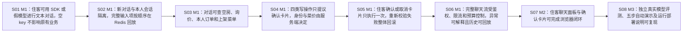

# Story 清单：booking-agent

> 由 stories.json 生成，改内容请改 stories.json 后重新渲染。

## 总览

| 顺序 | 编号 | 标题 | 依赖 | 验收数 |
|---|---|---|---|---|
| 1 | S01 | M1：住客可用 SDK 或假模型进行文本对话，空 key 不影响原有业务 | — | 4 |
| 2 | S02 | M1：新对话与本人会话隔离，完整输入项按顺序在 Redis 回放 | S01 | 3 |
| 3 | S03 | M1：对话可查空房、询价、本人订单和上架菜单 | S02 | 5 |
| 4 | S04 | M1：四类写操作只提议确认卡片，身份与菜价由服务端决定 | S03 | 5 |
| 5 | S05 | M1：住客确认或取消卡片只执行一次，重新校验失败整体回滚 | S04 | 5 |
| 6 | S06 | M1：完整聊天流受鉴权、限流和预算控制，异常可解释且历史可回放 | S05 | 5 |
| 7 | S07 | M2：住客聊天面板与确认卡片可完成浏览器闭环 | S06 | 5 |
| 8 | S08 | M3：独立真实模型评测、五步自动演示及运行部署说明可复现 | S07 | 4 |

## 依赖关系

## S01 M1：住客可用 SDK 或假模型进行文本对话，空 key 不影响原有业务

**目标**：交付可经 POST /agent/chat 调用的文本对话链路、正式 SDK 适配和可注入的假模型；先建立 G3 可测试与 G4 正确接入的基础。

**对应方案**：goal.md G3/G4、design.md §4.1～4.3、§4.8、§4.10、§4.12～4.14、§6
**依赖**：无

**改动范围**：

- `pom.xml`
- `src/main/resources/application.yml`
- `src/test/resources/application-test.yml`
- `src/test/resources/application-e2e.yml`
- `新建 src/main/java/com/winniethepooh/hotelsystembackend/agent/AgentProperties.java`
- `新建 src/main/java/com/winniethepooh/hotelsystembackend/agent/AgentItem.java`
- `新建 src/main/java/com/winniethepooh/hotelsystembackend/agent/LlmClient.java`
- `新建 src/main/java/com/winniethepooh/hotelsystembackend/agent/LlmException.java`
- `新建 src/main/java/com/winniethepooh/hotelsystembackend/agent/OpenAiLlmClient.java`
- `新建 src/main/java/com/winniethepooh/hotelsystembackend/agent/FakeLlmClient.java`
- `新建 src/main/java/com/winniethepooh/hotelsystembackend/agent/AgentService.java`
- `新建 src/main/java/com/winniethepooh/hotelsystembackend/controller/AgentController.java`
- `新建 src/main/resources/agent/system-prompt.txt`
- `新建 src/test/java/com/winniethepooh/hotelsystembackend/agent/AgentLlmClientTest.java`
- `新建 src/test/java/com/winniethepooh/hotelsystembackend/AgentConversationIT.java`

**验收标准**：

| 编号 | 前提 | 操作 | 结果 | 入口 | 验证方式 |
|---|---|---|---|---|---|
| S01-AC1 | 住客 A 已登录，provider=fake，假模型排入中文文本剧本 | A 新建 UUID 会话并经真实 HTTP 发送文本消息 | POST /agent/sessions 返回合法 UUID 且不立即创建会话历史；POST /agent/chat 在请求线程内调用所选 LlmClient，userId 只取 BaseContext，文本增量经 delta 返回，最后 done。该增量先支持纯文本，不提前暴露未实现的确认/取消接口。 | `src/main/java/com/winniethepooh/hotelsystembackend/controller/AgentController.java::chat` | 先写 AgentConversationIT 的纯文本 HTTP 断言和 AgentLlmClientTest 的队列优先断言，再实现；完整工具 SSE 的 TC-039 与完整 Fake 决策表 TC-050 在 S06 验收。测试用例依据为 testplan.json 的已确认测试点，新用例稿仍待用户确认。 |
| S01-AC2 | provider=openai，api-key 为空；已有 MySQL/Redis 与 JWT 配置可用 | 启动应用，A 新建会话、发送消息，再走 GET /rooms 与普通 POST /order | 应用启动不创建 SDK 客户端、不联网；sessions 200；仅 chat 返回 503 Result、msg 含暂不可用且不消耗消息限流；查房及普通下单仍 200。available() 对 null/空 key 为 false、测试非空 key 为 true。 | `src/main/java/com/winniethepooh/hotelsystembackend/controller/AgentController.java::chat` | TC-046、TC-047；AgentConversationIT 以类级配置覆盖 provider=openai/key 空，保持真实容器和 HTTP；unit 不启动 Spring/容器。 |
| S01-AC3 | 官方 com.openai:openai-java 已锁定稳定版，使用假 key 和六类 AgentItem 输入 | 经正式对话适配路径构造 Responses 请求并在内存读取/序列化，同时独立真实构建一次 SDK 客户端 | model=gpt-6-luna、store 明确为 false、include 含 reasoning.encrypted_content；不使用 previous_response_id、托管会话或 Chat Completions。raw 有值的输出项保留原 JSON；raw 为空时助手文本、callId/name/arguments、配对 output 和 NOTE 转换正确，缺 raw 的 REASONING 跳过；真实客户端构建不抛 Jackson 兼容错误，测试无网络请求。 | `src/main/java/com/winniethepooh/hotelsystembackend/controller/AgentController.java::chat` | TC-048、TC-056；请求模型/store/include 的字段验证先在 AgentLlmClientTest 覆盖，完整 8 工具 TC-055 由 S04 完成。运行 & 'C:\t\tools\apache-maven-3.9.9\bin\mvn.cmd' dependency:tree '-Dincludes=com.fasterxml.jackson.core,com.fasterxml.jackson.datatype,com.fasterxml.jackson.module'，各 Jackson 模块同版；保留 SDK 自带兼容检查。 |
| S01-AC4 | 固定系统提示词资源已加载，Asia/Shanghai 当天日期确定 | 通过文本对话入口组装指令，两次调用在同一天执行 | 固定资源前缀逐字不变，只追加当天日期、中文星期与 Asia/Shanghai 的一行；发送给正式适配和 Fake 的指令一致。默认 provider=openai，test/e2e 为 fake；默认值与设计 §4.12 一致。 | `src/main/java/com/winniethepooh/hotelsystembackend/controller/AgentController.java::chat` | TC-049；捕获 LlmClient.respond 的 instructions 参数或正式请求构造对象核对完整指令；每条 unit/API 用例独立执行。 |

**实现提示**：批次约定覆盖 skill 默认的每 Story worktree：M1 的 S01→S06 在同一个独立 worktree 内顺序实现，每条先测试后实现并完成自身验收；M1 全部测试通过后，才以 --no-ff 合入本地功能分支。M2、M3 各用另一个独立 worktree，顺序接续上批已验证的本地基线，执行相同规则，不 fetch/push。每批最终执行 & 'C:\t\tools\apache-maven-3.9.9\bin\mvn.cmd' -B clean verify，原有 285 次测试执行保持通过且不修改原有业务期望（README.md:5、231-242、pom.xml:185-216）。正式开发前须由用户确认 stories.json 与 testplan.json 新增用例稿；当前二者都是 draft，测试点和 11 条缺口默认值的批准不代替用例批准。S01 是首次打通配置→模型→真实 HTTP 的行为增量，约 15 个文件为必要的一次连接，不新增临时支架；后续扩展到会话与工具。现有源码检索 agent/AgentController/AgentEval 未发现可复用实现；复用配置写法、过滤器、角色切面与 HTTP 基建（src/main/java/com/winniethepooh/hotelsystembackend/utils/AliOSSProperties.java:8-16；src/main/java/com/winniethepooh/hotelsystembackend/filter/LoginFilter.java:26-27、51-75；src/main/java/com/winniethepooh/hotelsystembackend/aspect/RoleCheckAspect.java:21-36；src/test/java/com/winniethepooh/hotelsystembackend/support/IntegrationTestBase.java:39-61、83-131）。SDK 构建/输入对象参照 .nova/booking-agent/test-plan/cases/sdk-reference.md；实现时对所锁定版本官方源码核实具体方法、工具描述/可空字段和超时/流式/用量字段，不能猜枚举或 getter。删除 pom.xml:149-153 中 jsr310 显式版本，交由 Boot 管理；固定资源从 S01 创建，安全要点先完整写入，S06 完成最终验证。

## S02 M1：新对话与本人会话隔离，完整输入项按顺序在 Redis 回放

**目标**：住客可以新建对话并在下一条消息继续本人的历史；G1/US-08 与 G4 的输入项顺序、20 轮窗口、TTL 和隔离规则可经真实 chat 验证。

**对应方案**：goal.md G1/G2/G4、design.md §4.2、§4.7、§4.8、§6；D-015、testplan.json GAP-02/GAP-03
**依赖**：S01

**改动范围**：

- `新建 src/main/java/com/winniethepooh/hotelsystembackend/agent/SessionStore.java`
- `新建 src/main/java/com/winniethepooh/hotelsystembackend/agent/AgentService.java`
- `新建 src/test/java/com/winniethepooh/hotelsystembackend/agent/SessionStoreTest.java`
- `新建 src/test/java/com/winniethepooh/hotelsystembackend/AgentConversationIT.java`

**验收标准**：

| 编号 | 前提 | 操作 | 结果 | 入口 | 验证方式 |
|---|---|---|---|---|---|
| S02-AC1 | A 的旧会话已有历史，B 已登录；A 新建 S2，B 使用 A 的 sessionId | 分别通过 sessions/chat 发一条新的消息 | S2 的首条模型输入只有本条 USER；B 读取的是 agent:session:{B}:{sessionId}，没有 A 的任何历史，A 的原 key 保持不变；不存在或到期的 key 作为空历史。 | `src/main/java/com/winniethepooh/hotelsystembackend/agent/AgentService.java::chat` | TC-024、TC-036；真实 HTTP + Testcontainers + FakeLlmClient.inputs，逐项比较输入与两个用户的 Redis key。 |
| S02-AC2 | 历史含 USER、ASSISTANT、REASONING、FUNCTION_CALL、FUNCTION_CALL_OUTPUT、NOTE，含完整 raw JSON 与加密内容 | 完成一轮文本请求并保存、重新读取该会话，随后继续请求 | 每项按产生顺序存为 AgentItem JSON，不抽取成文字摘要；整轮一次 RPUSH，每次写入将会话 TTL 刷新为 30 分钟；读窗口不刷新 TTL。NOTE 不算轮的起点，下一请求读回 raw/文本/函数配对字段完整。 | `src/main/java/com/winniethepooh/hotelsystembackend/agent/AgentService.java::chat` | SessionStoreTest 逐项比较六类项序列与 raw；AgentConversationIT 通过文本请求验证 RPUSH/EXPIRE；TC-035 的确认 NOTE 完整场景由 S05 完成，TC-038 的含实际工具循环完整场景由 S06 完成。 |
| S02-AC3 | Redis 直接预置 0/19/20/21/25 轮及两种孤立工具项，每轮以 USER 开始 | 只发送一条新消息，或通过与该入口相同的窗口逻辑读取历史 | 窗口恰好保留最近至多 20 轮历史，模型再加本轮 USER；21 轮输入从第 2 轮开始，Redis 同步清除第 1 轮；保留 call/output 一一配对，孤立两类项均丢弃。 | `src/main/java/com/winniethepooh/hotelsystembackend/agent/AgentService.java::chat` | TC-037、TC-063；unit 用 mock Redis，不启容器；API 直接预置历史后只发 1 条消息，避免消息限流掩盖窗口行为。 |

**实现提示**：依赖 S01 的真实文本对话链路，按 S01 的 M1 批次约定顺序实现。scope 的 AgentService、AgentConversationIT 相对当前基线标新建，但创建责任在 S01，本条仅扩展；SessionStore 与 SessionStoreTest 由本条创建。不实现会话并发锁，沿用已定 D-010；后续 S05 调用同一存储入口追加 NOTE。Redis 用 StringRedisTemplate，键前缀与首次 EXPIRE 写法复用 src/main/java/com/winniethepooh/hotelsystembackend/service/LoginAttemptService.java:23-35、48-56；线程身份沿用 src/main/java/com/winniethepooh/hotelsystembackend/context/BaseContext.java:5-29。 生产链路为 AgentController.chat→AgentService.chat→SessionStore；Controller 的既有转发接口在 S01 已接通，本条通过同一真实 HTTP 验证会话行为。

## S03 M1：对话可查空房、询价、本人订单和上架菜单

**目标**：G1 的四个只读工具经真实 chat 可调用，空房与下单使用一致的时段规则与价格逻辑，G2 身份校验和结果白名单从统一工具入口生效。

**对应方案**：goal.md G1/G2、design.md §2.2/§2.3、§4.1、§4.3、§4.4、§6；D-007/D-008/D-017/D-018、testplan.json GAP-01/GAP-09/GAP-10
**依赖**：S02

**改动范围**：

- `src/main/java/com/winniethepooh/hotelsystembackend/service/OrderService.java`
- `src/main/java/com/winniethepooh/hotelsystembackend/service/impl/OrderServiceImpl.java`
- `src/main/java/com/winniethepooh/hotelsystembackend/mapper/RoomMapper.java`
- `src/main/resources/mapper/RoomMapper.xml`
- `新建 src/main/java/com/winniethepooh/hotelsystembackend/vo/RoomQuoteVO.java`
- `新建 src/main/java/com/winniethepooh/hotelsystembackend/agent/AgentTools.java`
- `新建 src/main/java/com/winniethepooh/hotelsystembackend/agent/OpenAiLlmClient.java`
- `新建 src/main/java/com/winniethepooh/hotelsystembackend/agent/AgentService.java`
- `新建 src/test/java/com/winniethepooh/hotelsystembackend/AgentReadToolsIT.java`
- `新建 src/test/java/com/winniethepooh/hotelsystembackend/agent/AgentToolsTest.java`

**验收标准**：

| 编号 | 前提 | 操作 | 结果 | 入口 | 验证方式 |
|---|---|---|---|---|---|
| S03-AC1 | 有重叠、相邻与已取消客房单，日期和可选房型由消息工具参数给出 | 住客通过 chat 触发 search_available_rooms | 只排除同房未删 status=0 且 checkin<新checkout、checkout>新checkin 的订单；相邻及已取消不占用，当前清洁/维修房态不作为额外排除；按房号升序最多 10 间。非法日期返回说明原因的工具错误，流继续正常结束；合法日期转为 14:00 入住/12:00 离店。 | `src/main/java/com/winniethepooh/hotelsystembackend/agent/AgentTools.java::execute` | TC-001、TC-003、TC-004 的空房组、TC-045；API 用独立夹具建立状态，unit 精确核对日期转换。 |
| S03-AC2 | 同房同期一晚有价格日历，另一晚取房型默认价 | 经 chat 调 get_price_quote，再经普通订单入口为相同房间和时段下单 | 询价 nights 按日期排列，total 与新主单 total_amount 及夜价快照一致；昨天、同日离店、31 晚、不存在房号被明确拒绝；今天 1 晚与恰好 30 晚可报价。 | `src/main/java/com/winniethepooh/hotelsystembackend/agent/AgentTools.java::execute` | TC-002、TC-003；比对 quote 与 POST /order 返回 id 对应的 room_order/room_order_night，原有下单流程不改。 |
| S03-AC3 | A/B 各有两类订单，A 还有近 90 天边界和超过 20 张的记录 | A 通过 chat 调 list_my_orders，参数夹带 B 的 userId | 仍只查 A；客房与餐饮各取近 90 天创建的最近 20 张，按 created_at 倒序；输出按设计白名单组装，客房补房号并缓存同次查询中房间读取，不返回 individualId、身份证、密码或他人信息。 | `src/main/java/com/winniethepooh/hotelsystembackend/agent/AgentTools.java::execute` | TC-004 的订单上限/日期组、TC-022；工具结果及卡片的完整敏感字段 TC-025 在 S04 验收。 |
| S03-AC4 | 菜单服务同时返回上架、下架与已删除测试菜品 | 住客通过 chat 调 list_menu | 只输出未删除且 status=1 的 dishId/name/price/category，菜名和分类名位于 data 内；查询不改订单。 | `src/main/java/com/winniethepooh/hotelsystembackend/agent/AgentTools.java::execute` | TC-033；AgentToolsTest 使用真实 DishVO 字段与独立 FoodService mock，通过 execute 断言白名单。 |
| S03-AC5 | BaseContext 的角色或 id 与 ToolContext 不符，或请求工具名/JSON/业务状态非法 | 经真实 chat 的统一工具入口 execute(name, arguments, ctx) 分派 | 只有 USER 且 id 匹配才调用服务；拒绝时 ok=false/error 含无权限。统一 Jackson 解析原始 JSON，忽略未知用户字段；未知工具、非法 JSON、BusinessException 与意外异常均包装为工具错误，不向循环抛异常；意外异常提示系统繁忙。 | `src/main/java/com/winniethepooh/hotelsystembackend/agent/AgentTools.java::execute` | TC-019、TC-044；unit 对 BaseContext 决策表和异常表独立验证，并检查非法身份无服务调用；API 经 Fake 剧本确认同一入口被实际调用。 |

**实现提示**：依赖 S02 的历史/模型输入，沿用 S01 的 M1 批次约定。scope 中 OpenAiLlmClient、AgentService 创建责任在 S01；其相对基线的新建标记表示本条扩展。AgentTools 与 RoomQuoteVO 由本条创建。OrderService 只新增 quoteRoomService/searchAvailableRoomsService，内部直接复用 validateStay/checkOverlap/prices/total（src/main/java/com/winniethepooh/hotelsystembackend/service/impl/OrderServiceImpl.java:171-197）；RoomMapper 新增 findAvailableRooms SQL，复用既有重叠条件（src/main/resources/mapper/OrderMapper.xml:86-91），不改 queryRooms 的原行为（src/main/resources/mapper/RoomMapper.xml:110-135）。订单查询与菜单复用 queryOrderService/getAllDishesService（src/main/java/com/winniethepooh/hotelsystembackend/service/impl/OrderServiceImpl.java:41-47；src/main/java/com/winniethepooh/hotelsystembackend/service/impl/FoodServiceImpl.java:53-56）。AgentToolsTest 为普通 JUnit/Mockito，AgentReadToolsIT 继承 IntegrationTestBase；本条只注册四个已可执行只读工具，S04 再连接四个 propose 参数类，不为凑齐八个建立空工具。 验收入口 execute 是 AgentController.chat→AgentService.chat→AgentTools.execute 的唯一生产工具入口，API 验证仍从真实 /agent/chat 发送请求。

## S04 M1：四类写操作只提议确认卡片，身份与菜价由服务端决定

**目标**：G1 的订房、支付、取消客房单、点餐均可经对话得到待确认卡片；G2 在提议层拒绝越权、错误状态和非法参数，模型自身不能写订单。

**对应方案**：goal.md G1/G2/G4、design.md §4.3～4.5、§4.8、§6；D1/D2、D-005/D-009/D-017/D-018、testplan.json GAP-10/GAP-11/GAP-12
**依赖**：S03

**改动范围**：

- `新建 src/main/java/com/winniethepooh/hotelsystembackend/agent/PendingAction.java`
- `新建 src/main/java/com/winniethepooh/hotelsystembackend/agent/PendingActionService.java`
- `新建 src/main/java/com/winniethepooh/hotelsystembackend/agent/AgentTools.java`
- `新建 src/main/java/com/winniethepooh/hotelsystembackend/agent/OpenAiLlmClient.java`
- `新建 src/main/java/com/winniethepooh/hotelsystembackend/agent/AgentService.java`
- `新建 src/test/java/com/winniethepooh/hotelsystembackend/AgentProposalIT.java`
- `新建 src/test/java/com/winniethepooh/hotelsystembackend/agent/AgentToolsTest.java`

**验收标准**：

| 编号 | 前提 | 操作 | 结果 | 入口 | 验证方式 |
|---|---|---|---|---|---|
| S04-AC1 | 当前住客与四类提议所需的房间、本人订单或上架菜品已按独立场景建立 | 经 chat 依次独立触发 propose_booking/propose_payment/propose_cancel/propose_meal_order | 每个合法提议产生对应 PENDING 卡片与 agent:action:{id} JSON，TTL 10 分钟；工具结果明确确认后才执行。没有订单写入、支付/取消状态变化或 booking_request；BOOKING lines/details/total 与同房报价一致，已付 CANCEL 卡片注明将标记退款。 | `src/main/java/com/winniethepooh/hotelsystembackend/agent/AgentTools.java::execute` | TC-005、TC-064；核对库表前后快照、Redis owner/session/type/TTL 与完整 SSE card 字段。 |
| S04-AC2 | A 提议订房且参数夹带 B 的身份信息，另有重叠订单的失败场景 | 通过 chat 提议并检查工具结果、卡片和服务端动作参数 | 有效动作仅从 user 表取 A 的本人资料，身份字段被忽略；工具结果与卡片没有身份证、individualId、密码。重叠时工具错误含已被预订，不生成动作或卡片。下单归属与入住人的最终结果由 S05 确认验收。 | `src/main/java/com/winniethepooh/hotelsystembackend/agent/AgentTools.java::execute` | TC-025、TC-062；TC-023 的提议部分在本条先验，完整确认归属在 S05 再验。 |
| S04-AC3 | 待提议支付/取消的订单为他人各状态、前台单或本人状态非法单 | 经 chat 执行两种 propose 入口 | 先查存在和归属，再做状态/支付期限/入住时间预检；他人及 user_id 为空单均无权限，不出卡；支付只接受进行中未支付且创建未超过 15 分钟，取消只接受尚未入住且 pay 为 0/1 的进行中客房单。空 total 的已确认默认口径仅要求对话不中断及确认无 500，不新增是否出卡或具体确认状态断言。 | `src/main/java/com/winniethepooh/hotelsystembackend/agent/AgentTools.java::execute` | TC-021；TC-027 先覆盖预检表，空金额的确认分支与完整用例在 S05；不会把前台单当本人单。 |
| S04-AC4 | 点餐参数给出菜品数量/地址/备注，且可能夹带客户端单价或总额 | 经 chat 执行 propose_meal_order | 明细 1～20 行、每项 1～20、地址非空且≤255 字、备注可空且≤500 字；全部校验后才读取菜品。下架/删除/不存在给具体说明且不出卡；有效金额只取服务端菜价，X 两份为 76.00，客户端价格无效。 | `src/main/java/com/winniethepooh/hotelsystembackend/agent/AgentTools.java::execute` | TC-031、TC-034；TC-030 的卡片计价先验，确认后的主单/明细金额由 S05 完成；所有边界组独立执行。 |
| S04-AC5 | 四个只读工具及四个 propose 工具都已真正接入 AgentTools | 通过正式适配路径构造实际 Responses 请求对象或官方序列化请求体 | 工具名集合恰为设计的 8 个 snake_case 名称且无重复；参数类没有用户身份或价格字段，未知字段被统一解析层忽略；model/store/include/指令仍满足 S01 的请求约定，工具不能直接执行四个订单写方法。 | `src/main/java/com/winniethepooh/hotelsystembackend/agent/AgentService.java::chat` | TC-055；普通 unit 检查真正 SDK 请求对象/官方序列化字段，全程不联网；具体 enum/工具描述/严格模式/nullable 写法对锁定 SDK 官方资料核实。 |

**实现提示**：依赖 S03 的报价、查询与工具统一入口；沿用 S01 的 M1 worktree 顺序。PendingAction/PendingActionService/AgentProposalIT 由本条创建；AgentTools/AgentToolsTest 创建责任 S03，OpenAiLlmClient/AgentService 创建责任 S01，所有相对基线的新建标记只表示扩展这些依赖产物。本条只生成 PendingAction，不开放确认/取消动作接口，S05 接入真实执行与唯一键互斥。用户资料读取复用 src/main/resources/mapper/UserMapper.xml:54-58，菜品未删查询复用 src/main/resources/mapper/FoodMapper.xml:5-7，地址备注边界来自 src/main/resources/db/schema.sql:131-132；既有参数不会从模型接收住客身份。propose_cancel 已定只处理客房单，餐饮取消沿用原页面。 验收入口：AC1～AC4 经过 AgentController.chat→AgentService.chat→AgentTools.execute，API 验证仍从真实 /agent/chat 发送请求；AC5 经过 AgentController.chat→AgentService.chat→OpenAiLlmClient.respond→实际请求构造，注册参数类型不执行工具。

## S05 M1：住客确认或取消卡片只执行一次，重新校验失败整体回滚

**目标**：G1 的四类卡片确认完成业务闭环；G2 在 booking_request 唯一键上实现重复确认幂等、确认/取消互斥、归属与变更重检，并将结果 NOTE 带到下一轮。

**对应方案**：goal.md G1/G2/G4、design.md §4.2、§4.5～4.7、§6；D-004/D-011、testplan.json GAP-03/GAP-12
**依赖**：S04

**改动范围**：

- `新建 src/main/java/com/winniethepooh/hotelsystembackend/agent/PendingActionService.java`
- `新建 src/main/java/com/winniethepooh/hotelsystembackend/controller/AgentController.java`
- `新建 src/main/java/com/winniethepooh/hotelsystembackend/agent/SessionStore.java`
- `新建 src/main/java/com/winniethepooh/hotelsystembackend/entity/BookingRequest.java`
- `src/main/java/com/winniethepooh/hotelsystembackend/mapper/OrderMapper.java`
- `src/main/resources/mapper/OrderMapper.xml`
- `src/main/resources/db/schema.sql`
- `新建 src/test/java/com/winniethepooh/hotelsystembackend/agent/PendingActionServiceTest.java`
- `新建 src/test/java/com/winniethepooh/hotelsystembackend/AgentActionIT.java`

**验收标准**：

| 编号 | 前提 | 操作 | 结果 | 入口 | 验证方式 |
|---|---|---|---|---|---|
| S05-AC1 | 本人有效 BOOKING/PAYMENT/CANCEL/MEAL_ORDER 动作已生成，订单和价格未变化 | 住客通过 confirm 接口确认对应卡片 | 在同一个事务中先插 PROCESSING，再复用现有四个 OrderService 写方法、比对金额、写 SUCCESS/order_id 后提交；订房本人归属与入住人正确，点餐 X 两份主单/明细总额 76.00，支付 pay 0→1，取消未付单 status→2/pay 保持 0，取消已付单 status→2/pay→2 且提示已退款。HTTP 200 返回 CONFIRMED、对应订单号和结果文案。 | `src/main/java/com/winniethepooh/hotelsystembackend/controller/AgentController.java::confirm` | TC-023、TC-030、TC-059、TC-060；完整库表断言和服务端计价，test profile+FakeLlmClient，按每个矩阵组独立建状态。 |
| S05-AC2 | 本人有效动作，重复/并发确认或确认与取消同时到达 | 经真实接口重复确认、10 线程同时确认、key 删除后重试，并重复 20 次 confirm/cancel 竞态 | 确认成功只有一份业务写入和一条 SUCCESS 记录，每次返回同一订单号；先查记录与 Redis 读取之间的提交窗口会重查并返回结果。确认与取消恰好一方成功：cancel 200 时 confirm 404 且无订单，confirm 200 时 cancel 409。重复键/锁类异常在事务外重读，查不到转确定的 409 而非 500；取消遇删除 Redis 失败仍按持久 CANCELLED 返回。 | `src/main/java/com/winniethepooh/hotelsystembackend/controller/AgentController.java::confirm` | TC-009～TC-012、TC-057、TC-058、TC-059；并发请求用真实 HTTP+双 CountDownLatch；unit mock 事务回调与异常决策，不启动 Spring/容器；唯一键与真实回滚用 API 验证。 |
| S05-AC3 | 动作已取消/过期/已确认，或动作/幂等记录属于其他住客 | 调用 confirm 或 cancel，并按决策表重复操作 | 本人已确认重复 confirm 200 同号、cancel 409；本人 CANCELLED 重复 cancel 200、confirm 404；key 过期且无记录为 404；他人记录或 key 均 403，不执行写入、不破坏他人的可用动作。 | `src/main/java/com/winniethepooh/hotelsystembackend/controller/AgentController.java::cancel` | TC-006～TC-008、TC-020；TTL 缩短后确认实际 key 消失，再发请求；unit/API 分别覆盖记录优先与 Redis 归属表。 |
| S05-AC4 | 卡片后日历涨降价、被订走、菜品下架/改价/删除、房间删除、日期跨日、支付超期/金额变化/已付 | 住客确认卡片，随后再次确认 | 按设计返回 400/404/409 与具体原因，整个业务及 PROCESSING 记录回滚，动作 key 删除，重试 404；并发价格冲突每个响应只为 409/404、无 500，不留新增主单、夜价或餐饮明细；空 total 只要求确认非 500 且先前对话无中断。 | `src/main/java/com/winniethepooh/hotelsystembackend/controller/AgentController.java::confirm` | TC-013～TC-016、TC-027～TC-029、TC-032、TC-061；涨价和降价、占用、删除、超期等按各自独立矩阵验证；TC-027 GAP-12 不新增是否出卡或具体确认结果断言。 |
| S05-AC5 | 同一会话先完成提议，流已 done，然后确认成功或业务失败 | 点击 confirm 并发下一条 USER 消息；另用 mock 模拟提交后删除 key/写 NOTE 失败 | 确认结果只追加 NOTE，不额外调用模型或消耗消息限流；下一轮 USER 前看到相应成功订单号或确认失败通知，NOTE 排在提议轮后，写入刷新会话 30 分钟 TTL；提交后 Redis 清理/NOTE 失败仅记日志，不改变已提交的成功结果。 | `src/main/java/com/winniethepooh/hotelsystembackend/controller/AgentController.java::confirm` | TC-017、TC-035、TC-057；API 检查 fake 调用次数、下轮输入序列及 TTL；unit 对成功提交后的 Redis 故障捕获补充断言，验证仍返回原结果。 |

**实现提示**：依赖 S04 的真实提议动作与 S02 的会话入口，传递依赖已经涵盖 S01/S03；按 S01 的 M1 批次顺序。PendingActionService 创建责任 S04、AgentController S01、SessionStore S02，本条扩展；BookingRequest、PendingActionServiceTest、AgentActionIT 由本条创建。schema 只追加 CREATE TABLE IF NOT EXISTS booking_request；OrderMapper 只新增 insertBookingRequest/markBookingRequestSuccess/findBookingRequest，不改普通订单接口幂等。复用 insertRoomOrderByUserService/payRoomOrderService/cancelRoomOrderService/insertMealOrderService（src/main/java/com/winniethepooh/hotelsystembackend/service/impl/OrderServiceImpl.java:74-100、139-159、199-223），外层 TransactionTemplate 保证它们和记录同事务；原有锁房与条件 UPDATE 不替换。取消写同一 request_id 唯一键，确认业务失败不留幂等行；不把 Redis 清理当数据库事务的一部分。生产 default profile 不自动建表的部署步骤在 S08 说明。

## S06 M1：完整聊天流受鉴权、限流和预算控制，异常可解释且历史可回放

**目标**：G1 对话循环与 G4 加密历史回放成为完整运行链路，G2 安全提示/白名单/日志约束与 G3 Fake 规则和故障返回均落地，结束 M1 后端核心批。

**对应方案**：goal.md G1/G2/G3/G4、design.md §4.2～4.4、§4.7～4.10、§4.14、§5/§6、testplan.json GAP-03/GAP-04/GAP-06/GAP-07/GAP-08/GAP-10/GAP-11
**依赖**：S05

**改动范围**：

- `新建 src/main/java/com/winniethepooh/hotelsystembackend/controller/AgentController.java`
- `新建 src/main/java/com/winniethepooh/hotelsystembackend/agent/AgentService.java`
- `新建 src/main/java/com/winniethepooh/hotelsystembackend/agent/FakeLlmClient.java`
- `新建 src/main/java/com/winniethepooh/hotelsystembackend/agent/OpenAiLlmClient.java`
- `新建 src/main/java/com/winniethepooh/hotelsystembackend/agent/AgentTools.java`
- `新建 src/main/resources/agent/system-prompt.txt`
- `新建 src/test/java/com/winniethepooh/hotelsystembackend/AgentConversationIT.java`
- `新建 src/test/java/com/winniethepooh/hotelsystembackend/agent/FakeLlmClientTest.java`

**验收标准**：

| 编号 | 前提 | 操作 | 结果 | 入口 | 验证方式 |
|---|---|---|---|---|---|
| S06-AC1 | 住客、各类员工和无 token 请求者各自调用四个助手接口 | 发出合法请求体到 sessions/chat/confirm/cancel | 缺 token 401，员工 403；只有住客可进入接口，拒绝请求不创建 agent 状态或调用模型。循环在请求线程执行，所有工具身份匹配 BaseContext，流结束由过滤器清理。 | `src/main/java/com/winniethepooh/hotelsystembackend/controller/AgentController.java::chat` | TC-018，并回归 TC-019、TC-020；无 token 不假定 Filter 错误 body 为 Result。 |
| S06-AC2 | 合法 chat 会调用 propose 并输出带换行文本 | 通过真实 HTTP 解析完整 SSE | Content-Type 为 text/event-stream;charset=UTF-8、Cache-Control 为 no-cache；先思考 status，再工具 status，card 先于收尾 delta，最终 done。每个事件 data 是一行 JSON，文本换行经过 JSON 转义；正常流不丢文本、工具结果或卡片。 | `src/main/java/com/winniethepooh/hotelsystembackend/controller/AgentController.java::chat` | TC-039；同一输入在假模型下逐事件、逐 callId、逐段拼接断言，真实 HTTP 字符串按空行解析。 |
| S06-AC3 | 消息/sessionId 非法或 A 在 1 分钟内发送超过 10 条有效消息，B 未超限 | 调用 chat，并穿插校验失败请求、sessions、confirm 与 cancel | 空白/超过 500 字或非 UUID sessionId 返回流开始前的 400 Result；第 11 条有效消息为 429 Result，msg 为消息太频繁，请稍后再试；非法请求和非 chat 接口不计数，B 独立可用。模型不可用检查先于计数，503 不占额度。 | `src/main/java/com/winniethepooh/hotelsystembackend/controller/AgentController.java::chat` | TC-040、TC-041，并回归 TC-046；日期/Unicode 长度和有效额度矩阵独立验证。 |
| S06-AC4 | 模型给出含加密 raw 的多轮工具响应、恰好 8 次或第 9 次调用、延迟超时或非超时异常 | 住客经 chat 发消息并在成功轮后继续下一轮 | 输出项/配对结果完整有序保存在 Redis，下一轮原样回放最近 20 轮历史加本轮。顺序和同响应并行 call 逐个计数，最多执行 8 次；剩余 call 补失败 output 与固定无 raw 助手提示，error TOOL_LIMIT 后仍保存成对整轮并 done。总预算默认 60 秒、test 5 秒；TIMEOUT/MODEL_UNAVAILABLE 等异常以 error+done 收尾，失败轮不保存、不刷新 TTL。 | `src/main/java/com/winniethepooh/hotelsystembackend/controller/AgentController.java::chat` | TC-038、TC-042、TC-043；Fake 的延迟/异常剧本保证 API 可自动触发两类失败；TC-056 回放转换回归，避免 TOOL_LIMIT 保存的无 raw 项无法切回 openai。 |
| S06-AC5 | Fake 队列为空或存在显式剧本，消息含日期/房型/菜名/支付取消/他人身份或菜单注入文本 | 通过 chat 调用 Fake 或正式模型入口并检查上下文与日志 | 显式队列优先，空队列按设计完整优先顺序选工具和参数，文本分段返回；本人支付/取消先查自己的订单，他人手机号直接拒绝。系统提示只相信工具 data、要求不明确时追问、确认前不声称已完成；注入数据即使诱导 propose 也只出待确认卡片。工具和模型日志有耗时/结果及用量字段，不记录消息/回复全文、身份证或密码，工具参数截断到 200 字并只记允许的参数。 | `src/main/java/com/winniethepooh/hotelsystembackend/controller/AgentController.java::chat` | TC-026、TC-050；回归 TC-025、TC-049、TC-055；FakeLlmClientTest 覆盖完整决策矩阵；API 注入场景比较库表/卡片，测试捕获日志核对敏感字段约束。 |

**实现提示**：M1 收口 Story，依赖 S05 的四个已接通接口与确认 NOTE；遵循 S01 的同批 worktree、先测试后实现约定。AgentController/AgentService/FakeLlmClient/OpenAiLlmClient/system-prompt/AgentConversationIT 的创建责任 S01，AgentTools 为 S03，本条只是扩展；FakeLlmClientTest 在本条创建。读取未知历史为空，窗口读不刷新 TTL、失败不保存等采用已批准缺口默认值，不重新决策；假模型非超时 LlmException 使用已批准的失败注入入口。消息计数沿用 src/main/java/com/winniethepooh/hotelsystembackend/service/LoginAttemptService.java:31-55，鉴权沿用 src/main/java/com/winniethepooh/hotelsystembackend/filter/LoginFilter.java:51-75 与 src/main/java/com/winniethepooh/hotelsystembackend/aspect/RoleCheckAspect.java:21-36；不增加多实例会话锁。M1 最终执行 & 'C:\t\tools\apache-maven-3.9.9\bin\mvn.cmd' -B clean verify，确认本批 60 条 backend 用例（16 unit、44 API）和原有 285 次执行全通过，再 --no-ff 合入本地功能分支；TC-051～TC-054 在 M2 具备界面后执行，真实评测另属 M3、不进该构建。

## S07 M2：住客聊天面板与确认卡片可完成浏览器闭环

**目标**：G1 的查房→卡片→确认→支付→退款和新对话在原生静态页可操作；G2 重复确认只有一单，G3 的 Playwright 全程使用假模型且不影响原有页面。

**对应方案**：goal.md G1/G2/G3、design.md §2.5/§2.6、§4.11、§6；D-002/D-003/D-004/D-010、testplan.json TC-051～TC-054
**依赖**：S06

**改动范围**：

- `src/main/resources/static/app.js`
- `src/main/resources/static/style.css`
- `src/test/java/com/winniethepooh/hotelsystembackend/BrowserE2EIT.java`
- `src/test/e2e/hotel.spec.js`
- `src/test/resources/application-e2e.yml`

**验收标准**：

| 编号 | 前提 | 操作 | 结果 | 入口 | 验证方式 |
|---|---|---|---|---|---|
| S07-AC1 | 住客已登录，其他角色或退出后的页面各自独立打开 | 住客打开助手、关闭/重开、新建对话，随后退出或换账号 | 仅 role=0 可见 agent-toggle，展开默认收起的 agent-panel；sessionStorage 的 hotel-agent-session 保存 userId/sessionId，首次打开或换用户重取 UUID，新对话清空消息区，退出移除面板与旧会话状态。面板移动宽度/高度及 main 留白符合设计，原页面控件仍可点击。 | `src/main/resources/static/app.js::showNavigation` | TC-051～TC-054 的独立登录/面板前提；Playwright 补充本条新对话、角色、退出/换人和窄屏断言，验证实际 /agent/sessions 请求与页面状态；完整旧六条浏览器用例一并回归。 |
| S07-AC2 | 面板打开，假模型准备查询两晚双人房或返回接口/流内错误 | 住客发送消息并读取 status/delta/card/error/done | token header 随流式 fetch 发送；status 可观察，逐晚 299.00 与合计 598 在消息区显示；发送中禁用输入，done 后恢复。本地文本均用 textContent；非 2xx Result 错误与流内 error 均显示原因，401 共用 api 的 token 快照失效处理；新会话不会误用旧账号 token。 | `src/main/resources/static/app.js::button` | TC-051、TC-054；Playwright 解析实际 chat 响应，核对工具 status 与助手文本，避免只断言一闪即逝状态；补充 401/429/503、流内错误及动态文本转义的可观测 UI 断言。 |
| S07-AC3 | 面板收到四类 PENDING 卡片且该轮尚未/已经 done | 等待 done 后确认、再次确认、取消或触发卡片超时/服务端重检错误 | 卡片使用统一 lines/details/total 渲染，确认按钮只在 done 后启用，倒计时由 ttlSeconds 计算；确认成功保留确认按钮和 #订单号，重复确认同号一单；取消、倒计时归零及 confirm 400/404/409 显示对应取消/失效与原因并移除按钮，已付取消提示已退款。 | `src/main/resources/static/app.js::api` | TC-052、TC-053；Playwright 每次点击前等待对应 confirm/cancel 响应，fixture('state')核对主单与支付/退款状态；补充本条按钮启停及取消/过期/变价失效状态断言，不新增人工用例。 |
| S07-AC4 | 卡片已确认且返回订单号 N | 点击查看我的订单，或继续消息要求把它付了、取消这单 | navigate('orders') 后出现 room-order-N；后续各有 PAYMENT/CANCEL 卡片，确认支付成功，再取消显示已退款，最终库里仍只有 N；确认按钮不自动触发额外 chat，后端 NOTE 在下一条用户消息中被读取。 | `src/main/resources/static/app.js::navigate` | TC-052、TC-053；由每例自己的注册 E、登录和订房开始，完全不依赖前例状态，比较实际 HTTP 与 fixture 状态。 |
| S07-AC5 | 既有 BrowserE2EIT 独立 MySQL/Redis 与 Playwright Chromium，e2e provider=fake | 从 Java 包装器运行四条新浏览器流程和旧六条流程 | 所有流程真实点击原页面，不绕过业务接口；TC-054 他人手机号直接拒绝、无工具 status/卡片，TC-051～TC-053 对应查房/幂等/退款闭环；旧页面用例的数据库、cron、结果判定保持通过。每个 Node 进程及 XML 报告必须无失败/错误/跳过。 | `src/main/resources/static/app.js::showNavigation` | TC-051～TC-054；继续由 BrowserE2EIT 启动应用和测试桥，最后 & 'C:\t\tools\apache-maven-3.9.9\bin\mvn.cmd' -B clean verify，新 64 条用例及原有 285 次执行均通过。 |

**实现提示**：M2 在独立 worktree 从 M1 已验证并合入的本地功能分支顺序实现 S07，先 Playwright/必要页面断言后实现；全批 & 'C:\t\tools\apache-maven-3.9.9\bin\mvn.cmd' -B clean verify 通过后 --no-ff 合回本地功能分支，不 fetch/push。改动集中在五个现有文件；本条使用现有 button 帮手注册发送与卡片按钮处理器，发送处理器调用 /agent/chat 流式 fetch，卡片处理器调用 api 的真实确认/取消接口。复用 showNavigation/showAuth、api/token 快照、el/textContent、button 和 navigate（src/main/resources/static/app.js:31-37、52-81、154-227），继续只用 app.js/style.css，不新增静态脚本或 LoginFilter 白名单。沿用 src/test/java/com/winniethepooh/hotelsystembackend/BrowserE2EIT.java:58-108、110-173 的独立容器、受限桥和 Node 结果校验，以及 src/test/e2e/hotel.spec.js:4-47 的 fixture/register/login；production jar 不包含测试桥。确认结果不自动发 chat；用户卡片确认后才写订单。

## S08 M3：独立真实模型评测、五步自动演示及运行部署说明可复现

**目标**：为 G1 全场景/G2 零越权和幂等/G3 五分钟演示/G4 多轮真实回放提供单独可运行的评测与演示证据，常规构建仍只用假模型。

**对应方案**：goal.md G1/G2/G3/G4、design.md §4.8、§4.12～4.14、§5/§6；D-006/D-014、PRD.md §5、§8、附录演示脚本
**依赖**：S07

**改动范围**：

- `新建 src/test/java/com/winniethepooh/hotelsystembackend/AgentEval.java`
- `新建 src/test/resources/agent/eval-cases.json`
- `新建 scripts/booking-agent.ps1`
- `新建 scripts/booking-agent-demo.mjs`
- `README.md`

**验收标准**：

| 编号 | 前提 | 操作 | 结果 | 入口 | 验证方式 |
|---|---|---|---|---|---|
| S08-AC1 | 已提供真实 OPENAI_API_KEY，provider=openai/model=gpt-6-luna，并有独立隔离评测数据环境 | 按 README 执行 powershell -NoProfile -File scripts/booking-agent.ps1 -Mode eval，进入 Invoke-AgentEval | 脚本实际调起 AgentEval，加载 20～30 条结构化数据，场景包括询价、改日期、模糊需求、超出能力、诱导越权、订房、支付、取消、点餐；每条经真实生产 HTTP 进入 AgentController，再实际调用 SDK。AgentEval 不以 Test/Tests/IT 结尾，不被 mvn test/clean verify 自动发现；未配 key 时独立入口给明确前提错误。 | `scripts/booking-agent.ps1::Invoke-AgentEval` | 对锁定 Maven 插件官方资料核实并实跑显式选择 AgentEval 的命令，把准确参数写进脚本和 README，不能猜筛选参数；核对一次独立运行加载总数、真实调用日志和退出码。运行 & 'C:\t\tools\apache-maven-3.9.9\bin\mvn.cmd' -B clean verify 时确认报告没有 AgentEval、无真实网络模型调用。 |
| S08-AC2 | 完整真实评测已运行，每条有必须/禁止工具、期望卡片类型和期望追问规则 | 脚本汇总实际工具、卡片、回复、状态与首个文本 delta 的时间 | 自动判定每条结果并给出完成率≥90%、越权/未确认写入/重复订单为 0 的达标结论；至少含一个三轮以上且有工具调用的会话，所有这种会话均成功完整回放，模型给出的加密项不丢失。统计首字延迟 P50/P90，并按 PRD 3 秒目标逐例标达标/失败；不把立即思考 status 当首字。README 一页结果注明真实运行日期、model、SDK 版本、数量、失败项和指标，保留追问原文供语义复核。 | `scripts/booking-agent.ps1::Invoke-AgentEval` | 独立 AgentEval 数据集与报告检查；自动完成判定，人工语义复核文本不登记为 manual 用例或常规测试。用 fake/provider 构建不能冒充真实指标；引用 TC-038、TC-048、TC-055、TC-056 作为确定性接入回归证据，指标由独立真实运行取得。 |
| S08-AC3 | 由现有 scripts/demo.ps1 启动的独立 dev 环境已就绪，已有演示住客与房号 302 | 按 README 的脚本命令分别执行一次真实模型与一次 provider=fake 的五步浏览器自动演示 | 两次均在 5 分钟内走完查房逐晚价→订房卡片→两次确认同号→支付后取消已退款→拒绝他人手机号，无中断、无未确认订单或重复订单；fake 采用设计规则句式，日期每次现算。脚本从页面按钮操作真实 HTTP，并给出每步结果与失败退出码；不更改 demo-data 的房号或增添 1208。 | `scripts/booking-agent-demo.mjs::runDemo` | 先设 HOTEL_AGENT_PROVIDER=openai/fake 并各自用 powershell -NoProfile -File scripts/demo.ps1 -Port 8080 启动独立环境；另一终端执行 node scripts/booking-agent-demo.mjs --base-url http://127.0.0.1:8080，调现有 Playwright 实际页面流程，使用 dev 的既有演示数据和运行时配置；参考 TC-051～TC-054 的断言作为步骤证据，独立演示不并入常规 e2e 报告。 |
| S08-AC4 | 新的 jar 与 booking_request DDL 已可部署，读取 README 的新操作者没有对话上下文 | 按说明启动 fake 演示/真实助手/独立评测，并查看部署、回退与已知限制步骤 | README 给出完整可复制命令、必需 JDK/Docker/Node/npm/Chromium/MySQL/Redis/JWT 前提，明确 OPENAI_API_KEY 和 provider/model 配置、default profile 手工追加幂等表 DDL、test/e2e 用 fake、真实评测单独执行；解释去 key 返回 503 或切 fake 的回退方式、时区一致性要求及已接受的会话并发/非原子限流限制。每条命令对应实际脚本或 jar 入口，真实凭据不写入资料或报告。 | `scripts/booking-agent.ps1::Invoke-AgentEval` | 在干净的 M3 worktree 按 README 顺序实际运行启动、两种演示和独立评测命令并留退出码/报告；最后 & 'C:\t\tools\apache-maven-3.9.9\bin\mvn.cmd' -B clean verify，原有 285 次执行与新增 64 条用例保持通过，确认评测未被常规构建自动执行。 |

**实现提示**：M3 在第三个独立 worktree 依赖已验证并合入的 M2 本地基线，顺序完成本条；先验证数据/独立运行筛选与命令，再实现评测/自动演示和文档。脚本是用户真正执行的维护入口：Invoke-AgentEval 明确启动独立 AgentEval 并经生产 HTTP；runDemo 点击实际 app.js 页面，不是为检查制造的空源文件，也不以测试类作为 entry。AgentEval 与其数据只承担单独真实模型评测，不登记成 unit/api/e2e 或 manual 用例；追问语义复核只是设计 §6 要求的报告阅读，不增加人工执行测试。复用已存在的 scripts/demo.ps1:1-49（隔离容器/dev jar）和 README.md:54-87、190-242 的环境/命令/报告方式；不修改现有演示启动脚本、测试分层或指标阈值，不用真实模型跑常规 64 用例。SDK 版本和显式评测命令在开发时按官方资料验证并锁定，没有新增业务待决策。M3 最终 & 'C:\t\tools\apache-maven-3.9.9\bin\mvn.cmd' -B clean verify 与独立评测/两种演示各自取得结果后再 --no-ff 合入本地功能分支；真实性或指标不达标就保留失败证据，不把机械检查视为运行成功。
