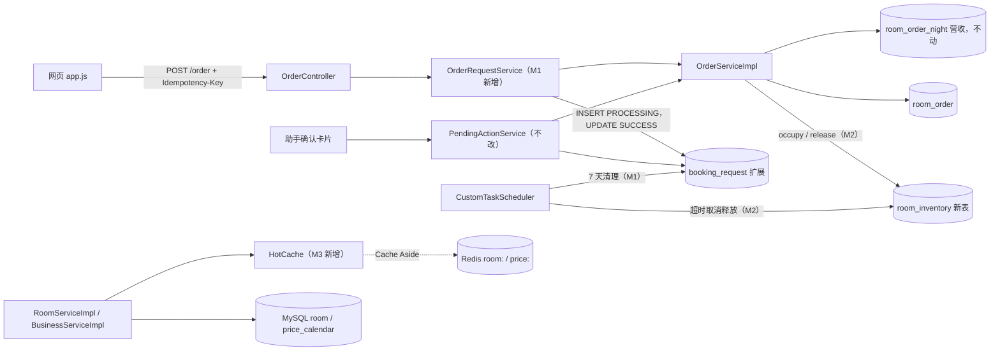
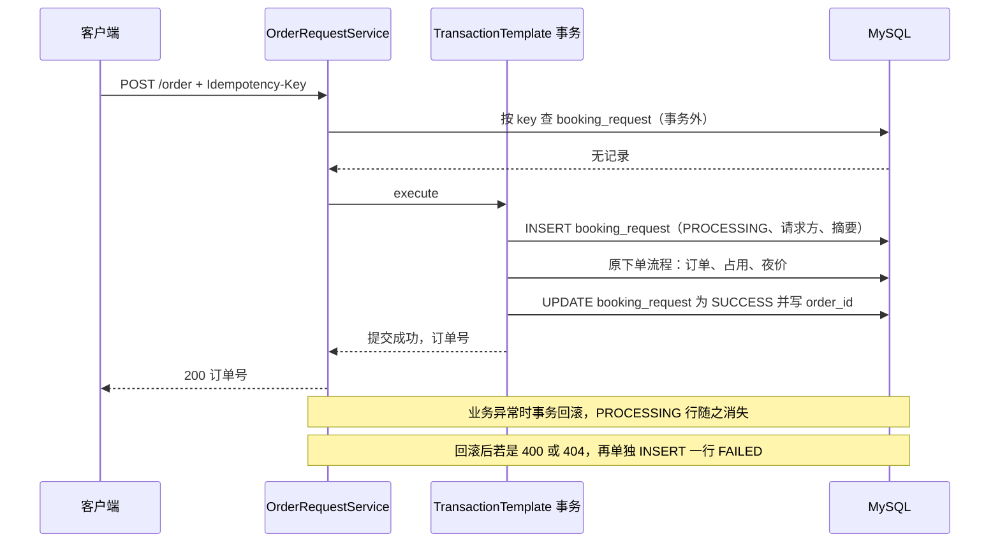
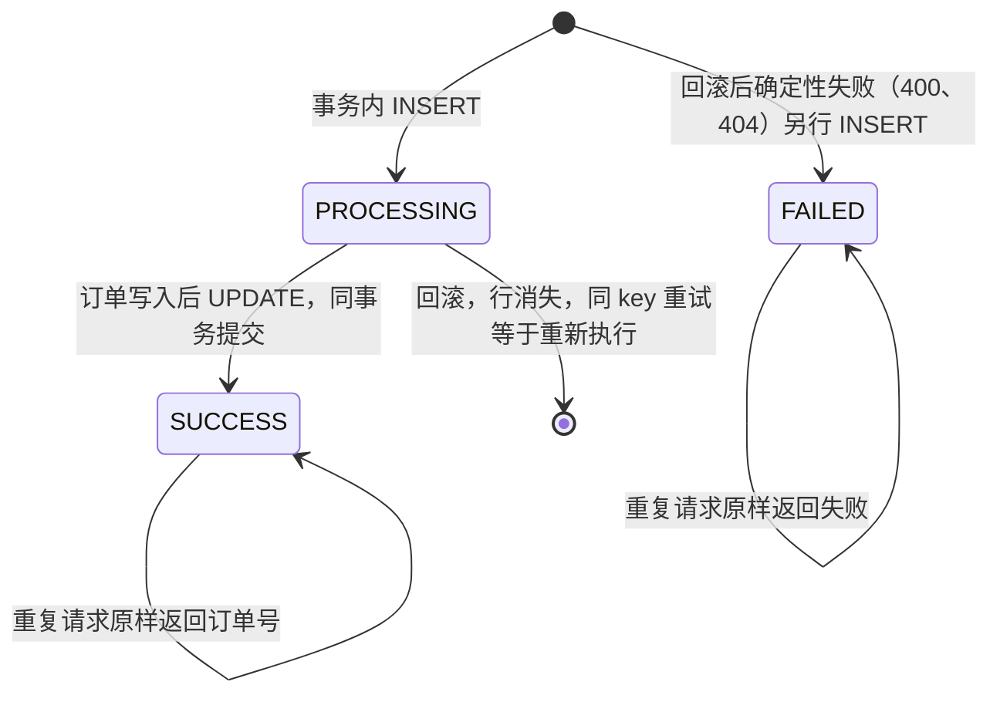
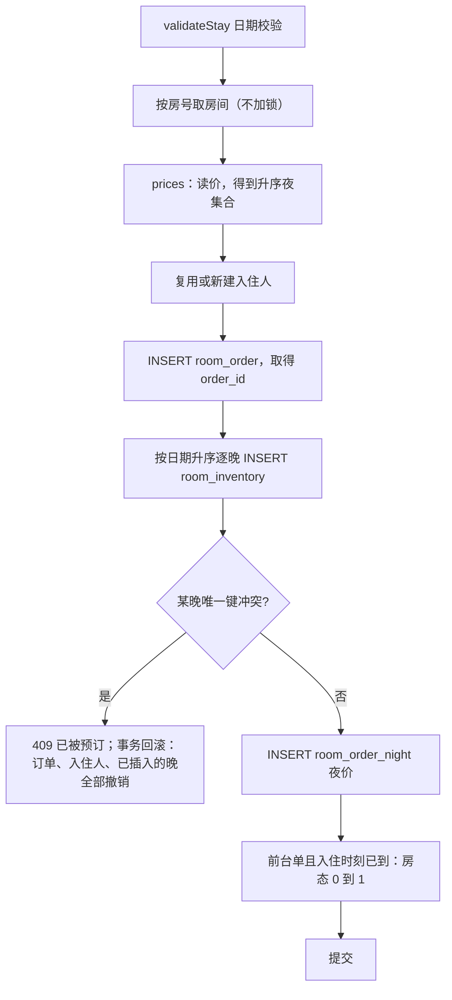
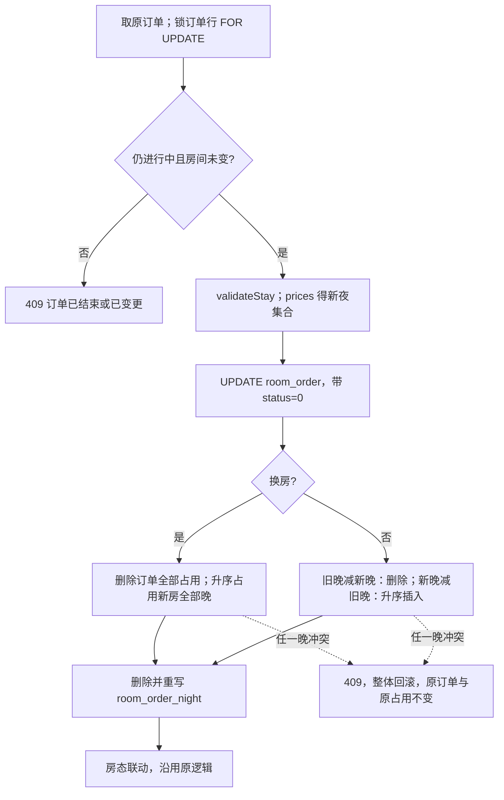
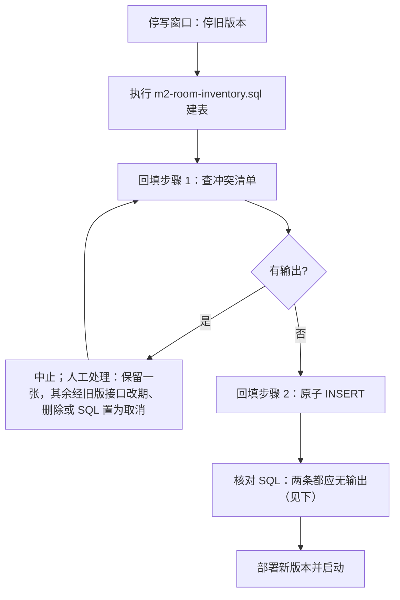
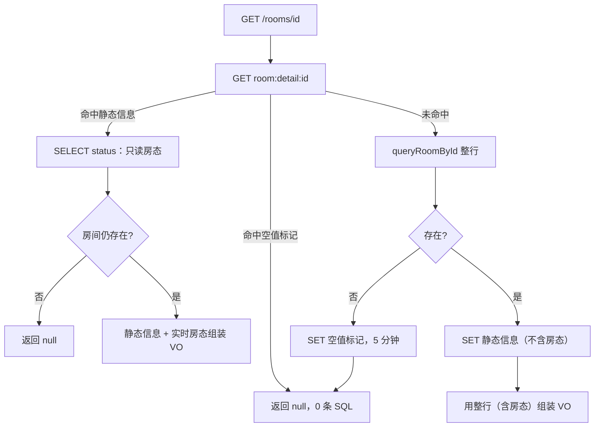
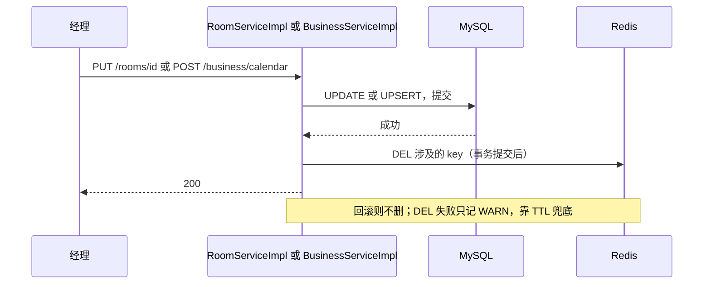

# 下单幂等、每日库存与 Redis 缓存：技术方案

## 1. 背景与目标

基线是分支 nova/booking-agent（48c56aa，含住客预订助手与 booking_request 表）。订单链路已能防超卖（锁房间行 + 区间重叠查询：`src/main/java/com/winniethepooh/hotelsystembackend/service/impl/OrderServiceImpl.java:108-109`），助手确认已用 booking_request 唯一键做到幂等（`src/main/java/com/winniethepooh/hotelsystembackend/agent/PendingActionService.java:78-84`）。仍有三处缺口（PRD §1.1）：

1. 普通下单没有请求幂等：DTO 里没有请求号（`src/main/java/com/winniethepooh/hotelsystembackend/dto/InsertRoomOrderDTO.java:10-18`），Controller 不读请求头（`src/main/java/com/winniethepooh/hotelsystembackend/controller/OrderController.java:56-65`）。网页连点或网关重发，同一住客同时订两间房这类「各自时段不重叠」的重复提交，冲突检查拦不住。
2. 库存没有按晚建模：冲突规则散落在下单、改期、报价三处共用的 `checkOverlap` 和空房搜索的 NOT EXISTS 里（`src/main/java/com/winniethepooh/hotelsystembackend/service/impl/OrderServiceImpl.java:206-209`、`src/main/resources/mapper/RoomMapper.xml:5-16`），没有一张能直接回答「某房某晚是否已售出」的表。
3. 热读全部查库：房间详情、房间列表价格、价格日历每次都走 MySQL；Redis 里只有登录态、限流和助手状态，没有业务缓存（`docs/codemap/hotelsystembackend/03-data.md:222`）。

### 1.1 目标与支撑章节

目标原文见 `docs/nova/booking-consistency/goal.md:10-13`。

| 目标 | 本方案怎么达成 | 支撑章节 | 验收章节 |
|---|---|---|---|
| G1 同一次下单意图最多生成一张订单 | POST /order 读 Idempotency-Key；扩展 booking_request 绑定请求方并存摘要；订单与幂等记录同事务；PROCESSING / SUCCESS / FAILED 与重放规则；与助手共用同一张表 | 4.1、4.4 | 6.1 |
| G2 同一间房同一晚最多被一张有效订单占用 | 新表 room_inventory，UNIQUE(room_id, stay_date)；按日期升序逐晚插入；所有订单写入口逐个接入占用与释放；区间重叠查询退役；迁移回填；死锁与锁等待转 409 | 4.2、4.4 | 6.2 |
| G3 房间静态信息与价格日历走缓存且不影响正确性 | HotCache：Cache Aside 读、事务提交后删 key、随机 TTL、空值缓存、Redis 故障降级；房态、可售、订单不缓存 | 4.3 | 6.3 |
| G4 不破坏现有行为 | 助手共用表的隔离设计；room_order_night 与营收统计 SQL 不动；受影响测试逐条调整；CI 命令不变 | 4.1.4、4.2.9、5.1、5.2 | 6.4 |

### 1.2 范围

包括：POST /order 的请求幂等（含 app.js 携带 key）、booking_request 扩展、room_inventory 与全部占用 / 释放入口、迁移回填脚本、助手查空房与提议改用库存表、房间静态信息与价格日历缓存、测试要点、上线与回滚；分 M1（幂等）、M2（库存）、M3（缓存）三批交付（`docs/nova/booking-consistency/goal.md:17`）。

不包括：按房型卖房；Kafka 等消息队列；微服务拆分与分布式事务；支付、取消接口的请求幂等；缓存房态、可售状态、订单；性能压测与性能指标承诺；热点键互斥重建（`docs/nova/booking-consistency/goal.md:18`）。也不加分布式锁。

### 1.3 术语

- 夜：一个日期。入住区间按左闭右开 [入住日, 离店日)，离店当天不占用。
- 有效订单：status=0（进行中）且未软删除。
- 占用行：room_inventory 的一行，表示某房某夜被某订单占用；行存在即占用。

## 2. 现状

### 2.1 客房订单写入口与冲突控制

「占用区间」目前只在 `findOverlappingOrder` 与 `findAvailableRooms` 两处判定，口径一致：status=0、未删除、时刻左闭右开、首尾相接不冲突（`src/main/resources/mapper/OrderMapper.xml:99-105`、`src/main/resources/mapper/RoomMapper.xml:9-13`）。取消、完成、软删除一提交就让订单不再被这两处看到，所以现在不需要「释放」动作。

| 入口 | 处理链 | 事务 | 锁与冲突检查 | 幂等 |
|---|---|---|---|---|
| POST /order（住客） | `src/main/java/com/winniethepooh/hotelsystembackend/controller/OrderController.java:58-61` → `src/main/java/com/winniethepooh/hotelsystembackend/service/impl/OrderServiceImpl.java:100-126` | @Transactional（101） | `lockRoomByNumber … for update`（108，`src/main/resources/mapper/RoomMapper.xml:17-19`）+ `checkOverlap`（109） | 无 |
| POST /order（前台开单） | `src/main/java/com/winniethepooh/hotelsystembackend/controller/OrderController.java:63` → `src/main/java/com/winniethepooh/hotelsystembackend/service/impl/OrderServiceImpl.java:94-98` → 同上私有方法 | @Transactional（95） | 同上；入住时刻已到则房态 0→1（123-124） | 无 |
| 助手确认 BOOKING | `src/main/java/com/winniethepooh/hotelsystembackend/agent/PendingActionService.java:66-96`、`:121-127` | TransactionTemplate 外层，内层加入（78-84） | 同住客下单 | booking_request.request_id 唯一键 |
| PUT /order/{id}（前台改期、换房） | `src/main/java/com/winniethepooh/hotelsystembackend/controller/OrderController.java:67-71` → `src/main/java/com/winniethepooh/hotelsystembackend/service/impl/OrderServiceImpl.java:128-159` | @Transactional（129） | 按房间 id 升序锁两间（136-139）、锁订单行（140）、`checkOverlap` 排除自身（146） | 订单须仍进行中，`modifyRoomOrder` 带 status=0（141-142、152） |
| POST /order/cancel（住客取消，已付置退款 pay_status=2） | `src/main/java/com/winniethepooh/hotelsystembackend/service/impl/OrderServiceImpl.java:172-178` | 无注解，单条 UPDATE | 条件 UPDATE：本人、status=0、入住时刻未到（`src/main/resources/mapper/OrderMapper.xml:134-139`） | 条件 UPDATE |
| 助手确认 CANCEL | `src/main/java/com/winniethepooh/hotelsystembackend/agent/PendingActionService.java:137-139` | TransactionTemplate | 同上 | booking_request |
| 超时取消（每分钟第 2 秒） | `src/main/java/com/winniethepooh/hotelsystembackend/service/CustomTaskScheduler.java:54-58` | @Transactional，单条 UPDATE | 条件：住客单、status=0、pay=0、创建超 15 分钟（`src/main/resources/mapper/OrderMapper.xml:141-150`） | 条件 UPDATE |
| DELETE /order/{id}（经理软删除） | `src/main/java/com/winniethepooh/hotelsystembackend/service/impl/OrderServiceImpl.java:161-162` → `src/main/resources/mapper/OrderMapper.xml:111-116` | 无 | 无状态条件，按 id 软删 | 无 |
| PUT /rooms 占用→空闲（提前结束） | `src/main/java/com/winniethepooh/hotelsystembackend/service/impl/RoomServiceImpl.java:63-74` | @Transactional（64） | `lockRoomById`（67）；当前订单置 DONE（70-71） | 无 |
| 退房任务（每分钟第 0 秒） | `src/main/java/com/winniethepooh/hotelsystembackend/service/CustomTaskScheduler.java:29-42` | @Transactional + scheduler_task_lock | 到离店时刻的订单置 DONE | 分钟抢占 |
| 支付、助手确认 PAYMENT | `src/main/java/com/winniethepooh/hotelsystembackend/service/impl/OrderServiceImpl.java:164-170` | 无 | 条件 UPDATE，不改区间 | 条件 UPDATE |

### 2.2 区间重叠查询的使用点（回答代码地图 Q9）

| 使用点 | 出处 | 加锁 |
|---|---|---|
| 下单 `checkOverlap` | `src/main/java/com/winniethepooh/hotelsystembackend/service/impl/OrderServiceImpl.java:109` | `findOverlappingOrder … limit 1 for update`（`src/main/resources/mapper/OrderMapper.xml:99-105`），外加房间行锁（108） |
| 改期 `checkOverlap`（排除自身） | `src/main/java/com/winniethepooh/hotelsystembackend/service/impl/OrderServiceImpl.java:146` | 同上 |
| 报价 `quoteRoomService`（助手 get_price_quote、propose_booking） | `src/main/java/com/winniethepooh/hotelsystembackend/service/impl/OrderServiceImpl.java:51-57`、`src/main/java/com/winniethepooh/hotelsystembackend/agent/AgentTools.java:228-232`、`:264-276` | 同样 `for update`；助手工具又包在带截止时间的事务里（`src/main/java/com/winniethepooh/hotelsystembackend/agent/AgentTools.java:148-154`） |
| 助手搜空房 `findAvailableRooms` | `src/main/resources/mapper/RoomMapper.xml:5-16`、`src/main/java/com/winniethepooh/hotelsystembackend/service/impl/OrderServiceImpl.java:59-66` | 无锁 NOT EXISTS |

Q9 的结论：报价、下单、改期共用同一个 `checkOverlap`（`src/main/java/com/winniethepooh/hotelsystembackend/service/impl/OrderServiceImpl.java:55`、`:109`、`:146`），代码里没有为报价单独写只读版本，也没有注释说明报价加锁是有意的（`docs/codemap/hotelsystembackend/README.md:103`）。本方案让报价只读、不加锁（见 4.2.5）。

### 2.3 booking_request 现状（回答代码地图 Q10 的现状部分）

- 表：id、request_id（唯一）、user_id（INT，非空）、action_type、order_id、status、created_at、updated_at；索引只有 request_id 唯一键和 user_id 普通索引（`src/main/resources/db/schema.sql:199-214`）。没有请求方角色、没有请求摘要、没有失败原因，也没有清理逻辑（`docs/codemap/hotelsystembackend/README.md:104`）。
- 住客与员工 id 取值空间重叠：user、staff 各自 INT 自增主键（`src/main/resources/db/schema.sql:8-21`、`:37-49`），所以只存 user_id 无法区分「住客 5」与「前台 5」。
- Mapper：`insertBookingRequest` 四参（requestId、userId、actionType、status）、`markBookingRequestSuccess`（仅 PROCESSING 行改 SUCCESS）、`findBookingRequest`（`src/main/java/com/winniethepooh/hotelsystembackend/mapper/OrderMapper.java:26-30`、`src/main/resources/mapper/OrderMapper.xml:5-16`）。
- 助手确认：事务内依次 INSERT PROCESSING → 执行业务 → UPDATE SUCCESS，业务失败整体回滚，所以 PROCESSING 只存在于未提交事务里（`src/main/java/com/winniethepooh/hotelsystembackend/agent/PendingActionService.java:78-84`、`src/main/resources/db/schema.sql:199-200`）。并发的第二个 INSERT 在唯一键上等待，收到 DuplicateKeyException 或悲观锁失败后，在事务外重读记录（`src/main/java/com/winniethepooh/hotelsystembackend/agent/PendingActionService.java:85-91`）。
- 助手取消：自动提交地 INSERT CANCELLED，与确认靠同一唯一键分出胜者（`src/main/java/com/winniethepooh/hotelsystembackend/agent/PendingActionService.java:108-113`）。
- 读记录：`byRecord` 在 SUCCESS 分支用 `PendingAction.Type.valueOf(record.getActionType())` 还原类型（`src/main/java/com/winniethepooh/hotelsystembackend/agent/PendingActionService.java:155-163`），枚举只有四个值（`src/main/java/com/winniethepooh/hotelsystembackend/agent/PendingAction.java:8`）。

### 2.4 错误处理

BusinessException 自带 HttpStatus，约定冲突 409、不存在 404、参数 400（`src/main/java/com/winniethepooh/hotelsystembackend/exception/BusinessException.java:5-20`）；统一返回 `Result{code:1,msg}`。GlobalExceptionHandler 只处理 BusinessException、Spring MVC 异常和兜底 Exception（500，通用提示）（`src/main/java/com/winniethepooh/hotelsystembackend/exception/GlobalExceptionHandler.java:33-42`）：**没有 DuplicateKeyException、死锁、锁等待超时的处理，这些异常目前会变成 500。**M2 的唯一键冲突与锁冲突必须在本方案里转换掉。

### 2.5 房间与价格的读写入口、Redis 现状

| 入口 | 出处 | 说明 |
|---|---|---|
| GET /rooms（列表） | `src/main/java/com/winniethepooh/hotelsystembackend/service/impl/RoomServiceImpl.java:113-127`、`src/main/resources/mapper/RoomMapper.xml:122-147` | 列表 + 计数两条 SQL；`date`（Controller 缺省今天：`src/main/java/com/winniethepooh/hotelsystembackend/controller/RoomController.java:31`）非空时 LEFT JOIN price_calendar，缺价用房型默认价 |
| GET /rooms/{id}（详情） | `src/main/java/com/winniethepooh/hotelsystembackend/service/impl/RoomServiceImpl.java:76-80`、`src/main/resources/mapper/RoomMapper.xml:84-93` | 整行读 room，排除软删；不存在或已删返回 data=null（200），VO 含房态 status |
| GET /business/calendar | `src/main/java/com/winniethepooh/hotelsystembackend/service/impl/BusinessServiceImpl.java:267-274`、`src/main/resources/mapper/RoomMapper.xml:108-113` | 一条区间 SQL，未设价日期返回 null 项 |
| 下单、改期、报价、助手搜房的计价 | `src/main/java/com/winniethepooh/hotelsystembackend/service/impl/OrderServiceImpl.java:211-219` | 一次区间读价格日历，缺日用默认价 |
| 房态墙 | `src/main/java/com/winniethepooh/hotelsystembackend/service/impl/RoomServiceImpl.java:106-111`、`src/main/resources/mapper/RoomMapper.xml:164-182` | 一条 JOIN SQL（含当日价、当日入住人、房态） |
| POST /rooms | `src/main/java/com/winniethepooh/hotelsystembackend/service/impl/RoomServiceImpl.java:82-88` | 写 room，`insertRoom` 不回填 id（`src/main/resources/mapper/RoomMapper.xml:29-33`） |
| PUT /rooms/{id}、DELETE /rooms/{id} | `src/main/java/com/winniethepooh/hotelsystembackend/service/impl/RoomServiceImpl.java:90-104` | 无事务注解，单条 UPDATE 自动提交 |
| POST /business/calendar | `src/main/java/com/winniethepooh/hotelsystembackend/service/impl/BusinessServiceImpl.java:262-265`、`src/main/resources/mapper/RoomMapper.xml:35-42` | 一条多 VALUES UPSERT，无事务注解，区间最多 366 天（`src/main/java/com/winniethepooh/hotelsystembackend/service/impl/BusinessServiceImpl.java:55-58`） |
| 房态写入 | `src/main/java/com/winniethepooh/hotelsystembackend/service/impl/RoomServiceImpl.java:63-74`、`src/main/resources/mapper/RoomMapper.xml:23-28` | PUT /rooms，以及下单、改期、定时任务的 0→1、1→2 条件更新 |

Redis 现状：全部 key 是登录态、登录失败限流、助手限流 / 卡片 / 会话（`docs/codemap/hotelsystembackend/03-data.md:227-237`）；本次在 src 与 pom.xml 检索 `@Cacheable`、`EnableCaching`、`CacheManager`、`starter-cache`、`TransactionSynchronization` 均无命中，没有任何业务缓存。**LoginFilter 对每个非公共请求都先读 Redis 取 token，读失败按 401 拒绝**（`src/main/java/com/winniethepooh/hotelsystembackend/filter/LoginFilter.java:57-71`），这决定了 G3「Redis 停止」的验收只能验证缓存层降级（见 D-015）。

### 2.6 前端

- `api()` 统一发请求，headers 只含 token 与 Content-Type，`options` 在对象展开时放在 headers 之后，传 `headers` 会整体覆盖（`src/main/resources/static/app.js:72-79`）。
- `submit()` 已在提交期间禁用按钮、`finally` 里恢复（`src/main/resources/static/app.js:109-120`），PRD 要求的「提交期间按钮禁用」不用新做。
- 两处 POST /order：住客预订（`src/main/resources/static/app.js:291-293`）、前台开单（`src/main/resources/static/app.js:308-310`），都没有 Idempotency-Key。
- CORS 允许任意请求头（`src/main/java/com/winniethepooh/hotelsystembackend/config/GlobalCorsConfig.java:21`），自定义头不需要改过滤器。

### 2.7 测试基建（复用）

| 能力 | 出处 |
|---|---|
| 真实 HTTP + Testcontainers MySQL 8.0 / Redis 7；每个测试前清表、FLUSHDB、写基础数据 | `src/test/java/com/winniethepooh/hotelsystembackend/support/IntegrationTestBase.java:39-91` |
| `Fixtures.reset()` 从 information_schema 读全部表名 TRUNCATE，新增表自动包含 | `src/test/java/com/winniethepooh/hotelsystembackend/support/Fixtures.java:150-158` |
| `Fixtures.roomOrder(...)` 直接 SQL 插订单（不经过服务层，不会产生占用） | `src/test/java/com/winniethepooh/hotelsystembackend/support/Fixtures.java:357-372` |
| SqlCounter：条数与 SQL 文本（`statements()`） | `src/test/java/com/winniethepooh/hotelsystembackend/support/SqlCounter.java:18-50` |
| 并发屏障 `together(...)`（线程池 + CountDownLatch 同时放行） | `src/test/java/com/winniethepooh/hotelsystembackend/OrderWorkflowIT.java:103-116` |
| `@SpyBean OrderMapper` 注入故障；SQL 触发器造回滚 | `src/test/java/com/winniethepooh/hotelsystembackend/OrderWorkflowIT.java:40`、`:279-285`、`:462-479` |
| test profile 关闭 cron，测试里直接调 CustomTaskScheduler 方法 | `src/test/resources/application-test.yml:7-8` |

### 2.8 先找现成的：复用与新建结论

| 要做的事 | 搜了什么 | 结论 |
|---|---|---|
| 每日库存表 | 在 src 全文检索 `inventory`、`stay_date`（java、xml、sql、js） | 无命中。room_order_night 是按订单的营收快照，取消后保留，不能承担占用语义（4.2.9）→ 新建 room_inventory；SQL 并入现有 OrderMapper、RoomMapper，不新增 Mapper 接口 |
| 幂等表 | booking_request 已有唯一键与 PROCESSING / SUCCESS 机制 | 扩展该表，不新建 |
| 幂等执行骨架 | PendingActionService 的 TransactionTemplate + 唯一键 + 事务外重读 | 沿用同一写法，新建 `OrderRequestService`（助手的实现绑定 PendingAction，不抽公共基类，避免改动助手代码） |
| 清理任务 | CustomTaskScheduler、SchedulingConfig 开关（`src/main/java/com/winniethepooh/hotelsystembackend/config/SchedulingConfig.java:11-14`） | 在 CustomTaskScheduler 里加一个方法 |
| 夜集合 | `prices()` 的返回 map 的 keySet 就是 [入住日, 离店日) 升序（`src/main/java/com/winniethepooh/hotelsystembackend/service/impl/OrderServiceImpl.java:211-219`、`src/main/java/com/winniethepooh/hotelsystembackend/utils/LocalDateUtil.java:12-23`） | 直接复用作为占用日期，不另写日期展开 |
| 缓存 | 无 Spring Cache；StringRedisTemplate 与 ObjectMapper 是现成 bean（`src/main/java/com/winniethepooh/hotelsystembackend/agent/PendingActionService.java:44-48` 已在注入使用） | 新建薄封装 `HotCache`，底层用 StringRedisTemplate；不引入 Spring Cache（它不支持每键随机 TTL，也要额外写降级处理） |
| 配置开关写法 | `@Value("${hotel.login.max-failures:5}")`（`src/main/java/com/winniethepooh/hotelsystembackend/service/LoginAttemptService.java:23-28`） | HotCache 用同样的 `@Value` 方式读开关 |

### 2.9 与既有设计稿 docs/booking-consistency.md 的出入

既有设计稿是演进设计，不是现有能力（`docs/booking-consistency.md:3`）。本方案按 PRD 与代码现状调整，有出入的地方如下，M2 上线时同步改写该文档。

| 项 | 设计稿 | 本方案 | 原因 |
|---|---|---|---|
| 库存行模型 | 预生成每日行，`available` 标志位 + 条件 UPDATE 看影响行数（`docs/booking-consistency.md:33-43`、`:76-85`） | 行存在即占用，INSERT 撞唯一键即冲突，没有 available 列 | PRD §4.2 模型；不需要预生成日历行，也不需要维护标志位 |
| booking_request | 无 action_type、角色、摘要（`docs/booking-consistency.md:45-55`） | 保留现有 action_type，新增 requester_role、request_hash、fail_status、fail_message | 现表已有 action_type 并服务助手；需绑定请求方 |
| 失败状态 | FAILED 可按重试策略回到 PROCESSING（`docs/booking-consistency.md:99-114`） | FAILED 是终态，同 key 同内容原样重放；其余失败随事务回滚、不留记录 | 与助手「PROCESSING 只在事务内」一致，不会卡死（见 D-007） |
| 死锁 | 有限次重试加随机退避（`docs/booking-consistency.md:133-138`） | 不自动重试，转 409 | 简化，演示项目（D-012） |
| 缓存范围 | 可缓存「面向用户的可售状态」（`docs/booking-consistency.md:142`） | 不缓存房态、可售、订单 | goal.md 不包括项 |

## 3. 方案概览

核心思路：三层各管一件事，且都以数据库约束为最终依据。**M1** 用 booking_request 的 request_id 唯一键，把「同一个 Idempotency-Key 最多生成一张订单」放进与订单同一个事务；**M2** 用 room_inventory 的 (room_id, stay_date) 唯一键，把「同一房同一晚最多一张有效订单」交给数据库裁决，退役区间重叠查询；**M3** 只缓存房间静态信息与价格日历，读走 Cache Aside，写在事务提交后删 key，缓存永远不参与「能不能订」的判断。



### 3.1 三批交付

| 批次 | 目标 | 数据库 | 主要改动 | 依赖 | 独立上线 / 回滚 |
|---|---|---|---|---|---|
| M1 幂等 | G1 | booking_request 加 4 列 + 1 索引（ALTER） | 新增 OrderRequestService；改 OrderController、OrderService、OrderMapper、BookingRequest、CustomTaskScheduler、PendingActionService（一处守卫）、app.js | 无 | 是；回滚 jar 即可，新增列有默认值 / 可空 |
| M2 库存 | G2 | 新表 room_inventory；历史订单回填 | OrderServiceImpl、RoomServiceImpl、CustomTaskScheduler、OrderMapper、RoomMapper、GlobalExceptionHandler；回填脚本 | 无（先 M1 更稳，非必须） | 是；回滚 jar，再上线前需清空并重新回填（5.7） |
| M3 缓存 | G3 | 无 | 新增 HotCache；改 RoomServiceImpl、BusinessServiceImpl、RoomMapper、application.yml | 无 | 是；配置开关即可关闭 |

### 3.2 考虑过但没采用

- Spring Cache（`@Cacheable`）：不支持每键随机 TTL 与空值差异化 TTL，降级要另写 CacheErrorHandler，不如 30 行薄封装直观。
- 保留房间行锁 + 区间重叠查询作双保险：两套规则会不一致，PRD D2 已定退役（D-002）。
- 既有设计稿的 available 标志位 + 条件 UPDATE：要预生成日历行并维护标志位；行存在即占用 + 唯一键插入更简单（2.9）。
- 幂等先单独提交 PROCESSING 占位行：能立刻返回「处理中」，但崩溃会留下永久 PROCESSING，要写遗弃回收，且与助手「PROCESSING 只在事务内」的约定不同（D-006）。
- 改期全量「删旧再插新」：持有旧行锁的同时等新行，增加死锁概率；改为只动差集（4.2.4）。
- 回填用 Java 启动任务：一次性运维动作，用 SQL 脚本更直观，可人工审阅冲突清单。
- 分布式锁、消息队列、按房型卖房：范围外（1.2）。

### 3.3 建议的 Story 切分

| Story | 内容 | 依赖 |
|---|---|---|
| M1-S1 | booking_request DDL / 迁移脚本 / schema.sql、BookingRequest 字段、OrderMapper 新增 SQL | 无 |
| M1-S2 | OrderRequestService、OrderController 读请求头、`insertRoomOrderByFrontService` 返回订单号、单元与集成测试 | M1-S1 |
| M1-S3 | 助手 `byRecord` 守卫与助手回归测试 | M1-S1 |
| M1-S4 | app.js 携带 key、网络错误重试、浏览器测试断言 | M1-S2 |
| M1-S5 | 7 天清理任务与测试 | M1-S1 |
| M2-S1 | room_inventory DDL / schema.sql / 回填脚本与回填测试、Fixtures 自动写占用 | 无 |
| M2-S2 | 占用 / 释放基础设施：Mapper SQL、occupy、reoccupy、release、错误转换、GlobalExceptionHandler | M2-S1 |
| M2-S3 | 下单（住客、前台、助手确认）接入占用，退役 lockRoomByNumber 与重叠查询 | M2-S2 |
| M2-S4 | 取消、超时取消、软删除、提前结束接入释放 | M2-S2 |
| M2-S5 | 改期接入差集占用 | M2-S2 |
| M2-S6 | 报价与空房搜索改用库存表 | M2-S1 |
| M2-S7 | 并发与一致性测试、现有测试调整 | M2-S3～S6 |
| M3-S1 | HotCache、开关与 Redis 超时配置、单元测试 | 无 |
| M3-S2 | 房间详情读缓存与改 / 删时清 key | M3-S1 |
| M3-S3 | 房间列表价格与价格日历读缓存、改价时清 key | M3-S1 |
| M3-S4 | 故障注入、不缓存房态、计价读库的回归测试 | M3-S2、M3-S3 |

## 4. 详细设计

### 4.1 M1：下单请求幂等

#### 4.1.1 接口

- POST /order（住客下单、前台开单）新增可选请求头 `Idempotency-Key`（D-001）。不带：完全按旧逻辑，不读不写 booking_request。带：8～64 位字母、数字、下划线或连字符（D-009），否则 400；空白头视为非法。
- 请求体、成功响应不变：住客返回订单 id，前台返回空 data（`src/main/java/com/winniethepooh/hotelsystembackend/controller/OrderController.java:58-64`）。重放时响应与首次相同。
- `@Valid` 校验失败发生在进入服务之前，不占用 key。

重复请求的判定顺序（命中记录后依次判断，先命中先返回）：

| 顺序 | 条件 | HTTP | msg | 说明 |
|---|---|---|---|---|
| 1 | 记录的 user_id 或 requester_role 与当前身份不同 | 409 | 请求号已被占用，请更换后重试 | 不含原订单号、房号等任何信息（D-008） |
| 2 | 记录 action_type 不是 ORDER，或 request_hash 与本次不同 | 422 | 请求号与内容不一致 | 含「用助手确认卡片的 actionId 当 key」 |
| 3 | status=SUCCESS | 200 | success | 返回记录里的 order_id（前台角色返回空 data） |
| 4 | status=FAILED | fail_status | fail_message | 原样重放首次失败 |
| 5 | status=PROCESSING | 409 | 请求处理中，请稍后重试 | 正常流程里读不到该状态（见 4.1.2），仅作防御 |

#### 4.1.2 流程与状态

PROCESSING 与订单同事务：INSERT 后未提交，其他连接读不到；事务回滚时该行随之消失。因此数据库里不会残留 PROCESSING，崩溃也不会卡死。并发的第二个相同 key 请求在唯一键上等待首个事务结束（与助手确认同一机制：`src/main/java/com/winniethepooh/hotelsystembackend/agent/PendingActionService.java:85-91`）。





执行骨架（`src/main/java/com/winniethepooh/hotelsystembackend/service/OrderRequestService.java`，新建；写法沿用助手确认）：

```java
public Long placeOrder(String key, InsertRoomOrderDTO dto) {
    if (key == null) return place(dto);                    // D-001：不带 key 走原逻辑
    requireValidKey(key);                                   // 400
    Integer uid = BaseContext.getCurrentId(), role = BaseContext.getCurrentRole();
    String hash = digest(dto, role);
    BookingRequest old = mapper.findBookingRequest(key);
    if (old != null) return replay(old, uid, role, hash);   // 4.1.1 的判定顺序
    try {
        return tx.execute(s -> {
            mapper.insertOrderRequest(key, uid, role, "PROCESSING", hash, null, null);
            Long id = place(dto);                           // 原 insertRoomOrderBy*Service，加入同一事务
            if (mapper.markBookingRequestSuccess(key, id) != 1)
                throw new BusinessException(HttpStatus.CONFLICT, "请求处理中，请稍后重试");
            return id;
        });
    } catch (DuplicateKeyException | PessimisticLockingFailureException e) {
        BookingRequest r = mapper.findBookingRequest(key);  // 事务已回滚，在事务外重读
        if (r != null) return replay(r, uid, role, hash);
        throw new BusinessException(HttpStatus.CONFLICT, "请求处理中，请稍后重试");
    } catch (BusinessException e) {
        if (e.getStatus() == HttpStatus.BAD_REQUEST || e.getStatus() == HttpStatus.NOT_FOUND)
            recordFailed(key, uid, role, hash, e);          // 单独 INSERT FAILED；DuplicateKey 或其他异常只记 WARN
        throw e;
    }
}
```

各种情形的结果：

| 情形 | 结果 | booking_request |
|---|---|---|
| 顺序重复（首单已提交） | 查到 SUCCESS，返回同一订单号 | 1 行 SUCCESS |
| 并发重复（首单仍在执行） | 后到者在唯一键上等待；首单提交后收到 DuplicateKeyException，重读得 SUCCESS，返回同一订单号。等待超过 InnoDB 锁等待超时或死锁则返回 409 请求处理中（D-006） | 1 行 SUCCESS |
| 他人复用同 key | 409，不泄露原请求 | 不变 |
| 同 key 内容不一致 | 422 | 不变 |
| 首次 400 / 404（日期非法、房间不存在） | 回滚后记 FAILED；重试同 key 同内容得到同样的 400 / 404，不会下单 | 1 行 FAILED（D-007） |
| 首次 409（库存冲突）、锁冲突、500 | 回滚，不记录；同 key 重试等于重新执行，条件满足就成功（只会生成 1 张） | 无 |
| 首次成功但响应丢失 | 重试同 key 查到 SUCCESS，返回同一订单号 | 1 行 SUCCESS |

`OrderRequestService` 本身不加 `@Transactional`：事务只开在 `tx.execute` 内，回滚后才能在事务外重读记录、写 FAILED。两个并发请求同时失败于 400 时，各自回滚后都想写 FAILED，后者撞唯一键，忽略即可。同一 key + 同内容的失败是确定性的，所以后来者无论是重放还是重新执行都得到同样结果。FAILED 行保留 7 天，期间同 key 修正内容后会得到 422；网页每次点击生成新 key，不受影响（4.1.6）。

#### 4.1.3 数据：booking_request 扩展

迁移脚本 `src/main/resources/db/migration/m1-booking-request.sql`（新建，手工执行，D-013）：

```sql
ALTER TABLE booking_request
    ADD COLUMN requester_role TINYINT      NOT NULL DEFAULT 0 COMMENT '请求方角色，取值同 RoleConstant，助手记录默认住客 0' AFTER user_id,
    ADD COLUMN request_hash   CHAR(64)     NULL COMMENT '请求摘要 SHA-256，助手记录为空',
    ADD COLUMN fail_status    INT          NULL COMMENT 'FAILED 时的 HTTP 状态',
    ADD COLUMN fail_message   VARCHAR(255) NULL COMMENT 'FAILED 时的失败原因',
    ADD KEY idx_booking_request_created (created_at);
```

- 默认值依据：助手只服务住客，类级 `@RoleRequired(USER)`（`src/main/java/com/winniethepooh/hotelsystembackend/controller/AgentController.java:19-22`），已有行都是住客，默认 0 正确。
- `src/main/resources/db/schema.sql:199-214` 的 booking_request 定义同步改为含新列（新库用）；旧库执行迁移脚本。ALTER 不可重复执行，重复执行会报列已存在，属预期。README 里手工 DDL 的说明（`README.md:232-251`）同步补充。
- `request_id` 唯一键不变：同一个 key 全局唯一，归属靠 user_id + requester_role 校验。
- `BookingRequest` 实体增加 requesterRole、requestHash、failStatus、failMessage（`src/main/java/com/winniethepooh/hotelsystembackend/entity/BookingRequest.java:6-16`）；`findBookingRequest` 是 `select *`（`src/main/resources/mapper/OrderMapper.xml:14-16`），新列自动映射。
- Mapper 新增：`insertOrderRequest(requestId, userId, role, status, hash, failStatus, failMessage)`（action_type 固定写 `ORDER`）、`deleteExpiredBookingRequests()`。复用不改：`markBookingRequestSuccess`、`findBookingRequest`、四参 `insertBookingRequest`。

#### 4.1.4 与助手确认共用 booking_request

| 维度 | 助手行（现有，不改） | 网页 / 前台行（新增） |
|---|---|---|
| action_type | BOOKING、PAYMENT、CANCEL、MEAL_ORDER | ORDER |
| status | PROCESSING（仅事务内）、SUCCESS、CANCELLED | PROCESSING（仅事务内）、SUCCESS、FAILED |
| requester_role | 默认 0（住客） | 当前 BaseContext 角色 |
| request_hash | 空 | SHA-256 |
| 写入 | `insertBookingRequest` 四参，签名不变 | `insertOrderRequest` |
| 读取、成功回写 | `findBookingRequest`、`markBookingRequestSuccess` | 同一方法 |

确认 / 取消互斥不被破坏的理由：

1. 互斥靠同一 request_id 唯一键上两个 INSERT 竞争（确认事务内 INSERT PROCESSING、取消自动提交 INSERT CANCELLED，`src/main/java/com/winniethepooh/hotelsystembackend/agent/PendingActionService.java:78-90`、`:108-113`）。M1 不改这两处的 SQL、签名与事务边界；新增列都有默认值或可空，四参 INSERT 照常执行。
2. 两类记录靠 action_type 隔离。唯一要改的助手代码是 `byRecord` 开头加一行守卫：记录的 action_type 不是 `PendingAction.Type` 的四个值时，按「确认卡片已失效」404 处理，放在 `requireOwner` 之前。否则用网页 key 当 actionId 调 confirm 会在 `Type.valueOf("ORDER")` 处抛 IllegalArgumentException 变成 500（`src/main/java/com/winniethepooh/hotelsystembackend/agent/PendingActionService.java:155-159`）。
3. 反向：网页请求撞上助手 actionId，同一请求方得到 422，他人得到 409（4.1.1 的顺序 1、2）。
4. 清理对两类行一视同仁（4.1.7）；助手卡片在 Redis 只活 10 分钟（`src/main/java/com/winniethepooh/hotelsystembackend/agent/AgentProperties.java:15`），7 天后不会有对应卡片。
5. 助手测试（`AgentActionIT` tc006～tc020、`PendingActionServiceTest`）不改动，作为回归。

#### 4.1.5 请求摘要

规范串 = 用 `|` 连接：roomNumber、checkInTime、checkOutTime、name、phone、idCard，前台角色再追加 paid；null 当空串；时间取解析后的 `LocalDateTime.toString()`（所以 `T14:00` 与 `T14:00:00` 等价）；对规范串做 SHA-256，转 64 位小写十六进制（JDK `MessageDigest`）。住客角色的 paid 被服务端忽略（`src/main/java/com/winniethepooh/hotelsystembackend/service/impl/OrderServiceImpl.java:100-104`、`:119`），不进摘要，避免无意义的 422。数据库只存摘要，不存入住人明文；日志不写 key 之外的请求内容。

#### 4.1.6 前端 app.js

- 新增 `postOrder(body)`，两处 POST /order 都改为调用它：每次点击生成一个 key；仅在 fetch 抛出（网络错误，没有 HTTP 状态）时自动重试，最多 2 次，间隔 0.5 秒、1 秒，**复用同一个 key**；有 HTTP 响应（含 409 处理中、422）一律不重试，直接显示错误（D-021）。
- `api()` 改为合并 headers：`fetch(path, { method, body, ...options, headers: { ...headers, ...options.headers } })`，原来的 `signal` 选项（`src/main/resources/static/app.js:584`）不受影响。
- `crypto.randomUUID` 只在安全上下文可用；回退用 `crypto.getRandomValues` 生成 32 位十六进制，长度与字符集仍满足服务端校验。
- 提交期间禁用按钮已由 `submit()` 实现，不改（2.6）。

```js
function newKey() {
  return crypto.randomUUID ? crypto.randomUUID()
    : [...crypto.getRandomValues(new Uint8Array(16))].map(b => b.toString(16).padStart(2, '0')).join('');
}
async function postOrder(body) {
  const key = newKey();                       // 一次点击一个 key
  for (let attempt = 0; ; attempt++) {
    try { return await api('/order', 'POST', body, { headers: { 'Idempotency-Key': key } }); }
    catch (error) {
      if (error.status !== undefined || attempt >= 2) throw error;   // 有 HTTP 状态就不重试
      await new Promise(resolve => setTimeout(resolve, 500 * (attempt + 1)));
    }
  }
}
```

`requestError` 创建的错误带 `status`，fetch 网络错误没有（`src/main/resources/static/app.js:52`、`:65-71`），以此区分。

#### 4.1.7 清理任务（D-005，回答 Q10）

保留期限 7 天。`CustomTaskScheduler` 新增 `cleanBookingRequests()`：`@Scheduled(cron = "0 30 3 * * ?")`、`@Transactional`，执行单条 `delete from booking_request where created_at < DATE_SUB(NOW(), INTERVAL 7 DAY)`，INFO 日志记删除行数（D-022）。cron 受 `hotel.scheduler.enabled` 控制（`src/main/java/com/winniethepooh/hotelsystembackend/config/SchedulingConfig.java:11-14`），test profile 关闭，测试直接调用方法。多实例同时执行是安全的（DELETE 幂等），不加任务锁。同时清理助手行：它们对应的卡片早已过期。演示规模下单条 DELETE 足够，数据量大时改分批。

#### 4.1.8 M1 改动点

| 类型 | 文件 | 改动 |
|---|---|---|
| 表 | `src/main/resources/db/schema.sql`、`src/main/resources/db/migration/m1-booking-request.sql`（新建） | 4.1.3 |
| 后端 | `src/main/java/com/winniethepooh/hotelsystembackend/service/OrderRequestService.java`（新建） | 4.1.2、4.1.5 |
| 后端 | `src/main/java/com/winniethepooh/hotelsystembackend/controller/OrderController.java` | 读 `@RequestHeader(value = "Idempotency-Key", required = false)`，调 `placeOrder`，成功响应的角色分支不变 |
| 后端 | `src/main/java/com/winniethepooh/hotelsystembackend/service/OrderService.java`、`.../service/impl/OrderServiceImpl.java` | `insertRoomOrderByFrontService` 返回订单 id（目前 void，唯一调用方是 Controller，`src/main/java/com/winniethepooh/hotelsystembackend/service/OrderService.java:28`） |
| 后端 | `src/main/java/com/winniethepooh/hotelsystembackend/mapper/OrderMapper.java`、`src/main/resources/mapper/OrderMapper.xml`、`src/main/java/com/winniethepooh/hotelsystembackend/entity/BookingRequest.java` | 4.1.3 |
| 后端 | `src/main/java/com/winniethepooh/hotelsystembackend/agent/PendingActionService.java` | `byRecord` 一行守卫 |
| 后端 | `src/main/java/com/winniethepooh/hotelsystembackend/service/CustomTaskScheduler.java` | `cleanBookingRequests` |
| 前端 | `src/main/resources/static/app.js` | 4.1.6 |
| 测试 | 新增 `OrderIdempotencyIT`、`OrderRequestServiceTest`；改 `PendingActionServiceTest`、`SchemaSqlIT`、`hotel.spec.js`（TC132、TC133 请求头断言） | 6.1 |
| 文档 | `README.md:22`、`README.md:232-251`、`docs/api-overview.md:81`、`docs/api-overview.md:195` | 补充 Idempotency-Key 说明、旧库 ALTER 步骤 |

### 4.2 M2：每日库存

#### 4.2.1 数据模型

```sql
CREATE TABLE IF NOT EXISTS room_inventory
(
    id         BIGINT   NOT NULL AUTO_INCREMENT,
    room_id    BIGINT   NOT NULL,
    stay_date  DATE     NOT NULL,
    order_id   BIGINT   NOT NULL,
    created_at DATETIME NOT NULL DEFAULT CURRENT_TIMESTAMP,
    PRIMARY KEY (id),
    UNIQUE KEY uk_room_inventory_room_date (room_id, stay_date),
    KEY idx_room_inventory_order (order_id)
) ENGINE = InnoDB DEFAULT CHARSET = utf8mb4 COMMENT = '客房每晚占用';
```

命名、引擎、字符集、不声明外键均沿用现有建表约定（`src/main/resources/db/schema.sql:85-124`）。room_id、order_id 与 room.id、room_order.id 同为 BIGINT。写入 `src/main/resources/db/schema.sql`（新库、测试容器都靠它建表：`src/test/java/com/winniethepooh/hotelsystembackend/support/IntegrationTestBase.java:53`），旧库用 `src/main/resources/db/migration/m2-room-inventory.sql`（同上 DDL）。

#### 4.2.2 占用与释放规则

1. 夜集合 = `prices()` 返回 map 的 keySet，即 [入住日, 离店日) 升序（2.8）。
2. 占用 `occupy(roomId, orderId, dates)`：对 dates **升序逐晚**单行 INSERT；任一晚 DuplicateKeyException → 转 BusinessException 409「房间在该时段已被预订」，事务整体回滚，已插入的晚一并撤销。
3. 释放：按 order_id 删除。
4. 有效订单（status=0、未删）持有其全部夜的占用行；已取消、已删除的订单不持有任何行；已完成（DONE）订单保留历史夜（PRD §4.2），提前结束的例外见 4.2.3。
5. 占用与订单写入在入口事务里完成，不开新事务。
6. 「是否可订」只看占用行；room.status 不参与（D-003）。
7. DuplicateKeyException 必须在 `occupy` 内就地转换：助手确认外层会 `catch (DuplicateKeyException | PessimisticLockingFailureException)` 并当成「请求号冲突」处理（`src/main/java/com/winniethepooh/hotelsystembackend/agent/PendingActionService.java:85-91`），库存冲突若原样抛出会被误报成「确认请求冲突」。

```java
private void occupy(long roomId, long orderId, Collection<LocalDate> dates) {   // dates 升序
    for (LocalDate d : dates) {
        try { orderMapper.insertRoomInventory(roomId, d, orderId); }
        catch (DuplicateKeyException e) {
            log.info("inventory.conflict room={} date={}", roomId, d);
            throw new BusinessException(HttpStatus.CONFLICT, "房间在该时段已被预订");
        } catch (PessimisticLockingFailureException e) {            // 死锁或锁等待超时
            throw new BusinessException(HttpStatus.CONFLICT, "该时段预订繁忙，请稍后重试");
        }
    }
}
```

#### 4.2.3 入口逐个接入

| 入口 | 占用 / 释放动作 | 事务 | 改动位置 |
|---|---|---|---|
| POST /order 住客下单 | 写订单取得 id 后，`occupy` 全部夜，再写夜价 | 原 @Transactional | `src/main/java/com/winniethepooh/hotelsystembackend/service/impl/OrderServiceImpl.java:106-126` |
| POST /order 前台开单 | 同上（共用私有方法） | 原 @Transactional | 同上 |
| 助手确认 BOOKING | 调同一方法，自动获得占用；冲突为 409「已被预订」，卡片作废（现有行为） | 助手外层事务 | 无需改助手代码 |
| PUT /order/{id} 前台改期、换房 | 先 UPDATE 订单（带 status=0），再 `reoccupy`：同房时旧晚减新晚删除、新晚减旧晚升序插入；换房时删除全部旧占用再升序插入新房全部晚。新晚冲突整体回滚，原订单与原占用不变 | 原 @Transactional | `src/main/java/com/winniethepooh/hotelsystembackend/service/impl/OrderServiceImpl.java:128-159` |
| POST /order/cancel（含已付退款）、助手确认 CANCEL | 条件 UPDATE 成功后，同事务删除该订单全部占用；取消方法新增 @Transactional | 新增 @Transactional；助手确认时加入其事务 | `src/main/java/com/winniethepooh/hotelsystembackend/service/impl/OrderServiceImpl.java:172-178` |
| 超时取消（15 分钟） | `select id … for update` 取出到期订单，逐单置 CANCELLED 并删除占用；不再用单条批量 UPDATE | 原 @Transactional | `src/main/java/com/winniethepooh/hotelsystembackend/service/CustomTaskScheduler.java:54-58` |
| DELETE /order/{id} 经理软删除 | 软删后同事务删除全部占用；新增 @Transactional | 新增 @Transactional | `src/main/java/com/winniethepooh/hotelsystembackend/service/impl/OrderServiceImpl.java:161-162` |
| PUT /rooms 占用→空闲（提前结束） | 当前订单置 DONE 后，删除该订单 stay_date ≥ 当天 的占用，过去的晚保留（D-011） | 原 @Transactional | `src/main/java/com/winniethepooh/hotelsystembackend/service/impl/RoomServiceImpl.java:63-74` |
| 退房任务完成订单 | 不动：订单置 DONE 时其全部夜都已是过去，作为历史保留 | 原 | 无 |
| 支付、助手确认 PAYMENT | 不动：不改区间 | 原 | 无 |

两个说明：

- 超时取消不能继续用「条件 UPDATE + 不知道改了哪些订单」：要释放占用就必须拿到订单 id，所以先 `for update` 锁住并取出，再逐单更新。锁住的行不会被并发支付抢先改成已付，仍满足「超时后不能支付」（`src/test/java/com/winniethepooh/hotelsystembackend/OrderWorkflowIT.java:223-227`）。逐单更新复用现有 `modifyRoomOrderStatus`（`src/main/resources/mapper/OrderMapper.xml:118-124`），方法名 `flushExpiredRoomOrders` 保持不变，现有测试直接调用它（`src/test/java/com/winniethepooh/hotelsystembackend/OrderWorkflowIT.java:225`、`:327`）。
- 取消、软删除先拿到订单行的更新锁再删占用，与同一订单上的并发改期互相串行：改期持有订单行锁（`getRoomOrderByIdForUpdate`，`src/main/resources/mapper/OrderMapper.xml:107-109`），取消 / 删除的 UPDATE 会等它提交，之后删到的是改期后的占用行。

#### 4.2.4 流程

下单：



改期（只动差集）：



只动差集的原因：全量「先删旧再插新」时事务会持有旧行的删除锁，同时又去等别人持有的新行；与另一个并发订单共用晚时可能互相等待。差集更新对没变的晚从不加新锁，别人撞上这些晚时直接收到唯一键冲突，不会阻塞（D-024）。

#### 4.2.5 区间重叠查询的退役与替换

| 旧 | 位置 | 新 |
|---|---|---|
| 下单：`lockRoomByNumber … for update` + `checkOverlap` | `src/main/java/com/winniethepooh/hotelsystembackend/service/impl/OrderServiceImpl.java:108-109` | `getRoomByRoomNumber`（不锁，同样排除软删：`src/main/resources/mapper/RoomMapper.xml:198-203`）+ `occupy` |
| 改期：`lockRoomById` 两间 + `checkOverlap`（排除自身） | `src/main/java/com/winniethepooh/hotelsystembackend/service/impl/OrderServiceImpl.java:136-146` | `queryRoomById(目标, false)` 取房间（`src/main/resources/mapper/RoomMapper.xml:84-93`）；保留锁订单行；`reoccupy` |
| 报价：`checkOverlap`（带 for update） | `src/main/java/com/winniethepooh/hotelsystembackend/service/impl/OrderServiceImpl.java:55` | 只读 `countRoomInventory(roomId, 入住日, 离店日) > 0` → 409「房间在该时段已被预订」，**不加锁**；助手 get_price_quote、propose_booking 的工具事务不再持有订单行或间隙锁（Q9） |
| 助手搜空房：`NOT EXISTS room_order` | `src/main/resources/mapper/RoomMapper.xml:5-16` | `NOT EXISTS room_inventory`：`stay_date >= DATE(#{checkin}) and stay_date < DATE(#{checkout})`，方法签名不变 |
| 删除 | `findOverlappingOrder`、`checkOverlap`、`lockRoomByNumber`、`flushExpiredRoomOrders`（SQL） | 同时删 Mapper 接口方法；`lockRoomById` 仍被 PUT /rooms 使用，保留（`src/main/java/com/winniethepooh/hotelsystembackend/service/impl/RoomServiceImpl.java:67`） |

- `findAvailableRooms` 签名保持 `(roomType, LocalDateTime checkin, LocalDateTime checkout, limit)`，`AgentToolsTest.s03ac1` 对该调用做了精确 verify（`src/test/java/com/winniethepooh/hotelsystembackend/agent/AgentToolsTest.java:260`、`:275`），不改签名就不用改测试。SQL 中 `DATE()` 套在参数上而不是列上，不触发「WHERE 不对列套 DATE」的静态检查（`src/test/java/com/winniethepooh/hotelsystembackend/MapperWhereDateTest.java:23-60`），范围查询也能走 `uk_room_inventory_room_date`。
- 同一个测试用 `new OrderServiceImpl()` 加反射注入 `roomMapper`、`orderMapper`（`src/test/java/com/winniethepooh/hotelsystembackend/agent/AgentToolsTest.java:251-254`）：`searchAvailableRoomsService` 不得依赖任何新增字段，只能用 roomMapper。
- 时刻不再参与冲突判断：入住、离店时刻只决定夜集合（取日期），所以「前单离店 12:00、后单同日 10:00 入住」旧规则 409，新规则允许（D-010，受影响用例见 5.1）。

#### 4.2.6 死锁与锁等待转换

| 来源 | Spring 异常 | 处理 | 结果 |
|---|---|---|---|
| room_inventory 唯一键冲突 | DuplicateKeyException | `occupy` 内转 BusinessException | 409「房间在该时段已被预订」 |
| room_inventory 插入时死锁、锁等待超时 | DeadlockLoserDataAccessException、CannotAcquireLockException（均为 PessimisticLockingFailureException 子类，现有测试已按此用法：`src/test/java/com/winniethepooh/hotelsystembackend/agent/PendingActionServiceTest.java:153`） | `occupy` 内转 BusinessException | 409「该时段预订繁忙，请稍后重试」 |
| 其他语句（改期锁订单行、释放 DELETE、取消 UPDATE 等）的死锁、锁等待 | PessimisticLockingFailureException | GlobalExceptionHandler 新增 `@ExceptionHandler`（更具体，优先于兜底 Exception） | 409「系统繁忙，请稍后重试」 |
| booking_request 唯一键等待 | DuplicateKeyException、PessimisticLockingFailureException | M1 事务外重读 | 重放或 409 请求处理中（4.1.2） |

不自动重试，直接 409（D-012）。为什么多晚订单不会因插入顺序互等：所有事务都按日期升序插入。若 A 在第 n 晚上等 B，则 A 此前只插过小于 n 的晚；B 要想反过来等 A，须等一个 A 已持有的、小于 n 的晚，而 B 已持有第 n 晚，按升序它不可能再去插小于 n 的晚，因此纯插入路径不会形成环。剩下的死锁来源是 InnoDB 间隙锁与改期的删除锁，概率低，统一转 409 即可。默认隔离级别不变（可重复读）。

#### 4.2.7 迁移与回填

历史有效订单 = status=0、未软删除、room_id 不为空、`checkout_time > NOW()`（PRD §4.2）。夜集合与新订单一致：从入住日起到离店日前一天；已开始的订单也回填其全部夜（含过去晚），使「订单 ↔ 占用」关系对所有有效订单成立。回填不依赖 room_order_night，旧单可能没有夜价行（`docs/codemap/hotelsystembackend/06-conventions.md:84`），所以用递归 CTE 从入住 / 离店日期展开。

脚本 `src/main/resources/db/migration/m2-room-inventory-backfill.sql`（新建，手工执行）：

```sql
-- 步骤 1：冲突清单。应当无输出；有输出就先人工处理，再执行步骤 2。
WITH RECURSIVE stay AS (
    SELECT id AS order_id, room_id, DATE(checkin_time) AS stay_date, DATE(checkout_time) AS end_date
    FROM room_order
    WHERE status = 0 AND is_deleted = 0 AND room_id IS NOT NULL AND checkout_time > NOW()
      AND DATE(checkin_time) < DATE(checkout_time)
    UNION ALL
    SELECT order_id, room_id, stay_date + INTERVAL 1 DAY, end_date FROM stay
    WHERE stay_date + INTERVAL 1 DAY < end_date
)
SELECT room_id, stay_date, COUNT(*) AS orders, GROUP_CONCAT(order_id ORDER BY order_id) AS order_ids
FROM stay GROUP BY room_id, stay_date HAVING COUNT(*) > 1 ORDER BY room_id, stay_date;

-- 步骤 2：回填。单条语句，原子；存在冲突时因唯一键失败，room_inventory 保持为空。
INSERT INTO room_inventory (room_id, stay_date, order_id)
WITH RECURSIVE stay AS (
    SELECT id AS order_id, room_id, DATE(checkin_time) AS stay_date, DATE(checkout_time) AS end_date
    FROM room_order
    WHERE status = 0 AND is_deleted = 0 AND room_id IS NOT NULL AND checkout_time > NOW()
      AND DATE(checkin_time) < DATE(checkout_time)
    UNION ALL
    SELECT order_id, room_id, stay_date + INTERVAL 1 DAY, end_date FROM stay
    WHERE stay_date + INTERVAL 1 DAY < end_date
)
SELECT room_id, stay_date, order_id FROM stay ORDER BY room_id, stay_date;
```



核对 SQL（回填后、上线后可随时跑；也是测试里的一致性断言）：

```sql
-- I1：有效订单（离店时间在未来，与 D-025 回填范围一致）的占用不等于其夜集合（缺行或多行）
SELECT o.id FROM room_order o
WHERE o.status = 0 AND o.is_deleted = 0 AND o.room_id IS NOT NULL AND o.checkout_time > NOW()
  AND (SELECT COUNT(*) FROM room_inventory i WHERE i.order_id = o.id AND i.room_id = o.room_id
         AND i.stay_date >= DATE(o.checkin_time) AND i.stay_date < DATE(o.checkout_time))
      <> DATEDIFF(DATE(o.checkout_time), DATE(o.checkin_time));
-- I2：孤儿占用（订单不存在、已删除或已取消；已完成的历史夜允许保留）
SELECT i.id FROM room_inventory i LEFT JOIN room_order o ON o.id = i.order_id
WHERE o.id IS NULL OR o.is_deleted = 1 OR o.status = 2;
```

要点：脚本只能执行一次，重做须先 `TRUNCATE room_inventory`；必须在停写窗口执行，否则旧版本在回填与新版本启动之间创建的订单没有占用；演示数据不含订单（`src/main/resources/db/demo-data.sql`），dev 环境无需回填。

#### 4.2.8 预订助手查空房与提议

助手工具只调 OrderService，不直接写订单 SQL（`src/main/java/com/winniethepooh/hotelsystembackend/agent/AgentTools.java:220-232`、`:264-276`），所以 4.2.5 的两处替换（`findAvailableRooms` 与 `quoteRoomService`）即完成「查空房与提议改用库存表」，助手代码不改。确认阶段走同一个 `insertRoomOrderByUserService`，冲突提示仍是 409「房间在该时段已被预订」，卡片作废、写会话通知的现有行为不变（`src/main/java/com/winniethepooh/hotelsystembackend/agent/PendingActionService.java:91`、`:189`）。D-003：搜房结果与提议仍不看房态（`src/test/java/com/winniethepooh/hotelsystembackend/AgentReadToolsIT.java:44-64` 的 room-status 组）。

#### 4.2.9 room_order_night 保留不动

| | room_order_night | room_inventory |
|---|---|---|
| 语义 | 每晚营收快照 | 每晚占用 |
| 写入 | 下单、改期（整单删除后重写） | 下单、改期（差集）、各释放入口 |
| 取消、超时、软删 | 保留，统计按订单状态过滤（`src/main/resources/mapper/OrderMapper.xml:210-234`） | 删除 |
| 读取 | 营收、ADR、房型营收统计 | 冲突判断、空房搜索、报价 |
| 唯一键 | (room_order_id, night) | (room_id, stay_date) |

营收统计 SQL 与代码一行不改（`src/main/resources/mapper/OrderMapper.xml:210-264`、`src/main/java/com/winniethepooh/hotelsystembackend/service/impl/BusinessServiceImpl.java:81`），统计口径不变。

#### 4.2.10 M2 改动点

| 类型 | 文件 | 改动 |
|---|---|---|
| 表 | `src/main/resources/db/schema.sql`；新建 `src/main/resources/db/migration/m2-room-inventory.sql`、`m2-room-inventory-backfill.sql` | 4.2.1、4.2.7 |
| Mapper | `src/main/resources/mapper/OrderMapper.xml`、`src/main/java/com/winniethepooh/hotelsystembackend/mapper/OrderMapper.java` | 新增 `insertRoomInventory`（单行 INSERT）、`deleteRoomInventoryByOrder`、`deleteRoomInventoryFrom(orderId, fromDate)`、`findRoomInventoryDates(orderId)`、`deleteRoomInventoryDates(orderId, dates)`、`countRoomInventory(roomId, checkin, checkout)`（只读，SQL 内对参数取 DATE）、`findExpiredRoomOrders`（`select id … for update`，条件同原超时 UPDATE）；删除 `findOverlappingOrder`、`flushExpiredRoomOrders` |
| Mapper | `src/main/resources/mapper/RoomMapper.xml`、`src/main/java/com/winniethepooh/hotelsystembackend/mapper/RoomMapper.java` | `findAvailableRooms` 改 SQL；删除 `lockRoomByNumber` |
| 服务 | `src/main/java/com/winniethepooh/hotelsystembackend/service/impl/OrderServiceImpl.java` | `insertRoomOrder`、`modifyRoomOrderService`、`cancelRoomOrderService`、`deleteRoomOrderService`、`quoteRoomService`；新增私有 `occupy`、`reoccupy`、`release`，类上加 `@Slf4j`（记录库存冲突日志）；删除 `checkOverlap` |
| 服务 | `src/main/java/com/winniethepooh/hotelsystembackend/service/impl/RoomServiceImpl.java`、`src/main/java/com/winniethepooh/hotelsystembackend/service/CustomTaskScheduler.java` | 提前结束释放；超时取消改造 |
| 异常 | `src/main/java/com/winniethepooh/hotelsystembackend/exception/GlobalExceptionHandler.java` | PessimisticLockingFailureException → 409 |
| 测试 | 新增 `RoomInventoryIT`、`RoomInventoryBackfillIT`、`RoomInventoryServiceTest`；改 `Fixtures.roomOrder`、`OrderWorkflowIT`、`AgentReadToolsIT`、`AgentProposalIT`、`SchemaSqlIT`、`GlobalExceptionHandlerTest`（受影响清单见 5.1） | 6.2 |
| 文档 | `README.md:22`、`README.md:404`、`docs/architecture.md:176`、`docs/architecture.md:329`、`docs/architecture.md:333`、`docs/booking-consistency.md` | 改为已实现并按 2.9 改写 |

### 4.3 M3：Redis 缓存

#### 4.3.1 缓存对象

| 数据 | 缓存 | 说明 |
|---|---|---|
| 房间静态信息：房号、房型、楼层、容量、描述、图片 | 是 | 用只含这些字段的 `RoomStatic` 记录序列化；类型里没有 status，从结构上保证房态不进缓存 |
| 价格日历：房型 + 日期 → 当日价（含「未设置、用默认价」） | 是 | 值为现有 `PriceCalendar` 实体（`src/main/java/com/winniethepooh/hotelsystembackend/entity/PriceCalendar.java:8-14`） |
| 房态 room.status | 否 | 实时；详情接口的房态始终读库 |
| 可订、可售 | 否 | 以 room_inventory 为准 |
| 订单、用户、登录态 | 否 | — |

#### 4.3.2 键、值与过期

| key | 值 | TTL | 谁写 | 谁删 |
|---|---|---|---|---|
| `room:detail:{roomId}` | `RoomStatic` JSON；不存在或已删：空值标记 `NULL` | 30 分钟 + 0～600 秒随机；空值 5 分钟 | GET /rooms/{id} 未命中 | PUT /rooms/{id}、DELETE /rooms/{id} |
| `price:{roomType}:{yyyy-MM-dd}` | `PriceCalendar` JSON；该日未设价：空值标记 `NULL` | 同上 | GET /rooms、GET /business/calendar 未命中 | POST /business/calendar |

- 空值标记统一 5 分钟（D-016）：缓存「未设价」同样要防止 Cache Aside 竞态把旧的「未设价」长时间留在缓存里。
- 前缀不与现有 key 冲突：现有 key 是原始 JWT、`session:`、`login:`、`agent:`（`docs/codemap/hotelsystembackend/03-data.md:229-237`）。
- 序列化沿用 ObjectMapper + StringRedisTemplate（助手已这样用，`src/main/java/com/winniethepooh/hotelsystembackend/agent/PendingActionService.java:61`）。
- 不加互斥重建（D-004）：热点键过期瞬间多个请求同时查库，演示流量下可忽略，靠随机 TTL 分散过期。

#### 4.3.3 读取：Cache Aside

读入口与是否走缓存：

| 入口 | 走缓存的部分 | 仍读库的部分 |
|---|---|---|
| GET /rooms/{id} | 静态信息 | 房态（一条只读 status 的 SQL，兼作存在 / 软删校验） |
| GET /rooms（列表） | 当日价：按本页出现的房型取 `price:{type}:{date}`，最多 3 个 key，一次 MGET | 房间行、状态、计数（过滤与分页需要，两条 SQL）；SQL 不再 JOIN price_calendar |
| GET /business/calendar | 区间内每日一个 key，一次 MGET | 有任一 key 未命中时，用现有区间 SQL 读一次，回填所有未命中的日子 |
| 下单、改期、报价、助手搜房的计价（`prices()`） | 否 | 全部读库（D-023：下单以数据库为准，PRD §9） |
| 房态墙、经营统计取房间 | 否 | 全部读库 |



响应内容与改造前逐字段一致：默认图片的补全逻辑仍在组装 VO 时执行（`src/main/java/com/winniethepooh/hotelsystembackend/service/impl/RoomServiceImpl.java:47-61`）；列表的价格 = 日历价，日历价为空或该日没有记录时取房型默认价（`RoomTypeConstant.getDefaultPrice`），与原 SQL 的 coalesce 一致（`src/main/resources/mapper/RoomMapper.xml:124-130`）。列表改为向 `queryRooms` 传空日期，让 SQL 不再 JOIN 价格；该参数为空的路径已被经营统计使用（`src/main/java/com/winniethepooh/hotelsystembackend/service/impl/BusinessServiceImpl.java:112-114`）。

#### 4.3.4 更新：提交后删 key



`HotCache.evictAfterCommit(keys)`：当前线程有活动事务（`TransactionSynchronizationManager.isSynchronizationActive()`）就注册 `afterCommit` 回调再删；没有事务就立即删。三个写入口目前都没有外层事务，单条语句自动提交，方法返回时已提交（`src/main/java/com/winniethepooh/hotelsystembackend/service/impl/RoomServiceImpl.java:90-104`、`src/main/java/com/winniethepooh/hotelsystembackend/service/impl/BusinessServiceImpl.java:262-265`），将来改成带事务也自动延后到提交之后。不在事务中途删，也不直接改缓存值。

要删缓存的写入口（全部）：

| 写入口 | 出处 | 删除的 key |
|---|---|---|
| PUT /rooms/{id} 修改房间 | `src/main/java/com/winniethepooh/hotelsystembackend/service/impl/RoomServiceImpl.java:90-99` | `room:detail:{id}` |
| DELETE /rooms/{id} 删除房间 | `src/main/java/com/winniethepooh/hotelsystembackend/service/impl/RoomServiceImpl.java:101-104` | `room:detail:{id}` |
| POST /business/calendar 批量改价 | `src/main/java/com/winniethepooh/hotelsystembackend/service/impl/BusinessServiceImpl.java:262-265` | 区间内每一天的 `price:{roomType}:{date}`（一条 DEL 带全部 key） |
| POST /rooms 新建房间 | `src/main/java/com/winniethepooh/hotelsystembackend/service/impl/RoomServiceImpl.java:82-88` | 不删：`insertRoom` 不回填 id，新 id 事先未知；靠空值 5 分钟 TTL（D-019） |
| PUT /rooms 改房态；下单、改期、定时任务改房态 | `src/main/java/com/winniethepooh/hotelsystembackend/service/impl/RoomServiceImpl.java:63-74`、`src/main/resources/mapper/RoomMapper.xml:23-28` | 不删：房态不进缓存 |

直接改库（运维 SQL、测试夹具）不经过这些入口，不会删 key，须手工删键；测试每例 FLUSHDB（`src/test/java/com/winniethepooh/hotelsystembackend/support/Fixtures.java:150-158`）不受影响。已知竞态：读者读到旧库值、写者提交并删 key、读者再写入旧值，会让旧值留到 TTL（最长 40 分钟）；只影响展示，下单以库为准。

#### 4.3.5 降级、开关与日志

- `HotCache` 的每个 Redis 调用都 `catch (RuntimeException)`：读失败当未命中、写失败忽略、删失败只记 WARN，业务代码永远收不到 Redis 异常；日志只写 key 前缀与异常类名，不含个人信息。
- 开关 `hotel.cache.enabled`（环境变量 `HOTEL_CACHE_ENABLED`，默认 true，D-017）：为 false 时不读不写缓存，写入口仍执行删 key，所以再次打开不会读到陈旧值。
- Redis 命令超时：application.yml 未配置 `spring.data.redis.timeout`（`src/main/resources/application.yml:10-14`），没有截止时间的请求取配置的命令超时（`src/main/java/com/winniethepooh/hotelsystembackend/agent/AgentIoConfiguration.java:30-36`）；显式设为 1 秒（D-018），避免 Redis 响应慢时每个缓存调用拖住请求。该配置同时作用于登录态读取。
- 日志：缓存命中 / 未命中 DEBUG，Redis 故障 WARN；库存冲突、幂等命中 INFO（D-020）。

HotCache 接口（`src/main/java/com/winniethepooh/hotelsystembackend/service/HotCache.java`，新建，与 RedisService 同包）：

```java
public <T> T get(String key, Class<T> type, Supplier<T> loader);                 // loader 返回 null 即「不存在」，写空值标记
public <T> Map<String, T> getAll(List<String> keys, Class<T> type,
                                 Function<List<String>, Map<String, T>> loader);  // 一次 MGET，未命中的交给 loader，缺失的写空值标记
public void evictAfterCommit(Collection<String> keys);
```

#### 4.3.6 M3 改动点

| 类型 | 文件 | 改动 |
|---|---|---|
| 后端 | `src/main/java/com/winniethepooh/hotelsystembackend/service/HotCache.java`（新建） | 4.3.5 |
| 后端 | `src/main/java/com/winniethepooh/hotelsystembackend/service/impl/RoomServiceImpl.java` | 详情读缓存、列表价格走缓存、改 / 删时删 key |
| 后端 | `src/main/java/com/winniethepooh/hotelsystembackend/service/impl/BusinessServiceImpl.java` | `getPriceCalendarService` 读缓存、`updateRoomPriceService` 删 key |
| Mapper | `src/main/resources/mapper/RoomMapper.xml`、`src/main/java/com/winniethepooh/hotelsystembackend/mapper/RoomMapper.java` | 新增 `getRoomStatus(id)`（只读房态，不存在或已删返回空） |
| 配置 | `src/main/resources/application.yml` | `hotel.cache.enabled`、`spring.data.redis.timeout` |
| 测试 | 新增 `RoomCacheIT`、`HotCacheTest`；`OrderWorkflowIT` tc117 复核 | 6.3 |
| 文档 | `README.md:404`、`docs/architecture.md`、`docs/booking-consistency.md` | 缓存已实现，写明缓存边界 |

OrderServiceImpl、PriceCalendarIT 现有断言不受 M3 影响：计价路径不碰缓存，`GET /business/calendar` 首次读取仍是 1 条 SQL（`src/test/java/com/winniethepooh/hotelsystembackend/PriceCalendarIT.java:97-111`）。

### 4.4 错误码汇总（沿用 C1：冲突 409、内容不一致 422）

| 场景 | HTTP | msg | 批次 | 是否写 booking_request |
|---|---|---|---|---|
| Idempotency-Key 格式非法 | 400 | Idempotency-Key 必须是 8 到 64 位字母、数字、下划线或连字符 | M1 | 否 |
| 他人使用同一 key | 409 | 请求号已被占用，请更换后重试 | M1 | 否 |
| 同 key 内容不一致（含与助手 actionId 撞号） | 422 | 请求号与内容不一致 | M1 | 否 |
| 首单仍在处理，等待超时或死锁 | 409 | 请求处理中，请稍后重试 | M1 | 否 |
| 重放首次失败（400、404） | 原状态 | 原消息 | M1 | 已有 FAILED 行 |
| 库存冲突 | 409 | 房间在该时段已被预订（沿用，含「已被预订」） | M2 | 否 |
| 库存插入时死锁、锁等待超时 | 409 | 该时段预订繁忙，请稍后重试 | M2 | 否 |
| 其他语句死锁、锁等待超时 | 409 | 系统繁忙，请稍后重试 | M2 | 否 |

### 4.5 配置变更

| 配置 | 默认 | 批次 |
|---|---|---|
| `hotel.cache.enabled`（`HOTEL_CACHE_ENABLED`） | true | M3 |
| `spring.data.redis.timeout` | 1s | M3 |

M1、M2 没有新增配置：7 天保留期写在清理 SQL 里，库存规则无开关。

## 5. 影响面与风险

### 5.1 对现有测试的影响

现有 640 次（goal.md G4；其中单元 198 / 集成 432 / 浏览器 10，由需求方提供，本方案未重新统计）。以下是对照代码核实后需要动的测试，其余用例随 `mvn -B clean verify` 全量回归（`pom.xml:189-220`）。

| 测试 | 批次 | 原因 | 调整 |
|---|---|---|---|
| `OrderWorkflowIT` tc064、tc065 场景 2（`src/test/java/com/winniethepooh/hotelsystembackend/OrderWorkflowIT.java:188-196`） | M2 | 新订单入住 d+3 10:00，早于前单 d+3 12:00 离店；旧规则按时刻重叠 409，新规则按晚，无共同夜 | 场景 2 改断言允许（两单并存）；场景 0、1 不变；另加「同一晚冲突」仍 409 的断言（D-010） |
| `OrderWorkflowIT` tc080 两条、tc097 夜价重写失败（`:279-285`、`:462-479`） | M2 | 回滚断言要覆盖新表 | 追加 room_inventory 计数 / 快照断言 |
| `OrderWorkflowIT` tc089（`:335-338`） | M2 | 提前结束应释放 | 追加：该订单占用行为 0 |
| `OrderWorkflowIT` tc068、tc075、tc069（`:211-222`、`:249-258`、`:223-227`） | M2 | 并发裁决来源由行锁换成唯一键；取消后可重订；超时取消改写 | 断言不变，作为 M2 回归 |
| `OrderWorkflowIT` tc117 rooms 一组（`:432-446`） | M3 | 价格走缓存后 SQL 条数 | 基线请求已预热当日价（`:437`），两次读取条数相同，断言不变；若不稳定改为小于等于 |
| `AgentReadToolsIT` tc001 三组（`src/test/java/com/winniethepooh/hotelsystembackend/AgentReadToolsIT.java:44-64`） | M2 | 用 SQL 种子订单制造占用；R3 订单用 SQL 软删 | `Fixtures.roomOrder` 自动写占用（见下）；R3 改用经理 DELETE /order/{id} 软删，顺带覆盖释放 |
| `AgentReadToolsIT` tc044 报价冲突（`:203-210`） | M2 | 同上 | `Fixtures.roomOrder` 自动写占用即可 |
| `AgentProposalIT` tc062（`src/test/java/com/winniethepooh/hotelsystembackend/AgentProposalIT.java:150-156`） | M2 | 先建订单再用 SQL 延长 checkout_time，占用不会跟着变 | 种子订单直接按 d+1～d+3 创建 |
| `Fixtures.roomOrder`（`src/test/java/com/winniethepooh/hotelsystembackend/support/Fixtures.java:357-372`） | M2 | SQL 种子订单没有占用 | status=0 时，对每个夜 `insert ignore into room_inventory`；用 IGNORE 是因为旧用例里同房同晚可能有多张种子订单（如统计用例） |
| `PendingActionServiceTest`（`src/test/java/com/winniethepooh/hotelsystembackend/agent/PendingActionServiceTest.java:199`） | M1 | `byRecord` 新增 ORDER 守卫 | 四参 `insertBookingRequest` 不变，原用例不改；新增 ORDER 记录用例 |
| `AgentToolsTest.s03ac1`（`src/test/java/com/winniethepooh/hotelsystembackend/agent/AgentToolsTest.java:250-277`） | M2 | 反射构造 OrderServiceImpl，新字段为 null | 不改；靠 4.2.5 的约束（签名不变、搜房只用 roomMapper） |
| `SchemaSqlIT` tc131（`src/test/java/com/winniethepooh/hotelsystembackend/SchemaSqlIT.java:24-57`） | M1、M2 | 新表新列 | 追加 room_inventory 唯一键 (room_id, stay_date) 与 booking_request 新列断言 |
| `GlobalExceptionHandlerTest`（`src/test/java/com/winniethepooh/hotelsystembackend/exception/GlobalExceptionHandlerTest.java`） | M2 | 新 handler | 追加 PessimisticLockingFailureException → 409 |
| 浏览器 TC132、TC133（`src/test/e2e/hotel.spec.js:48-59`、`:123-134`） | M1 | 请求头 | `booking()` 与开单步骤里断言 POST /order 带合法 Idempotency-Key |
| 浏览器 TC137 退款重订（`src/test/e2e/hotel.spec.js:291-321`） | M2 | 取消后立即重订同房同晚，天然验证释放 | 不改，作为回归 |

浏览器测试数量保持 10，不新增用例，只在现有步骤里加断言（每例会启动完整应用与 Chromium，成本高）。e2e 夹具桥直接改订单时刻与创建时间（`src/test/java/com/winniethepooh/hotelsystembackend/BrowserE2EIT.java:150-152`），不会同步占用的日期；释放按 order_id 删除，不依赖日期，所以不受影响。

### 5.2 营收统计口径

`room_order_night` 的写入位置、统计 SQL、`BusinessServiceImpl` 全部不动（4.2.9）。回归：`OrderWorkflowIT` tc083、tc097、tc076（已付取消）的营收断言与 `BusinessStatsIT` 全部不改。新增断言：取消后 room_order_night 行数不变而 room_inventory 为 0。

### 5.3 兼容性

- API：Idempotency-Key 可选，不带则行为与响应不变；成功响应字段不变；新增的 409、422 只在带 key 或并发冲突时出现。旧前端（不带 key）可对接新后端；新前端对接旧后端时多出的请求头被忽略。
- 库存冲突的状态码、文案不变（409，含「已被预订」），助手与前端的现有提示不受影响。
- 行为变化：冲突判定从时刻改为按晚（D-010）；报价与助手 propose 不再加锁（4.2.5）；取消、软删除新增事务。
- 数据：新表与新列都是增量；旧版本 jar 与新库兼容（M1 回滚：新列有默认值，旧代码四参 INSERT 与 `select *` 照常；M2 回滚：旧代码不读写 room_inventory）。

### 5.4 性能与数据量

不做压测，也不承诺指标。可确定的事实：每张订单最多插入 30 行占用（入住最多 30 晚：`src/main/java/com/winniethepooh/hotelsystembackend/service/impl/OrderServiceImpl.java:197-204`），逐晚单行 INSERT 最多 30 次往返；占用表行数 = 有效订单夜数 + 已完成订单的历史夜，演示规模可忽略；空房搜索与报价的范围查询走 `uk_room_inventory_room_date`。缓存命中时价格路径 0 SQL，详情路径 1 条轻量 SQL（D-014）。

### 5.5 安全与隐私

- key 与请求方绑定（user_id + requester_role），他人拿到 key 也无法读到原订单（4.1.1 顺序 1）。
- booking_request 只存摘要，不存入住人姓名、手机号、身份证号明文；日志不写这些字段。
- Idempotency-Key 长度与字符集受限（D-009），不会被用来灌入长字符串。

### 5.6 风险与应对

| 风险 | 应对 |
|---|---|
| 某个改变订单有效性的入口漏接释放，房间被永久占住 | 4.2.3 逐入口列全；一致性断言 I1、I2 加到每个入口的测试末尾；上线后可随时跑核对 SQL |
| 直接改库（运维 SQL、测试夹具、e2e 夹具桥）改了订单状态或时间，占用不同步 | 约定改状态走接口；确需 SQL 修复时同步删 / 补占用，用 I1、I2 查出偏差；夹具已统一经 `Fixtures.roomOrder` 写占用 |
| 回填窗口外旧版本写入订单，漏占用 | 停写窗口；回填后跑 I1 核对（4.2.7） |
| 冲突规则从时刻改为按晚，翻房日的时刻错位不再被拦 | 记入 D-010，由用户拍板 |
| 多晚订单并发的死锁 | 统一升序插入消除纯插入环（4.2.6）；剩余死锁转 409，不出 500 |
| 重复请求在唯一键上等待，占着数据库连接直到首单提交；突发重复请求可能占满连接池 | 首单事务短（毫秒级）；连接池大小在 application.yml 未配置，沿用 HikariCP 默认，默认最大 10 个连接；等待超时转 409 |
| 同 key 的 FAILED 重放使用户拿不到修正后的结果 | 网页每次点击新 key；API 调用方修正内容须换 key（修正内容后用旧 key 会得到 422） |
| 7 天后同 key 不再幂等 | 文档写明窗口为 7 天（D-005） |
| 缓存与库短暂不一致、DEL 失败 | 只缓存展示数据；提交后删 key + TTL 兜底（最长 40 分钟）；下单一律读库 |
| Redis 整体不可用时登录态也不可用，接口返回 401 | 超出本期范围，见 D-015；缓存层降级用缓存键故障注入验收 |
| 改动助手代码（`byRecord` 守卫）影响现有确认 / 取消 | 只加一行守卫；`AgentActionIT`、`PendingActionServiceTest` 全量回归 |
| M2 回滚后再次上线，占用表与订单不一致 | 回滚后再上线前必须清空 room_inventory 并重新回填（5.7） |

### 5.7 上线与回滚

| 批次 | 上线步骤 | 回滚 |
|---|---|---|
| M1 | 1. 执行 `m1-booking-request.sql`；2. 部署新 jar（app.js 在 jar 的静态资源里，一起上线）；3. 冒烟：带 key 重复提交同一订单只有一张 | 回滚 jar 即可。新列有默认值或可空，旧代码照常运行；已写入的 ORDER 行留在表里，旧版本不清理，可手工 `delete from booking_request where action_type = 'ORDER'` |
| M2 | 1. 停写窗口，停旧版本；2. 执行 `m2-room-inventory.sql`；3. 回填步骤 1，必须无输出，否则人工处理后重跑；4. 回填步骤 2；5. 跑 I1、I2 均无输出；6. 启动新版本；7. 冒烟：下单、同晚重复下单得 409、取消后重订成功 | 回滚 jar，room_inventory 可保留（旧代码不读写，旧版冲突检查仍读 room_order）。回滚期间旧版本新建、取消的订单不维护占用，**再次上线前必须 `TRUNCATE room_inventory` 并重新回填** |
| M3 | 1. 部署新 jar，无 DDL；2. 确认 Redis 可用（不可用时自动降级）；3. 冒烟：同一房间详情读两次，第二次 SQL 仅 1 条 | 设 `HOTEL_CACHE_ENABLED=false` 并重启（不读写缓存，写入口仍删 key），或回滚 jar。回滚 jar 期间若有改价或改房间，再次上线前先删除 `room:detail:*` 与 `price:*` |

CI：新增测试类都以 IT 或 Test 结尾，由现有 surefire / failsafe 自动执行；不新增 Maven 插件或 CI 步骤（`.github/workflows/ci.yml:6-43`）。

## 6. 验收与测试要点

并发用例沿用 `together()`（线程池 + CountDownLatch 同时放行）；命中用 SqlCounter 的 `statements()` 断言 SQL 文本；故障用 `@SpyBean`；每个 IT 继承 `IntegrationTestBase`（每例清表、FLUSHDB）。

### 6.1 G1 幂等（M1）

| 编号 | 场景 | 步骤与预期 |
|---|---|---|
| T1-01 | 顺序重复 | 同一 key 连续 POST 3 次（住客）：三次 200 且 data 同一订单号；room_order 1 张；booking_request 1 行，action_type=ORDER、status=SUCCESS、request_hash 为 64 位 |
| T1-02 | 并发重复 | 10 线程同 key 同时放行：room_order 恰 1 张；每个响应要么 200 且订单号相同，要么 409「请求处理中」；至少 1 个 200；无 500 |
| T1-03 | 他人复用 | 住客 A 成功后住客 B 用同 key：409，msg 与响应不含订单号、房号；订单仍 1 张。再加一例：前台与住客 id 相同时（角色错位）同样 409 |
| T1-04 | 内容不一致 | 同一请求方同 key 改房号、日期、入住人之一：422；订单数不变。前台改 paid 同样 422；住客改 paid 不触发 422（paid 不进摘要） |
| T1-05 | 首次失败后重试 | a. 日期非法（离店早于入住）400：重试同样 400，room_order 0，booking_request 1 行 FAILED 且 fail_status=400；之后同 key 换正确日期得 422。b. 房间不存在 404：同 a。c. 库存冲突 409：无 booking_request 行；冲突方取消后，同 key 重试 200，订单恰 1 张。d. `@SpyBean OrderMapper` 在写订单时抛 RuntimeException（500）：无订单、无 booking_request 行；去掉故障后同 key 重试成功恰 1 张 |
| T1-06 | 无 key | 不带头：行为与响应同改造前；booking_request 无新增；连续两次不同房间 / 日期的请求生成两张订单 |
| T1-07 | key 格式 | 空串、空白、7 位、65 位、含空格或斜杠：均 400，无记录；8 位与 64 位边界各一例成功 |
| T1-08 | 前台开单 | 前台带 key 重复提交：三次 200 且 data 为空，订单 1 张；booking_request.requester_role=2 |
| T1-09 | 与助手共用 | a. 现有 AgentActionIT 全部通过（tc009 十并发确认、tc012 二十轮确认 / 取消竞争）。b. 用助手 actionId 当 Idempotency-Key：同一住客 422，他人 409。c. 用网页 key 当 actionId 调 confirm、cancel：404「已失效」，不是 500 |
| T1-10 | 7 天清理 | 夹具插入 created_at 为 8 天前与 6 天前的行（含助手行）：调用 `cleanBookingRequests()` 后只剩 6 天前的行 |
| T1-11 | 前端 | 并入现有浏览器用例，不新增用例：TC137 两个住客各订一次，断言两次 POST /order 的 key 不同且均匹配 `^[A-Za-z0-9_-]{8,64}$`；TC132 的预订步骤对第一个 POST /order 做一次 `route.abort()` 后放行，断言订单仅 1 张且两次请求头的 key 相同；TC133 前台开单同样断言带 key |
| T1-12 | 单元 | `OrderRequestServiceTest`（mock Mapper、TransactionTemplate）：DuplicateKey 重读命中 SUCCESS / FAILED、PessimisticLockingFailure 无记录返回 409 处理中、400 与 404 记 FAILED、409 与 500 不记、记 FAILED 时的 DuplicateKey 被忽略 |

### 6.2 G2 库存（M2）

| 编号 | 场景 | 步骤与预期 |
|---|---|---|
| T2-01 | 50 并发抢同一晚 | 50 线程同房同晚同时放行：成功恰 1、失败恰 49 且均 409、msg 含「已被预订」，500 为 0；有效订单 1 张；该房该晚占用恰 1 行且 order_id=成功订单；失败方没有占用行，入住人新增被回滚 |
| T2-02 | 部分重叠多晚并发 | A 占 d～d+2、B 占 d+1～d+3，多轮（如 20 轮）同时放行：每轮恰一单成功，另一单 409；无 500；占用行只属于成功订单 |
| T2-03 | 多晚末晚冲突 | 先占 d+2，再订 d～d+2：409；d、d+1 没有占用行；订单数不变 |
| T2-04 | 各入口占用 | 住客、前台、助手确认各下 N 晚订单：占用恰 N 行，order_id 正确 |
| T2-05 | 各入口释放 | 取消未付、取消已付（退款）、助手确认取消、超时取消、经理软删除：占用 0 行；同房同晚随即可被他人订成功。提前结束（PUT /rooms 占用→空闲）：今天及以后的晚被删，过去的晚保留。退房任务完成：占用保留。支付：占用不变 |
| T2-06 | 改期 | 同房延长、缩短、整体平移、换房：占用行集合 = 新夜集合；新晚冲突时 409，订单与占用与改前完全一致；同房延长时原有各晚的占用行 id 不变（证明差集更新） |
| T2-07 | 一致性回归 | 上述每个场景末尾执行 I1、I2（4.2.7），均应无结果；封装为测试辅助方法 |
| T2-08 | 报价只读 | get_price_quote、propose_booking 期间 `sql.statements()` 不含 `for update`；一个事务内报价未提交时，另一线程下单同房同晚在数秒内完成（无锁等待） |
| T2-09 | 空房搜索 | 被占房间不在 search_available_rooms 结果；相邻晚可见；维修中、清洁中房间仍可见（D-003）；沿用 AgentReadToolsIT tc001 三组 |
| T2-10 | 回填 | 种子（`room_inventory` 先清空）：多晚进行中订单、已开始的订单、取消单、已删除单、已过期单 → 执行脚本 → I1 通过且取消 / 删除 / 过期单无占用。种子两张重叠的进行中订单 → 步骤 1 输出该冲突（房、日期、订单号），步骤 2 报唯一键错误，room_inventory 仍为空 |
| T2-11 | 错误映射（单元） | mock 让 `insertRoomInventory` 依次抛 DuplicateKeyException、DeadlockLoserDataAccessException、CannotAcquireLockException：对应 409「已被预订」「预订繁忙」；GlobalExceptionHandler 对 PessimisticLockingFailureException 返回 409 |
| T2-12 | 升序与回滚 | `@SpyBean OrderMapper` 记录 `insertRoomInventory` 调用，30 晚订单的日期严格递增；在 room_inventory 上建触发器让第 2 晚插入失败：整单回滚，无订单、无入住人新增、无占用、无夜价 |
| T2-13 | 营收口径 | 取消后 room_order_night 行数不变而 room_inventory 为 0；`BusinessStatsIT` 与营收相关断言不改且通过 |
| T2-14 | 现有用例 | 5.1 的调整后全部通过；`OrderWorkflowIT` tc068（20 并发 × 10 轮）、tc095（换房冲突）不降级 |

### 6.3 G3 缓存（M3）

| 编号 | 场景 | 步骤与预期 |
|---|---|---|
| T3-01 | 详情命中 | 第一次 GET /rooms/{id} 未命中；第二次 `sql.count()` 为 1 且唯一语句只读 status（不含 description、image 等静态列）；两次响应逐字段相同（D-014） |
| T3-02 | 价格日历命中 | 同一房型同一区间 GET /business/calendar 两次：第二次 `sql.count()` 为 0。GET /rooms?date=… 两次：第二次不出现 price_calendar 语句 |
| T3-03 | 更新后读到新值 | POST /business/calendar 改价后立即读 GET /business/calendar 与 GET /rooms?date= 为新价；PUT /rooms/{id} 改描述后 GET 详情为新值；DELETE /rooms/{id} 后详情 data 为 null；批量改 N 天后这 N 个 price key 在 Redis 里都不存在 |
| T3-04 | 房态不缓存 | 缓存命中后 PUT /rooms 改房态，GET 详情立即是新房态；Redis 里 room:detail 的值不含 status 字段 |
| T3-05 | 不缓存订单、可售 | 全程新增的 Redis key 只有 `room:`、`price:` 两种前缀；下单后搜房结果立即体现占用 |
| T3-06 | 空值缓存 | GET /rooms/99999 两次：第二次 0 条 SQL；该 key 的 TTL 在 (0, 300] 秒；未设价日期的 price key 同样是空值标记且 TTL 在 (0, 300] 秒 |
| T3-07 | 随机 TTL | 回填多个 key：TTL 均落在 [1800, 2400] 秒，且不全相等 |
| T3-08 | Redis 故障降级 | HTTP 级：`@SpyBean StringRedisTemplate`，对以 `room:`、`price:` 开头的 key 的读、写、删抛 RedisConnectionFailureException，其余（token）透传：GET /rooms/{id}、GET /rooms、GET /business/calendar 仍 200 且数据正确；下单、支付不受影响。单元级：`HotCacheTest` 对每个方法注入异常，业务调用不抛 |
| T3-09 | 提交后才删 | 单元：事务内 `evictAfterCommit`，提交前 key 仍在，提交后被删；回滚则保留 |
| T3-10 | 开关 | `hotel.cache.enabled=false`：读写缓存都不发生；写入口仍删 key（先放一个 key 再改数据验证） |
| T3-11 | 计价读库 | 改价后立即下单，夜价为新价，且 `sql.statements()` 仍含 price_calendar 查询；`AgentToolsTest.s03ac1` 的 `verifyNoMoreInteractions(rooms)` 仍通过 |

### 6.4 G4 不破坏现有行为

| 编号 | 场景 | 预期 |
|---|---|---|
| T4-01 | 全量回归 | 按 5.1 调整后，`mvn -B clean verify` 的单元、集成、浏览器（10 条）全部通过，加上新增用例 |
| T4-02 | 助手确认流程 | AgentActionIT、AgentProposalIT、AgentReadToolsIT、PendingActionServiceTest、浏览器 TC051～TC054 通过 |
| T4-03 | 营收统计 | BusinessStatsIT 与 OrderWorkflowIT 营收断言通过；5.2 的新增断言通过 |
| T4-04 | CI | PR 触发的 GitHub Actions（`.github/workflows/ci.yml:6-43`）保持绿色，工作流文件不改 |

### 6.5 测试数据与夹具

- `Fixtures.roomOrder`：status=0 时同步 `insert ignore` 占用（5.1）；新增辅助 `assertInventoryConsistent()` 执行 I1、I2。
- 夹具造「旧库」：回填测试先 `delete from room_inventory`，再用 `Fixtures.roomOrder` 的订单执行脚本（`ScriptUtils.executeSqlScript`，写法同 `SchemaSqlIT`：`src/test/java/com/winniethepooh/hotelsystembackend/SchemaSqlIT.java:37`）。
- 7 天清理：用 `Fixtures.insert("booking_request", …)` 写入指定 created_at 的行（`src/test/java/com/winniethepooh/hotelsystembackend/support/Fixtures.java:257-272`）。
- 日期一律用 `LocalDate.now().plusDays(n)`，与现有用例一致（`src/test/java/com/winniethepooh/hotelsystembackend/OrderWorkflowIT.java:38`）。

## 7. 待决策

D-001～D-005 即 PRD 的 D1～D5，顺序相同。

| 编号 | 要决定的事 | 选项 | 建议 | 状态 | 来源 |
|---|---|---|---|---|---|
| D-001 | （PRD D1）不带 Idempotency-Key 的下单请求怎么处理 | A：接口层可选，不带则按旧逻辑 / B：必填 | A：兼容旧客户端 | 已定：A，接口层可选；网页前端 app.js 一律携带（§4.1.1、§4.1.6） | PRD §10 D1 |
| D-002 | （PRD D2）库存表上线后原「锁房间行 + 区间重叠查询」是否保留 | A：退役，以 room_inventory 唯一约束为唯一依据 / B：保留作双保险 | A：避免两套规则不一致 | 已定：A（§4.2.5） | PRD §10 D2 |
| D-003 | （PRD D3）维修中的房间是否禁止被预订 | A：沿用现状，房态不参与可订判断 / B：禁止 | A：沿用现状 | 已定：A（§4.2.2、§4.2.8） | PRD §10 D3 |
| D-004 | （PRD D4）热点键过期瞬间大量请求同时查库怎么处理 | A：不加互斥锁，靠随机 TTL / B：互斥重建 | A：演示流量下影响可忽略 | 已定：A（§4.3.2） | PRD §10 D4 |
| D-005 | （PRD D5）幂等记录保留多久 | A：7 天，定时清理 / B：永久 | A | 已定：A，7 天（§4.1.7，同时回答代码地图 Q10） | PRD §10 D5 |
| D-006 | 并发重复请求（首单仍在执行）怎么返回 | A：后到者在唯一键上等待，首单提交后返回同一订单号；仅等待超时或死锁时返回 409「请求处理中」 / B：先单独提交 PROCESSING 占位行，重复请求立即返回 409「请求处理中」，需另写遗弃行回收，§4.1.2 改为两段式 | A：与 PRD §4.1「同事务、不留永久 PROCESSING」及助手现有机制一致，PRD US-01 验收允许「同一订单号或请求处理中」；代价是 S-02 场景里通常得到订单号而不是「处理中」提示 | 已定：A，后到者等待并返回同一订单号；仅等待超时或死锁时返回 409「请求处理中」 | PRD §4.1、S-02；写方案时发现 |
| D-007 | 首次失败后，同 key 重试的返回 | A：只对确定性失败（400、404）记 FAILED 并原样重放；409、锁冲突、500 不记，同 key 重试等于重新执行 / B：所有业务失败都记 FAILED 重放 / C：都不记，取消 FAILED 状态 | A：满足 PRD US-01 第 3 条（校验失败重试得同样结果、不会下单），又让「已被预订」之类可恢复的失败可以重试；C 与 G1 要求的 FAILED 状态不符 | 已定：A，只对 400、404 记 FAILED 并重放 | PRD §4.1、US-01；goal.md G1 |
| D-008 | 他人复用 key 的响应 | A：409「请求号已被占用，请更换后重试」 / B：403 无权限 | A：不泄露原请求，也不暗示权限问题；助手卡片用 403 是因为 actionId 本应只有本人知道 | 默认：A | 写方案时发现 |
| D-009 | Idempotency-Key 的格式 | 8～64 位字母、数字、下划线、连字符；带了但不合法返回 400 | 与 PRD「建议 UUID，长度 8～64」一致，并兼容无连字符的 32 位十六进制 | 默认：如左 | PRD §4.1 |
| D-010 | 冲突判定从时刻改为按晚后，「前单离店 12:00、后单同日更早入住」不再被拦 | A：接受（D-002 的直接结果），按晚判定 / B：占用成功后再校验相邻订单的时刻（保留一条时刻检查，违背 D-002「唯一依据」） | A：PRD 把夜定义为最小冲突单元，离店当天不占用；影响 `OrderWorkflowIT` tc064、tc065 场景 2，改为断言允许 | 已定：A，按晚判定；tc064、tc065 场景 2 改为断言允许 | 写方案时发现 |
| D-011 | 提前结束（PUT /rooms 占用→空闲，当前订单置 DONE）后占用怎么处理 | A：删除 stay_date 大于等于当天的占用，保留过去的晚 / B：全部保留 / C：全部删除 | A：沿用旧行为——订单完成后不再占用区间，剩余日期可被预订 | 默认：A | `src/main/java/com/winniethepooh/hotelsystembackend/service/impl/RoomServiceImpl.java:69-72` |
| D-012 | 死锁与锁等待超时 | A：不自动重试，转 409「该时段预订繁忙，请稍后重试」/「系统繁忙，请稍后重试」 / B：有限次重试加退避 | A：实现简单，演示项目；纯插入路径无环，剩余概率低 | 默认：A | PRD §5 并发 |
| D-013 | 迁移与回填脚本放哪、怎么执行 | A：`src/main/resources/db/migration/`，手工执行，不自动跑 / B：引入 Flyway | A：与 README 现有「旧库手工执行 DDL」的约定一致（README.md:232-251） | 默认：A | `docs/architecture.md:336` |
| D-014 | G3「命中时 SQL 计数为 0」与「房间详情房态始终读库」互相矛盾 | A：详情命中时仍执行 1 条只读房态 SQL，验收改为「静态字段整行查询为 0」；价格日历命中为 0 条 SQL / B：详情接口去掉 status（破坏 API） / C：把 status 也缓存（违背「不缓存房态」） | A：两条硬要求都满足；代价是详情接口的缓存只省掉整行读取，不省 SQL 次数 | 已定：A，详情命中时仍查 1 条房态 SQL；价格日历命中为 0 条 | PRD US-07、§4.3、G3 |
| D-015 | Redis 整体停止时，登录态也读不到（所有登录接口 401），G3「Redis 停止接口仍返回 200」无法按字面验收 | A：只做缓存层降级，验收用缓存键故障注入，不改 LoginFilter / B：LoginFilter 在 Redis 故障时放行（降低安全性，超出本期范围） | A：登录态不在范围内，B 会削弱鉴权 | 已定：A，只做缓存层降级，用缓存键故障注入验收 | `src/main/java/com/winniethepooh/hotelsystembackend/filter/LoginFilter.java:57-71`；PRD US-08 |
| D-016 | 空值缓存的范围与时长 | 房间不存在、日期未设价两种空值标记都缓存 5 分钟 | 未设价与房间不存在同样需要防止竞态把旧空值留得太久 | 默认：如左 | PRD §4.3 |
| D-017 | 缓存开关 | `hotel.cache.enabled`，默认 true；关闭时不读不写，写入口仍删 key | 回滚时只改配置，不必回滚 jar | 默认：如左 | 写方案时发现 |
| D-018 | Redis 命令超时 | `spring.data.redis.timeout=1s` | 避免 Redis 慢时拖住请求；同时作用于登录态读取 | 默认：1s | 写方案时发现 |
| D-019 | 新建房间是否删缓存 | 不删：`insertRoom` 不回填 id；空值只缓存 5 分钟 | 只在有人恰好查过尚未创建的 id 时才有影响 | 默认：不删 | `src/main/resources/mapper/RoomMapper.xml:29-33` |
| D-020 | 日志级别 | 库存冲突、幂等命中 INFO；缓存命中、未命中 DEBUG；Redis 故障 WARN；均不含个人信息 | 命中日志在热路径上，默认不打 | 默认：如左 | PRD §5 可观测 |
| D-021 | 前端自动重试 | 仅网络错误（fetch 抛出）重试，最多 2 次，间隔 0.5 秒、1 秒，复用同一 key；有 HTTP 响应不重试 | 满足 PRD「自动重试复用同一个 key」，又不会把业务错误重放 | 默认：如左 | PRD §4.1 前端 |
| D-022 | 清理任务的调度 | 每天 03:30，单条 DELETE，不加任务锁 | DELETE 幂等，多实例并行无害 | 默认：如左 | 写方案时发现 |
| D-023 | 计价路径是否走缓存 | 下单、改期、报价、助手搜房的计价读价格日历仍直接查库，不走缓存 | PRD §9「下单以数据库为准」；也保住 `AgentToolsTest.s03ac1` 的精确 verify | 默认：读库 | PRD §9 |
| D-024 | 改期的占用更新方式 | 同房只动差集，换房全删再插；不做全量先删后插 | 减少锁持有与死锁概率（4.2.4）；PRD 写的是「释放旧占用 + 占用新间夜」，差集是其等价且更小的实现 | 默认：差集 | PRD §4.2 改期 |
| D-025 | 回填范围 | 有效订单（status=0、未删除、离店时间在未来）的全部夜，含已开始订单的过去晚；已完成、已取消、已删除订单不回填 | 让「有效订单 ↔ 全部夜占用」对所有有效订单成立，改期差集才不会漏算；PRD 的有效订单定义 | 默认：如左 | PRD §4.2 数据迁移 |
