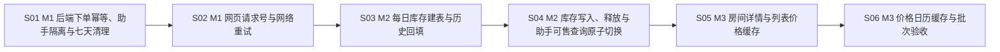

# Story 清单：booking-consistency

> 由 stories.json 生成，改内容请改 stories.json 后重新渲染。

## 总览

| 顺序 | 编号 | 标题 | 依赖 | 验收数 |
|---|---|---|---|---|
| 1 | S01 | M1 后端下单幂等、助手隔离与七天清理 | — | 5 |
| 2 | S02 | M1 网页请求号与网络重试 | S01 | 3 |
| 3 | S03 | M2 每日库存建表与历史回填 | S02 | 3 |
| 4 | S04 | M2 库存写入、释放与助手可售查询原子切换 | S03 | 10 |
| 5 | S05 | M3 房间详情与列表价格缓存 | S04 | 5 |
| 6 | S06 | M3 价格日历缓存与批次验收 | S05 | 3 |

## 依赖关系

## S01 M1 后端下单幂等、助手隔离与七天清理

**目标**：住客与前台带同一请求号安全重试，确定性失败可以回放，助手记录仍按原规则处理，过期记录自动清理。

**对应方案**：§4.1.1、§4.1.2、§4.1.3、§4.1.4、§4.1.5、§4.1.7、§5.4、§6.1
**依赖**：无

**改动范围**：

- `src/main/resources/db/schema.sql`
- `新建 src/main/resources/db/migration/m1-booking-request.sql`
- `新建 src/main/java/com/winniethepooh/hotelsystembackend/service/OrderRequestService.java`
- `src/main/java/com/winniethepooh/hotelsystembackend/controller/OrderController.java`
- `src/main/java/com/winniethepooh/hotelsystembackend/service/OrderService.java`
- `src/main/java/com/winniethepooh/hotelsystembackend/service/impl/OrderServiceImpl.java`
- `src/main/java/com/winniethepooh/hotelsystembackend/mapper/OrderMapper.java`
- `src/main/resources/mapper/OrderMapper.xml`
- `src/main/java/com/winniethepooh/hotelsystembackend/entity/BookingRequest.java`
- `src/main/java/com/winniethepooh/hotelsystembackend/agent/PendingActionService.java`
- `src/main/java/com/winniethepooh/hotelsystembackend/service/CustomTaskScheduler.java`
- `新建 src/test/java/com/winniethepooh/hotelsystembackend/OrderIdempotencyIT.java`
- `新建 src/test/java/com/winniethepooh/hotelsystembackend/service/OrderRequestServiceTest.java`
- `src/test/java/com/winniethepooh/hotelsystembackend/support/IntegrationTestBase.java`
- `src/test/java/com/winniethepooh/hotelsystembackend/agent/PendingActionServiceTest.java`
- `src/test/java/com/winniethepooh/hotelsystembackend/SchemaSqlIT.java`
- `README.md`
- `docs/api-overview.md`

**验收标准**：

| 编号 | 前提 | 操作 | 结果 | 入口 | 验证方式 |
|---|---|---|---|---|---|
| S01-AC1 | 已登录住客或前台，房间与日期可预订；请求头缺省或符合 8～64 位字母、数字、下划线、连字符规则 | 经 POST /order 提交；同一合法 key 同内容顺序提交三次；另测头部与摘要边界 | 带 key 三次 200，只新增 1 张订单和 1 条 ORDER/SUCCESS 记录；住客 data 为同一订单号，前台 data 仍为空。记录含身份、角色及 64 位小写 SHA-256；不存入住人明文。缺省头完全不读写 booking_request；非法或空白头 400 且无新增。 | `src/main/java/com/winniethepooh/hotelsystembackend/controller/OrderController.java::insertRoomOrderController` | OrderIdempotencyIT：TC-001、TC-008、TC-009；OrderRequestServiceTest：TC-005 捕获 hash，覆盖 USER paid 忽略、FRONT paid 纳入、解析后时间等价、null=空串及六字段变化；SchemaSqlIT 核对四列、created_at 索引和全局 request_id 唯一键。 |
| S01-AC2 | key 已属于网页订单或助手 actionId；请求方、角色、内容或原失败内容按 TC-003/004 矩阵变化 | 当前身份再次 POST /order 使用同一 key | 先比 user_id 与 requester_role：任一不符均 409「请求号已被占用，请更换后重试」，不泄露原订单号或房号；同身份 action_type 非 ORDER 或摘要不符均 422「请求号与内容不一致」；原记录与订单不变。 | `src/main/java/com/winniethepooh/hotelsystembackend/controller/OrderController.java::insertRoomOrderController` | OrderIdempotencyIT：TC-003、TC-004；覆盖同 id 不同角色、他人助手 actionId、六字段各变一项、FRONT paid、FAILED 后改正内容；OrderRequestServiceTest TC-014 同时身份和摘要不符仍优先 409。 |
| S01-AC3 | 同一 key 十线程并发，或首次下单遇 400/404/409/500、幂等记录唯一键/锁竞争 | 经 POST /order 下单并重试；可恢复错误排除原因后使用原 key，竞争在事务结束后重读记录 | 十并发只新增 1 订单/1 SUCCESS，至少一项 200，其余同号 200 或 409「请求处理中，请稍后重试」，无 500。PROCESSING→订单→SUCCESS 同事务，竞争先回滚再重读 SUCCESS/FAILED；无记录/PROCESSING 返回处理中。400/404 回滚后另存 FAILED 并原样回放；409/锁失败/500 不留记录，修复后可成功；FAILED 写竞争只 WARN、不覆盖原失败。 | `src/main/java/com/winniethepooh/hotelsystembackend/controller/OrderController.java::insertRoomOrderController` | OrderIdempotencyIT TC-002 十并发、TC-006 400/404 回放、TC-007 取消冲突单/撤 spy 故障后原 key 重试；OrderRequestServiceTest TC-014 覆盖 PROCESSING、竞争重读顺序、FAILED 另写和忽略失败写 DuplicateKey；核订单/入住人/夜价回滚无新增。 |
| S01-AC4 | booking_request 同时含 ORDER 和 BOOKING/PAYMENT/CANCEL/MEAL_ORDER；助手仍使用四参 insertBookingRequest | 经 POST /agent/actions/{id}/confirm、/cancel 提交网页 key；再执行原助手确认、取消竞争 | ORDER 或非四种助手类型在归属判断之前返回 404「确认卡片已失效」，同人/他人均不转 500；原 ORDER 行不变。助手成功、重复确认、确认/取消互斥保持；助手行 requester_role=0，摘要与失败列为空。 | `src/main/java/com/winniethepooh/hotelsystembackend/controller/AgentController.java::confirm` | OrderIdempotencyIT TC-010；PendingActionServiceTest TC-012 追加 ORDER 守卫（含他人）；AgentActionIT 原 tc006～tc020，重点 tc009 十并发与 tc012 二十轮竞争（TC-011）；SchemaSqlIT 新列默认值。 |
| S01-AC5 | ORDER 与助手行各有早于 7 天、少于 7 天两种创建时间；hotel.scheduler.enabled 控制定时注册 | 03:30 调度新增 cleanBookingRequests；测试直接调用同一生产方法 | 单条 DELETE 只删除 created_at < DATE_SUB(NOW(), INTERVAL 7 DAY) 的两条旧记录，保留两条新记录；事务执行、INFO 记删除数，多实例重复删除安全，无任务锁。 | `src/main/java/com/winniethepooh/hotelsystembackend/service/CustomTaskScheduler.java::CustomTaskScheduler` | OrderIdempotencyIT TC-013 四行夹具（7 天零 1 小时、6 天 23 小时各两类），调用 cleanBookingRequests；检查 @Scheduled(cron="0 30 3 * * ?")、@Transactional、现有 SchedulingConfig 开关及单条 SQL。 |

**实现提示**：现状依据：src/main/java/com/winniethepooh/hotelsystembackend/controller/OrderController.java:56～64 仍按角色调用服务；src/main/java/com/winniethepooh/hotelsystembackend/service/OrderService.java:28 的 FRONT 返回 void；src/main/java/com/winniethepooh/hotelsystembackend/service/impl/OrderServiceImpl.java:94～125 已有下单事务；src/main/resources/mapper/OrderMapper.xml:5～16 的助手四参写入与成功回写可直接复用；src/main/java/com/winniethepooh/hotelsystembackend/agent/PendingActionService.java:155～162 在归属判断后 valueOf，须先加类型守卫；src/main/java/com/winniethepooh/hotelsystembackend/service/CustomTaskScheduler.java:54～58 为现有调度类。新增 OrderRequestService 仅用 TransactionTemplate 包裹下单，类上不加 @Transactional；FRONT 服务改返回 Long 供记录，HTTP 响应不变。清理方法在现存调度类中新增，entry 引用现有类符号，验收调用新方法。基础数据、门面、助手守卫和清理必须一次接入才能从 POST /order 独立验收，故范围超过通常 10 文件；无纯基础设施 Story。目标测试：mvn -B test -Dtest=OrderRequestServiceTest,PendingActionServiceTest；mvn -B verify -DskipBrowserTests=true -Dit.test=OrderIdempotencyIT,SchemaSqlIT,AgentActionIT。逐条验收只跑本 Story 对应单元、HTTP 或既有浏览器用例；保留原 640 条测试的名称与断言，不通过删除、跳过或放宽断言过关。批次末 S02/S04/S06 执行一次 TC-051：mvn -B clean verify，退出 0；Surefire/Failsafe/E2E failures=errors=skipped=0；逐项比对原 198 单元＋432 API＋10 浏览器，新增测试单列；BrowserE2EIT 仍是 tc051～tc054、tc132～tc137 共 10 条。

## S02 M1 网页请求号与网络重试

**目标**：住客预订与前台开单每次点击携带新 key，同次网络重试复用 key，提交期间连点不重复下单。

**对应方案**：§4.1.6、§5.1、§6.1 T1-11、§6.4
**依赖**：S01

**改动范围**：

- `src/main/resources/static/app.js`
- `src/test/e2e/hotel.spec.js`

**验收标准**：

| 编号 | 前提 | 操作 | 结果 | 入口 | 验证方式 |
|---|---|---|---|---|---|
| S02-AC1 | crypto.randomUUID 可用或不可用，住客与前台打开真实表单 | 在 showBooking、frontView 提交；两名住客依次预订 | 每次点击通过 newKey/postOrder 带合法 Idempotency-Key；UUID 不可用时 getRandomValues 生成 32 位十六进制；不同点击 key 不同；token、Content-Type 与 signal 选项保留。 | `src/main/resources/static/app.js::showBooking` | 只扩展既有浏览器 TC-132、TC-133、TC-137（测试方案 TC-017）；TC-133 addInitScript 关闭 randomUUID，TC-132 验证 UUID 路径，TC-137 两次 key 不同。检查 api 合并 headers 后仍传 signal。 |
| S02-AC2 | 提交请求遇 fetch 网络异常，或收到 HTTP 409/422 等响应 | 真实预订表单经 postOrder 自动重试或显示错误 | 仅无 HTTP 状态的网络异常重试，最多 2 次、间隔 500ms/1000ms，复用原 key；有 HTTP 响应不重试并显示错误。首请求 abort 后放行时共 2 次 POST、同 key、一张订单、页面进入订单列表。 | `src/main/resources/static/app.js::showBooking` | TC-132 内覆盖 route.abort()、route.fulfill(409)（TC-015），记录请求数与 key；参数化网络连续失败核对最多 3 次发送；保留原 TC-132 支付、按晚营收、真实 cron 退房断言，不新增浏览器 testcase。 |
| S02-AC3 | 住客提交按钮首个响应放慢 | 快速连点「提交预订」，随后走支付、取消退款、另一住客重订原流程 | 按钮禁用期恰 1 次 POST、1 张订单、一次成功提示；原退款和重订业务断言通过。 | `src/main/resources/static/app.js::submit` | 只在既有 TC-137 内追加连点与请求计数（TC-016），保留原退款、营收清零、另一住客重订断言；M1 批次末执行 TC-051 全量门禁。 |

**实现提示**：现状依据：src/main/resources/static/app.js:72～78 的 ...options 会整体替换 headers；:109～119 已有禁用按钮防连点；:291～295 与 :308～312 是两处 POST /order。复用 submit，不添加另一套按钮状态。M1 浏览器只改既有 TC-132/133/137，助手 TC-051～054 回归保留，浏览器总数仍为 10。Story 内针对上述既有场景验证；完成 M1 后 S02 承担 TP-049/TC-051 的 M1 一次全量门禁。逐条验收只跑本 Story 对应单元、HTTP 或既有浏览器用例；保留原 640 条测试的名称与断言，不通过删除、跳过或放宽断言过关。批次末 S02/S04/S06 执行一次 TC-051：mvn -B clean verify，退出 0；Surefire/Failsafe/E2E failures=errors=skipped=0；逐项比对原 198 单元＋432 API＋10 浏览器，新增测试单列；BrowserE2EIT 仍是 tc051～tc054、tc132～tc137 共 10 条。

## S03 M2 每日库存建表与历史回填

**目标**：新库具备每日唯一库存，旧库在停写窗口可以定位冲突、原子回填并核对历史有效订单。

**对应方案**：§4.2.1、§4.2.7、§5.7、§6.2 T2-08、§6.5
**依赖**：S02

**改动范围**：

- `src/main/resources/db/schema.sql`
- `新建 src/main/resources/db/migration/m2-room-inventory.sql`
- `新建 src/main/resources/db/migration/m2-room-inventory-backfill.sql`
- `新建 src/test/java/com/winniethepooh/hotelsystembackend/RoomInventoryBackfillIT.java`
- `src/test/java/com/winniethepooh/hotelsystembackend/SchemaSqlIT.java`
- `README.md`
- `docs/architecture.md`
- `docs/booking-consistency.md`

**验收标准**：

| 编号 | 前提 | 操作 | 结果 | 入口 | 验证方式 |
|---|---|---|---|---|---|
| S03-AC1 | 新库使用 schema.sql，旧库手工执行 m2-room-inventory.sql | 创建 room_inventory 并写入同房同日、不同房或不同日的占用 | 表含 id、room_id、stay_date、order_id、created_at；唯一键 uk_room_inventory_room_date(room_id,stay_date) 拒绝第二条同房同日；不同房/日可插；idx_room_inventory_order(order_id) 存在；无外键。 | `src/main/resources/db/migration/m2-room-inventory.sql::CREATE TABLE` | SchemaSqlIT 覆盖 TC-036 的建表/唯一键/索引矩阵；核对新库 schema 与手工 DDL 字段、键一致，按已定 GAP-06 保留手工 DDL 审阅方式。 |
| S03-AC2 | 停写、库存表为空；历史夹具含未来进行中、已入住进行中、取消、软删、离店已过及 DONE 六类订单 | 执行真实回填脚本步骤 1，再执行步骤 2 的单条 INSERT…WITH RECURSIVE | 无冲突时步骤 1 无结果；仅 status=0、未删、room_id 非空、checkout_time>NOW() 订单填完整 [入住日,离店日) 夜集合，已入住单含过去晚；其余零占用；I1/I2 无输出。 | `src/main/resources/db/migration/m2-room-inventory-backfill.sql::INSERT INTO room_inventory` | RoomInventoryBackfillIT TC-029 从资源读取并执行真实 SQL（不另写简化算法），先清空库存模拟旧库；逐日核对两个有效订单各 3 晚，核对排除的四类和 I1/I2。 |
| S03-AC3 | 库存表为空，两张有效历史订单同房有一个共同夜 | 执行回填步骤 1；故意跳过处理再执行步骤 2；按 README 执行停写、处理冲突、复核流程 | 冲突清单恰 1 行，含 room_id、stay_date、orders=2 和两个 order_ids；步骤 2 唯一键失败后库存仍为 0，不能部分回填；文档说明有冲突必须停止，脚本只执行一次，重做先清空，回填后 I1/I2 无结果才启动 S04 版本。 | `src/main/resources/db/migration/m2-room-inventory-backfill.sql::HAVING COUNT(*) > 1` | RoomInventoryBackfillIT TC-030 执行真实两段 SQL，断言冲突清单与原子失败；审阅 README 停写和回滚顺序，不把脚本当自动迁移框架。 |

**实现提示**：现状依据：src/main/resources/db/schema.sql:199～214 仅有 booking_request，不存在 room_inventory；src/test/java/com/winniethepooh/hotelsystembackend/support/Fixtures.java:359～370 目前只造 room_order；src/main/resources/mapper/RoomMapper.xml:9～12 与 src/main/resources/mapper/OrderMapper.xml:99～104 仍按订单时间判断冲突。S03 交付可独立执行的迁移工具与验证，生产 Java 尚未读写库存，Fixtures 的自动占用留 S04 原子切换。仅加表不改变原订单路径；最终部署必须在停写窗口完成此脚本与 S04 新版本连续切换，不能在旧版恢复写入后沿用早先回填结果。历史重叠种子在回填测试中刻意清空库存，TC-036 的夹具行留 S04。目标测试：mvn -B verify -DskipBrowserTests=true -Dit.test=RoomInventoryBackfillIT,SchemaSqlIT；保留已定时钟/手工 DDL 验证范围，无新增方向决策。逐条验收只跑本 Story 对应单元、HTTP 或既有浏览器用例；保留原 640 条测试的名称与断言，不通过删除、跳过或放宽断言过关。批次末 S02/S04/S06 执行一次 TC-051：mvn -B clean verify，退出 0；Surefire/Failsafe/E2E failures=errors=skipped=0；逐项比对原 198 单元＋432 API＋10 浏览器，新增测试单列；BrowserE2EIT 仍是 tc051～tc054、tc132～tc137 共 10 条。

## S04 M2 库存写入、释放与助手可售查询原子切换

**目标**：所有订单入口同事务维护每日占用，所有可售查询采用同一夜集合，竞争、失败、改期和释放均不残留库存。

**对应方案**：§4.2.2、§4.2.3、§4.2.4、§4.2.5、§4.2.6、§4.2.8、§4.2.9、§5.1、§6.2、§6.4、§6.5
**依赖**：S03

**改动范围**：

- `src/main/java/com/winniethepooh/hotelsystembackend/service/impl/OrderServiceImpl.java`
- `src/main/java/com/winniethepooh/hotelsystembackend/service/impl/RoomServiceImpl.java`
- `src/main/java/com/winniethepooh/hotelsystembackend/service/CustomTaskScheduler.java`
- `src/main/java/com/winniethepooh/hotelsystembackend/mapper/OrderMapper.java`
- `src/main/resources/mapper/OrderMapper.xml`
- `src/main/java/com/winniethepooh/hotelsystembackend/mapper/RoomMapper.java`
- `src/main/resources/mapper/RoomMapper.xml`
- `src/main/java/com/winniethepooh/hotelsystembackend/exception/GlobalExceptionHandler.java`
- `新建 src/test/java/com/winniethepooh/hotelsystembackend/RoomInventoryIT.java`
- `新建 src/test/java/com/winniethepooh/hotelsystembackend/service/RoomInventoryServiceTest.java`
- `src/test/java/com/winniethepooh/hotelsystembackend/support/Fixtures.java`
- `src/test/java/com/winniethepooh/hotelsystembackend/OrderWorkflowIT.java`
- `src/test/java/com/winniethepooh/hotelsystembackend/AgentReadToolsIT.java`
- `src/test/java/com/winniethepooh/hotelsystembackend/AgentProposalIT.java`
- `src/test/java/com/winniethepooh/hotelsystembackend/AgentActionIT.java`
- `src/test/java/com/winniethepooh/hotelsystembackend/SchemaSqlIT.java`
- `src/test/java/com/winniethepooh/hotelsystembackend/exception/GlobalExceptionHandlerTest.java`
- `src/test/java/com/winniethepooh/hotelsystembackend/BrowserE2EIT.java`
- `src/test/e2e/hotel.spec.js`
- `README.md`
- `docs/architecture.md`
- `docs/booking-consistency.md`

**验收标准**：

| 编号 | 前提 | 操作 | 结果 | 入口 | 验证方式 |
|---|---|---|---|---|---|
| S04-AC1 | 通过住客、前台或助手确认订 1/3/30 晚，另有同日交接与共同夜边界 | POST /order 或 POST /agent/actions/{id}/confirm 执行原下单事务 | 写订单后按价格夜集合逐日升序单行 INSERT 库存、再写夜价；三入口占全部 [入住日,离店日) 夜，31 晚仍 400。离店日同日 10:00 入住允许，共同夜 409；不依赖 room.status。room_inventory、订单、入住人、夜价同事务。 | `src/main/java/com/winniethepooh/hotelsystembackend/controller/OrderController.java::insertRoomOrderController` | RoomInventoryIT TC-021、TC-022；RoomInventoryServiceTest TC-032 验证 5/30 晚升序与第三晚冲突后停止；OrderWorkflowIT tc064/tc065 只改场景 2 为允许，场景 0/1 仍冲突。Fixtures.roomOrder status=0 自动 INSERT IGNORE 各晚，非 0 不写，重叠种子保留先写归属（TC-036）；有效业务场景核 I1/I2。 |
| S04-AC2 | 50 请求争同一晚、两个三晚区间部分重叠，或首/末晚冲突及第二晚写入故障 | 真实 HTTP 并发 POST /order；对库存 INSERT 注入 SQL 触发器/spy 故障 | 50 并发恰 1 成功、49 个库存 409、无 500；部分重叠 20 轮每轮恰一赢家。单晚冲突整单回滚，失败方库存/订单/入住人/夜价均无新增；中途失败无首晚残留；I1/I2 无输出。 | `src/main/java/com/winniethepooh/hotelsystembackend/controller/OrderController.java::insertRoomOrderController` | RoomInventoryIT TC-018、TC-019、TC-020、TC-033；保留 OrderWorkflowIT tc068（20 并发×10轮），tc080 两条、tc097 追加库存回滚快照，原断言不放宽；spy 锁异常结果 409。 |
| S04-AC3 | 尚未入住的有效订单未付或已付，或由助手确认 CANCEL | POST /order/cancel 或 POST /agent/actions/{id}/confirm 执行取消；另一住客立即订原房原晚 | 条件取消成功后同事务删除全部该单占用；已付仍 pay_status=2 退款标记；失败的取消不删占用。重订 200 且新单拥有各夜；原 room_order_night 不删除，取消单不计营收。 | `src/main/java/com/winniethepooh/hotelsystembackend/controller/OrderController.java::cancelRoomOrderController` | RoomInventoryIT TC-023 的住客未付/已付/助手取消三行、TC-034；保留 OrderWorkflowIT tc075 支付/取消竞争 50 轮、tc083、tc076 两条，以及 BusinessStatsIT 原营收断言；I1/I2。 |
| S04-AC4 | 未付住客单创建 16 分钟，另有未付前台单与已付单 | cron 的 flushExpiredRoomOrders 查锁超时订单，逐单关闭并释放 | 用与原 SQL 相同条件的 select id…for update 取超时住客单，再置 CANCELLED、删除占用，同事务生效；前台未付及已付单不受影响；旧批量 UPDATE 退役；释放后可重订且超时单不能支付。 | `src/main/java/com/winniethepooh/hotelsystembackend/service/CustomTaskScheduler.java::flushExpiredRoomOrders` | RoomInventoryIT TC-023 超时行；OrderWorkflowIT tc069 及前台未付超时原用例，核状态、库存、重订、不能支付；I1/I2。 |
| S04-AC5 | 经理可软删除仍持占用的订单 | DELETE /order/{id} 后另一住客订同房同晚 | 软删与 deleteRoomInventoryByOrder 同事务；旧订单 is_deleted=1、占用零，重订成功；不删除夜价，营收按既有状态过滤。 | `src/main/java/com/winniethepooh/hotelsystembackend/controller/OrderController.java::deleteRoomOrderController` | RoomInventoryIT TC-023 经理软删行；保留 OrderWorkflowIT tc076/其他原删除断言；I1/I2；AgentReadToolsIT tc001 R3 的软删从直改 SQL 改为经理 HTTP DELETE。 |
| S04-AC6 | 入住中订单跨昨天至明天，另有到期退房单与待支付单 | PUT /rooms 将房态 1→0 提前结束；或 releaseExpiredRooms 正常退房；或 POST /order/pay | 提前结束置 DONE 后只删今天及以后夜、保留过去夜，他人可订今天；正常退房 DONE 保留全部历史占用；支付前后库存行（含 id）完全不变。 | `src/main/java/com/winniethepooh/hotelsystembackend/controller/RoomController.java::modifyRoomStatusController` | RoomInventoryIT TC-024 三行；OrderWorkflowIT tc089 追加库存零行、保留原房态与订单断言；今天使用已定 JVM 日期，正常退房保留原任务锁逻辑；I1/I2。 |
| S04-AC7 | 前台修改进行中订单的日期或目标房，另有新增夜/目标房冲突 | PUT /order/{id} 执行延长、缩短、平移、换房及冲突矩阵 | 保留订单行锁与状态/源房复核，移除预订房间行锁。同房删旧−新、升序插新−旧，公共夜库存 id 不变；换房删旧房全夜后占新房。任一冲突整体回滚订单金额/日期/房号、所有库存含 id、夜价及他人占用。 | `src/main/java/com/winniethepooh/hotelsystembackend/controller/OrderController.java::modifyRoomOrderController` | RoomInventoryIT TC-025、TC-026；保留 OrderWorkflowIT tc095、tc097（两条）及原换房/改期断言，tc097 追加库存快照；重新计价和夜价整单重写沿用原逻辑；I1/I2。 |
| S04-AC8 | 同一房间部分夜被占，首尾相接可售，维修/清洁房态仍按已定规则可售 | 真实 POST /agent/chat 经 search_available_rooms、get_price_quote、propose_booking 调用生产 OrderService | findAvailableRooms 改 NOT EXISTS room_inventory；quoteRoomService 用只读 countRoomInventory，参数转 DATE，列不包 DATE，无 for update。共同夜搜房排除、报价/提议失败；相接可售；开放报价事务不阻塞另一线程 3 秒内下单。助手确认库存冲突仍 409「已被预订」，不被误判确认记录冲突。 | `src/main/java/com/winniethepooh/hotelsystembackend/controller/AgentController.java::chat` | RoomInventoryIT/AgentReadToolsIT TC-027、TC-028；调整 tc001 三组及 tc044 夹具；AgentProposalIT tc062 直接造最终区间，不事后 SQL 延长；TC-037 验证 AgentActionIT tc014 仍库存冲突、AgentToolsTest.s03ac1 原反射注入/verifyNoMoreInteractions 不改。全仓检索退役 checkOverlap/findOverlappingOrder/lockRoomByNumber/旧 flushExpiredRoomOrders SQL；保留 PUT /rooms 的 lockRoomById。 |
| S04-AC9 | 库存单行 INSERT 抛 DuplicateKey 或 PessimisticLockingFailureException，其余 SQL 也可能锁失败 | 占用经三个下单入口或改期执行；未被占用层转换的锁异常进入全局处理 | 占用 DuplicateKey 局部转 409「房间在该时段已被预订」；占用死锁/锁等待转 409「该时段预订繁忙，请稍后重试」并让事务回滚；其余锁异常全局转 409「系统繁忙，请稍后重试」；不自动重试。 | `src/main/java/com/winniethepooh/hotelsystembackend/controller/OrderController.java::insertRoomOrderController` | RoomInventoryServiceTest TC-031 的 DuplicateKey/DeadlockLoser/CannotAcquireLock；GlobalExceptionHandlerTest TC-031 追加全局分支；RoomInventoryIT TC-033 spy 验证真实 HTTP 与完整回滚；已定 GAP-03 不声称确定性触发真实数据库死锁。 |
| S04-AC10 | 网页住客支付后取消退款，另一住客重订同房同晚 | 既有 TC-137 的真实表单和订单操作完成全流程 | 页面成功与退款、营收清零原断言均保留；原单占用零，新有效单持有该房该晚唯一占用，order_id 为新单。 | `src/main/resources/static/app.js::ordersView` | TC-038 并入既有浏览器 TC-137；BrowserE2EIT.state 新增 roomInventory（select *…order by id）并以该状态断言归属；Browser testcase 总数不增加。M2 批次末 TC-051；订单侧 tc068/069/075/083/076/095/097、BusinessStatsIT、助手原用例均逐项通过。 |

**实现提示**：必须作为一次可验证原子切换：若只接入部分写入口或先换助手只读查询，中间版本会出现缺失占用、陈旧占用或查询与实际写入依据不同，因此范围/10条 AC 超过通常阈值。现状依据：src/main/java/com/winniethepooh/hotelsystembackend/service/impl/OrderServiceImpl.java:106～125 下单、:130～157 改期、:161～177 删除/取消；src/main/java/com/winniethepooh/hotelsystembackend/service/impl/RoomServiceImpl.java:65～74 提前结束；src/main/java/com/winniethepooh/hotelsystembackend/service/CustomTaskScheduler.java:31～41 正常退房、:56～58 超时；src/main/resources/mapper/RoomMapper.xml:5～21 搜索和房间锁；src/main/resources/mapper/OrderMapper.xml:99～149 旧冲突和超时 SQL；src/main/java/com/winniethepooh/hotelsystembackend/agent/AgentTools.java:177～186 工具派发复用服务；src/test/java/com/winniethepooh/hotelsystembackend/BrowserE2EIT.java:106～111 状态桥目前没有库存。SchemaSqlIT 的库存定义在 S03，S04 验证 Fixtures 自动占用；同房同晚历史统计重叠种子用 INSERT IGNORE，不对这些刻意不一致种子套 I1。每个正常生产动作后核 I1/I2；未完结未来有效单夜集合完整、取消/删除无孤儿。营收统计 SQL 与 BusinessServiceImpl 统计逻辑不改；OrderWorkflow 原断言仅同日交接场景 2 按已定规则修改，其他只增加库存断言。目标单元 RoomInventoryServiceTest/GlobalExceptionHandlerTest/AgentToolsTest，HTTP RoomInventoryIT/OrderWorkflowIT/BusinessStatsIT/AgentReadToolsIT/AgentProposalIT/AgentActionIT/SchemaSqlIT，浏览器既有 TC-137。完成 M2 后本 Story 承担 TP-049/TC-051 一次全量门禁。逐条验收只跑本 Story 对应单元、HTTP 或既有浏览器用例；保留原 640 条测试的名称与断言，不通过删除、跳过或放宽断言过关。批次末 S02/S04/S06 执行一次 TC-051：mvn -B clean verify，退出 0；Surefire/Failsafe/E2E failures=errors=skipped=0；逐项比对原 198 单元＋432 API＋10 浏览器，新增测试单列；BrowserE2EIT 仍是 tc051～tc054、tc132～tc137 共 10 条。

## S05 M3 房间详情与列表价格缓存

**目标**：房间静态详情和列表价格复用 Redis，房态实时读库，房间与价格写入同步失效，Redis 故障不影响业务。

**对应方案**：§4.3.1、§4.3.2、§4.3.3、§4.3.4、§4.3.5、§4.3.6、§4.5、§5.1、§6.3
**依赖**：S04

**改动范围**：

- `新建 src/main/java/com/winniethepooh/hotelsystembackend/service/HotCache.java`
- `src/main/java/com/winniethepooh/hotelsystembackend/service/impl/RoomServiceImpl.java`
- `src/main/java/com/winniethepooh/hotelsystembackend/service/impl/BusinessServiceImpl.java`
- `src/main/java/com/winniethepooh/hotelsystembackend/mapper/RoomMapper.java`
- `src/main/resources/mapper/RoomMapper.xml`
- `src/main/resources/application.yml`
- `新建 src/test/java/com/winniethepooh/hotelsystembackend/service/HotCacheTest.java`
- `新建 src/test/java/com/winniethepooh/hotelsystembackend/RoomCacheIT.java`
- `README.md`

**验收标准**：

| 编号 | 前提 | 操作 | 结果 | 入口 | 验证方式 |
|---|---|---|---|---|---|
| S05-AC1 | 存在房间或不存在的 id，Redis 起初未命中 | GET /rooms/{id} 两次；预热后 PUT /rooms 改房态再读 | 缓存仅房号/房型/楼层/容量/描述/图片，JSON 无 status。已存在房间二次恰 1 条只读 status、检查未删的 SQL，两次响应含默认图片逐字段一致，房态改变立即可见；不存在 id 存 NULL，TTL≤300 秒，二次零 SQL、data=null。 | `src/main/java/com/winniethepooh/hotelsystembackend/controller/RoomController.java::queryRoomByIdController` | RoomCacheIT TC-039、TC-042、TC-044 房间行；检查 SqlCounter 语句无静态列、Redis JSON 无 status；保留 convertToVO 默认图片。 |
| S05-AC2 | 列表涉及最多三种房型，同日有已设日历价和未设价 | GET /rooms?date= 两次经 HotCache.getAll 读取每房型当天价格 | RoomServiceImpl 用 null date 查房间列表并保留分页/过滤/计数，单次 MGET≤3 个 price:{type}:{date}；命中时列表 SQL 不 JOIN、不读取 price_calendar，默认价仍 199/299/499，价格与首次响应一致。 | `src/main/java/com/winniethepooh/hotelsystembackend/controller/RoomController.java::queryRoomsController` | RoomCacheIT TC-040 列表行；捕获 MGET 键数与 SQL，保留 OrderWorkflowIT tc117 rooms 一组（已预热后加 49 房，SQL 条数相同）；AgentToolsTest.s03ac1 计价交互原样通过。 |
| S05-AC3 | 详情和列表价格已经预热，经理修改描述、删除房间或批量改价 | PUT/DELETE /rooms/{id}；POST /business/calendar 修改 N 天后 GET 详情/列表 | 数据库成功提交后删除对应 room:detail 或 N 个 price key（单次批量 DEL）；回滚不删、无事务 SQL 自动提交后立即删。立即读到新描述、删除后 null、新价格；缓存开关关闭时写入口仍失效，S05 阶段列表不出现改价后旧缓存。 | `src/main/java/com/winniethepooh/hotelsystembackend/controller/RoomController.java::modifyRoomInfoController` | RoomCacheIT TC-041 房间两行及改价列表部分；HotCacheTest TC-048 事务四行、TC-049 关闭开关仍删除；改三天检查三个 price key 均不存在。S06 补相同矩阵的价格日历读取。 |
| S05-AC4 | 缓存开关默认 true，可设 HOTEL_CACHE_ENABLED；Redis 读写删或 JSON 处理抛 RuntimeException | 详情走 get、房间列表走 getAll、房间/价格写入口走 evictAfterCommit | 有值 TTL 为 1800～2400 秒随机，NULL 恒 300 秒。异常读当未命中、写忽略、删 WARN，返回 loader 正确值；关闭开关 get/getAll 对 Redis 零读写，但写后仍删。redis timeout 配置 1s；三种 HotCache 方法均已从真实生产入口调用。 | `src/main/java/com/winniethepooh/hotelsystembackend/controller/RoomController.java::queryRoomsController` | HotCacheTest TC-045 200 个有值键 TTL 全在范围且至少两种、20 个 NULL 恒 300；TC-047 六种读写删故障、TC-048 四种事务时机、TC-049 三种开关行为（getAll 混合 room/price 四键）；RoomCacheIT 验证故障 HTTP 详情/列表/改价正确。 |
| S05-AC5 | 静态/列表价格缓存已预热或缓存键故障，登录 token 正常透传 | 经理改价后住客立即 POST /order、/order/pay | 订单夜价读 price_calendar 得新价；订单、可售、助手计价不使用缓存，库存规则维持 M2。仅新增 room:/price: 缓存前缀；缓存故障下详情、列表、改价、下单/支付均 200 正确，不能以真实停 Redis 破坏登录验证。 | `src/main/java/com/winniethepooh/hotelsystembackend/controller/OrderController.java::insertRoomOrderController` | RoomCacheIT TC-043，TC-046 详情/列表/改价/下单/支付行；注入只针对 room:/price:，token 透传；SqlCounter 核下单价格 SQL、夜价与支付状态。TC-050 的 OrderWorkflowIT/PriceCalendarIT/AgentToolsTest 先作本阶段兼容回归，S06 再验完整缓存后结果。 |

**实现提示**：现状依据：src/main/java/com/winniethepooh/hotelsystembackend/service/impl/RoomServiceImpl.java:47～60 补默认图片、:77～79 详情整行读库、:114～125 列表；src/main/resources/mapper/RoomMapper.xml:122～147 已支持 null date 时不 JOIN 价格；src/main/java/com/winniethepooh/hotelsystembackend/service/impl/BusinessServiceImpl.java:263～265 写价当前无失效；src/main/resources/application.yml:10～14 复用现有 StringRedisTemplate 配置；src/main/java/com/winniethepooh/hotelsystembackend/service/impl/OrderServiceImpl.java:211～218 计价直接读库。HotCache 用现有 StringRedisTemplate/ObjectMapper 的 get/getAll/evictAfterCommit 薄封装；S05 同时接入列表价格及改价失效，避免仅测试调用的 getAll 和中间版本旧价。S06 只扩价格日历读取，无须修改 S05 新建文件。房间新建不批量扫描/失效未知 id，接受 NULL 最多 300 秒；PUT /rooms 房态变更不需删静态键。目标 HotCacheTest、RoomCacheIT、OrderWorkflowIT、PriceCalendarIT、AgentToolsTest；无新增浏览器 testcase。逐条验收只跑本 Story 对应单元、HTTP 或既有浏览器用例；保留原 640 条测试的名称与断言，不通过删除、跳过或放宽断言过关。批次末 S02/S04/S06 执行一次 TC-051：mvn -B clean verify，退出 0；Surefire/Failsafe/E2E failures=errors=skipped=0；逐项比对原 198 单元＋432 API＋10 浏览器，新增测试单列；BrowserE2EIT 仍是 tc051～tc054、tc132～tc137 共 10 条。

## S06 M3 价格日历缓存与批次验收

**目标**：价格日历区间用批量缓存读取和一次 SQL 补全未命中，完成价格更新、数据库计价和缓存降级全链路验收。

**对应方案**：§4.3.3、§4.3.4、§4.3.5、§4.3.6、§5.1、§6.3、§6.4
**依赖**：S05

**改动范围**：

- `src/main/java/com/winniethepooh/hotelsystembackend/service/impl/BusinessServiceImpl.java`
- `新建 src/test/java/com/winniethepooh/hotelsystembackend/PriceCacheIT.java`
- `README.md`
- `docs/architecture.md`
- `docs/booking-consistency.md`

**验收标准**：

| 编号 | 前提 | 操作 | 结果 | 入口 | 验证方式 |
|---|---|---|---|---|---|
| S06-AC1 | GET /business/calendar 价格区间全未命中、全命中或部分命中，包含未设价日期 | 经理读取 [d1,d2] 再扩到 [d1,d4]；重复读同区间 | 经 S05 的 getAll 单次 MGET；只要缺任一日便用原区间一次 SQL 取得全部价格，填缺键（包括 NULL），不逐日 SQL。全命中零 SQL，部分命中恰 1 条，响应按日期排序、未设价仍 null；NULL TTL≤300 秒且再次零 SQL。 | `src/main/java/com/winniethepooh/hotelsystembackend/controller/BusinessController.java::getPriceCalendarController` | PriceCacheIT TC-040 日历全命中/部分命中、TC-044 价格空值行；与数据库结果逐日比对；PriceCalendarIT 首次读仍 1 SQL。 |
| S06-AC2 | 日历和列表都已预热相同 price key，经理批量改三天价格 | POST /business/calendar 后立即 GET 日历、GET /rooms?date=，再经下单、改期、报价或搜房计价 | 复用 S05 提交后失效，三天 key 全部删除，日历/列表立即新价。订单夜价及改期/助手计价始终 SQL 读库；不缓存订单、库存或可售结果；Redis 新增键仅 room:/price:。 | `src/main/java/com/winniethepooh/hotelsystembackend/controller/BusinessController.java::updatePriceCalendarController` | PriceCacheIT TC-041 改价日历与列表完整矩阵、TC-043；保留 AgentToolsTest.s03ac1 原 SQL 一次/房型、夜序及 verifyNoMoreInteractions；核订单 SQL/夜价新价，不更改营收统计 SQL。 |
| S06-AC3 | 仅 room:/price: Redis 读写删抛连接异常，token Redis 调用真实透传 | 依次真实 HTTP 读详情、列表、日历、改价、下单、支付并执行现有读性能回归 | TC-046 六行均 200、数据与库一致，无 401/500；GET 日历正确返回价格/null，改价写库成功，订单夜价与支付正确。tc117 列表 SQL 不随 49 新房增加，PriceCalendarIT 冷读 1 SQL，AgentToolsTest 计价原交互通过。 | `src/main/java/com/winniethepooh/hotelsystembackend/controller/BusinessController.java::getPriceCalendarController` | PriceCacheIT 完整 TC-046 六行；重跑 S05 的 HotCacheTest/RoomCacheIT（无需改其文件）、TC-050 点名三类；完成 M3 后 TC-051 一次全量，逐项对原 640 名单与零跳过，BrowserE2EIT 仍 10 条。 |

**实现提示**：现状依据：src/main/java/com/winniethepooh/hotelsystembackend/service/impl/BusinessServiceImpl.java:267～273 当前用一次区间 SQL 组装逐日/null；src/main/java/com/winniethepooh/hotelsystembackend/controller/BusinessController.java:74～78 是真实日历入口；src/main/java/com/winniethepooh/hotelsystembackend/service/impl/OrderServiceImpl.java:211～218 和 src/main/java/com/winniethepooh/hotelsystembackend/agent/AgentTools.java:264～276 计价继续直接读取生产 SQL。S05 已有 getAll 与价格写失效的生产调用，S06 接入 getPriceCalendarService；新建 PriceCacheIT 专门验证日历与跨端点链路，避免把依赖 S05 尚未新建的测试/HotCache 文件标为现存 scope。tc117 优先保持相同条数断言，仅出现已定 GAP-12 的真实不稳定再说明依据；不预先放宽。目标 PriceCacheIT、PriceCalendarIT、OrderWorkflowIT、AgentToolsTest 及依赖已有 HotCacheTest/RoomCacheIT。完成 M3 后本 Story 承担 TP-049/TC-051 一次全量门禁；三批结束均须原 640 逐项通过，不只核总数。逐条验收只跑本 Story 对应单元、HTTP 或既有浏览器用例；保留原 640 条测试的名称与断言，不通过删除、跳过或放宽断言过关。批次末 S02/S04/S06 执行一次 TC-051：mvn -B clean verify，退出 0；Surefire/Failsafe/E2E failures=errors=skipped=0；逐项比对原 198 单元＋432 API＋10 浏览器，新增测试单列；BrowserE2EIT 仍是 tc051～tc054、tc132～tc137 共 10 条。
